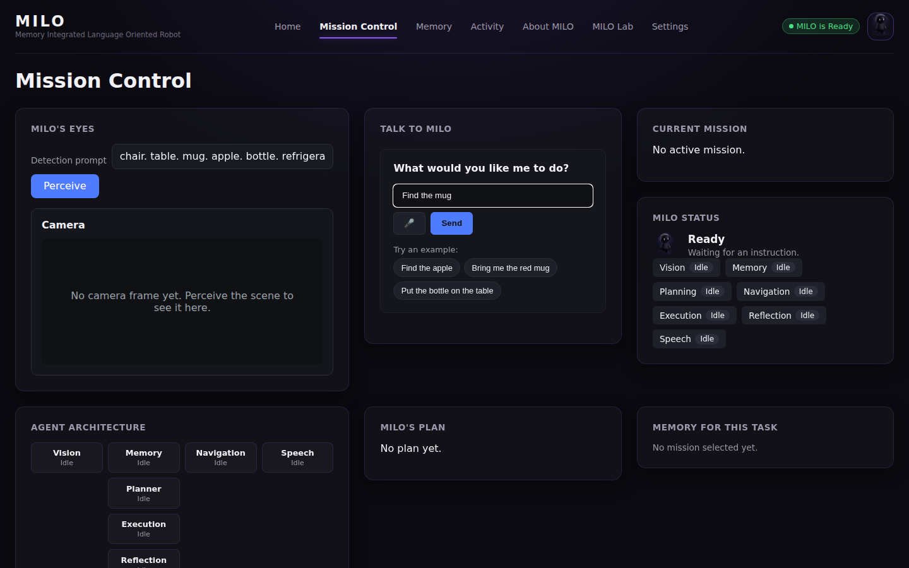
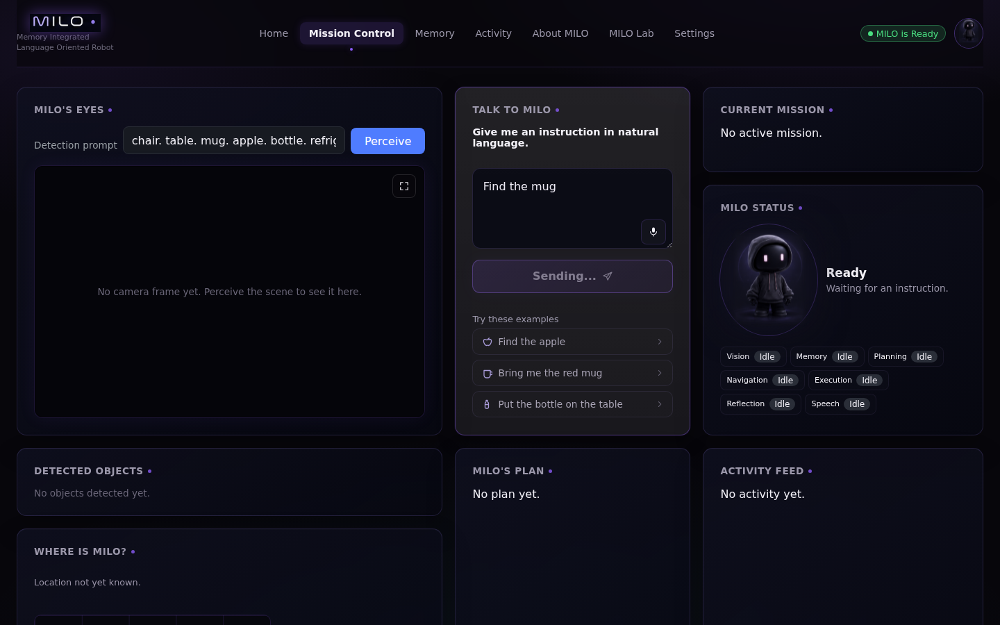
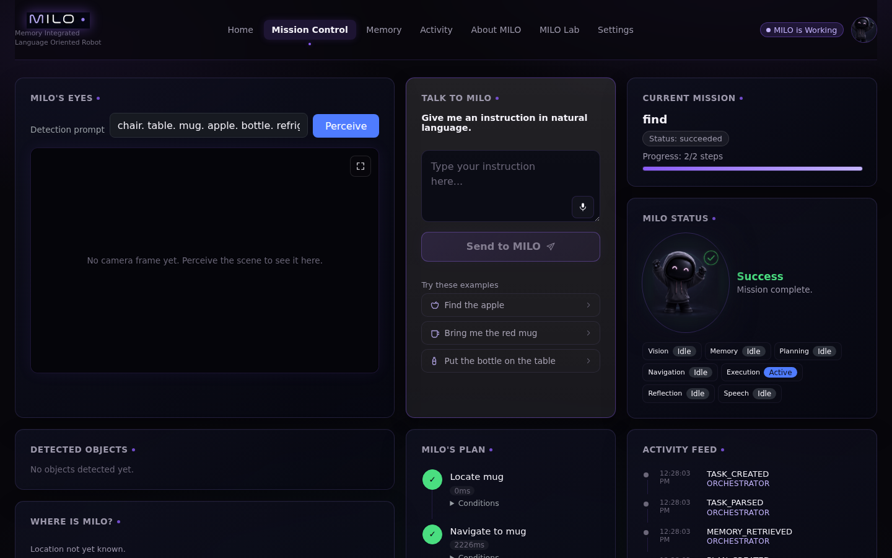
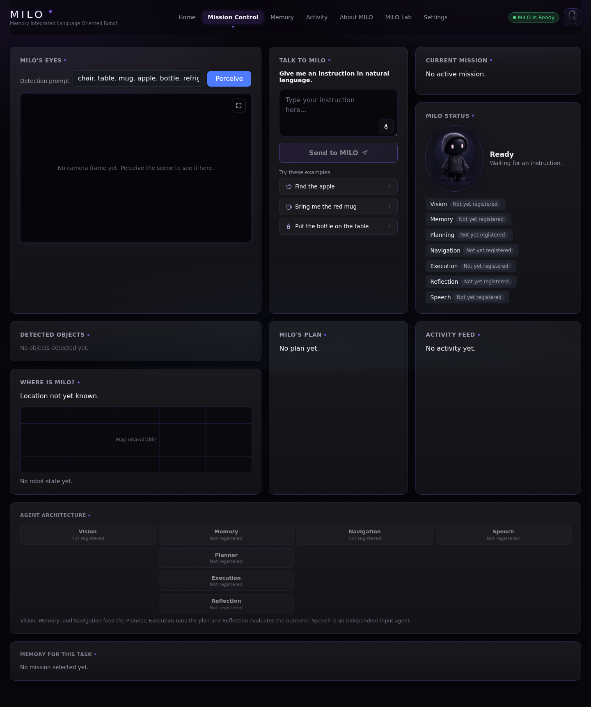
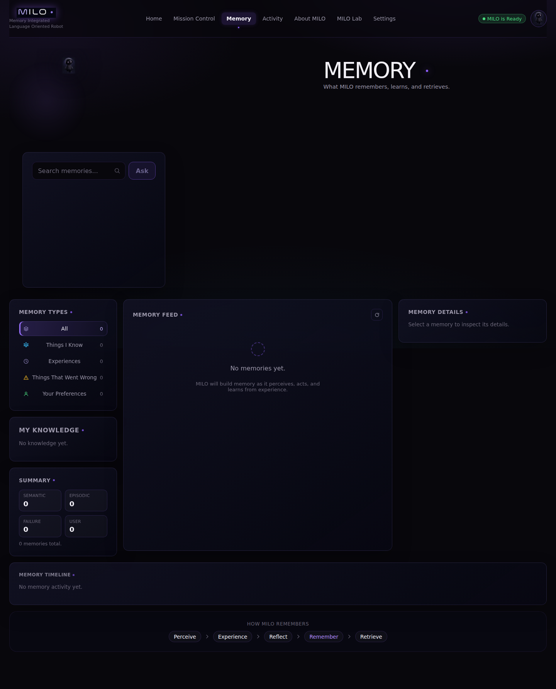
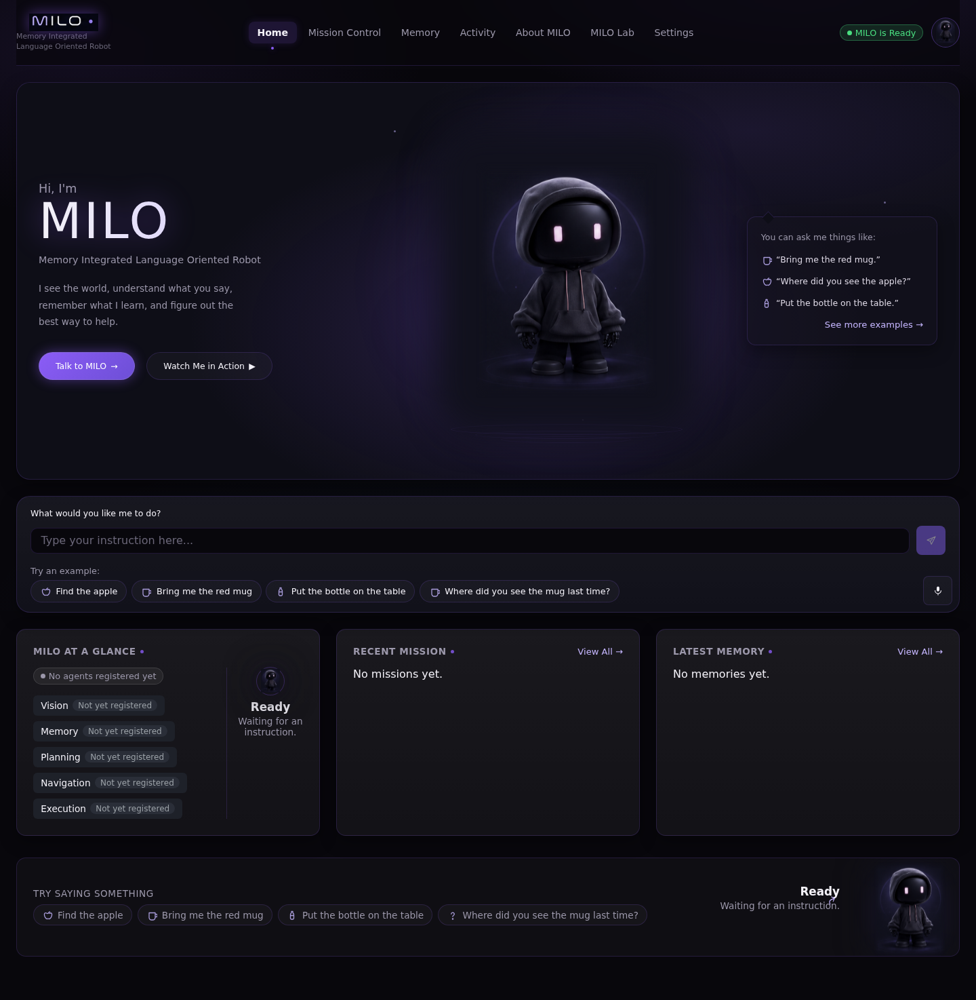
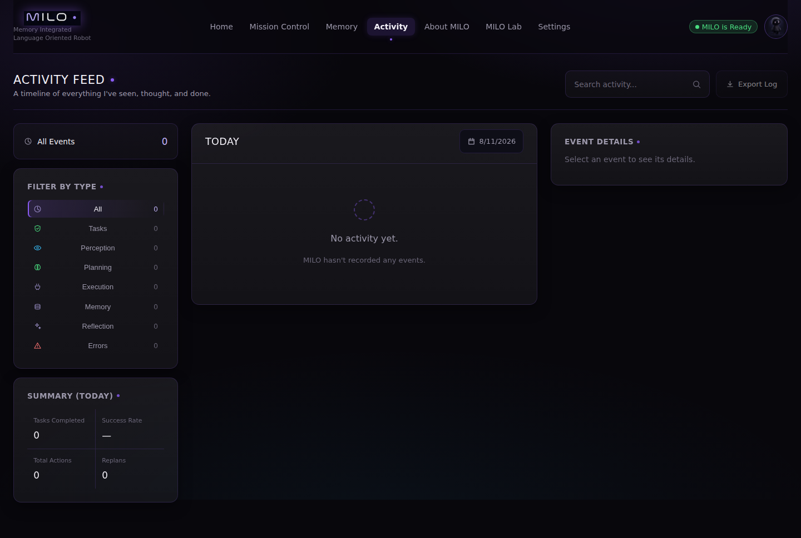
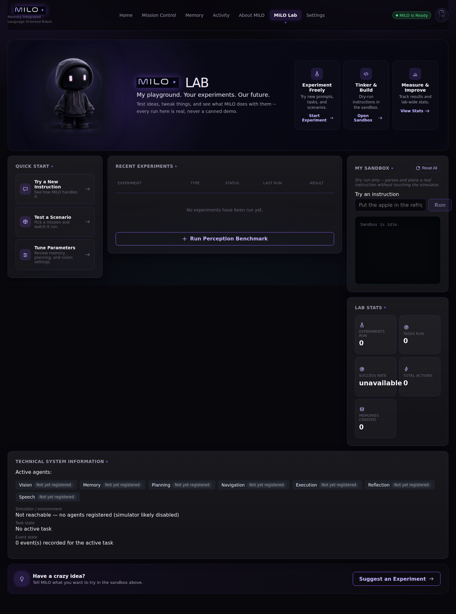
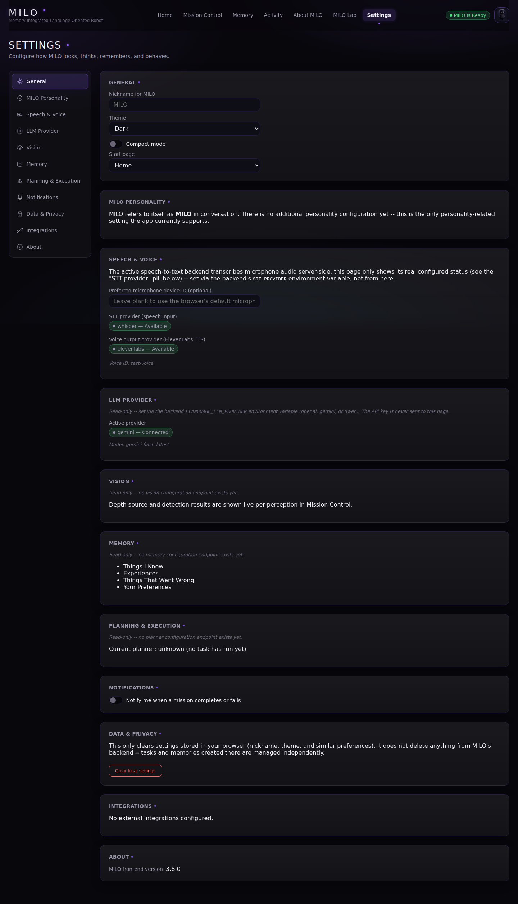

# MILO

**Memory Integrated Language-Oriented Robot**

MILO is a research platform for embodied AI: a natural-language
instruction is understood, planned, and executed by a simulated robot
in [AI2-THOR](https://ai2thor.allenai.org/), with every stage — vision,
language, memory, planning, execution, and reflection — implemented as
an independently testable, swappable module rather than a monolithic
pipeline.

## Overview

Most "vision-language robotics" demos wire a single detector directly
into a single policy, which makes it hard to answer basic research
questions in isolation — does memory actually help planning? does a
different planning strategy change task success? MILO is built the
other way: perception, language understanding, memory, planning,
execution, and reflection are separate modules behind small, consistent
interfaces, so each can be evaluated and swapped independently.

**Research question:** Can a modular embodied agent — with
independently swappable perception, language-understanding, planning,
execution, memory, and reflection stages — perceive an AI2-THOR scene,
understand a natural-language instruction, retrieve and use relevant
past experience, generate and validate a multi-step plan, execute it
with step-by-step precondition/result checking against simulator
ground truth, detect its own execution failures, and replan in
response — producing a structured, traceable record of every decision
along the way?

This is scoped to what the implemented system can actually
demonstrate: it's a question about *architecture and integration*, not
about generalization across many environments (see
[Known Limitations](#known-limitations)).

## What MILO Can Do

- **Perception** — open-vocabulary object detection (Grounding DINO),
  segmentation (SAM2), depth estimation, and a heuristic spatial scene
  graph over live AI2-THOR frames.
- **Spatial/temporal understanding** — 2D→3D object localization,
  cross-frame object tracking, and scene-change detection (new/moved/
  removed/occluded objects).
- **Language understanding** — natural-language instructions parsed
  into structured goals via a real LLM call (not rule-based NLU).
- **Planning** — three interchangeable strategies behind one interface:
  a deterministic rule-based planner, an LLM-driven ReAct planner, and
  a Behavior Tree planner, each validated against a symbolic world
  model.
- **Vision-grounded planning** — the planner's world model is grounded
  from a live Vision `Scene` before planning (existence, proximity, and
  containment), not just a symbolic default or a raw simulator scan.
- **Execution** — plans are driven step by step through real AI2-THOR,
  with preconditions checked before every action and results validated
  against simulator ground truth, never assumed.
- **Memory** — episodic, semantic, and failure memory, persisted in
  SQLite with ranked vector retrieval, read and written on every real
  task, with a real, confirmed-engaging memory-hint mechanism under
  real AI2-THOR.
- **Reflection & replanning** — execution failures are classified and
  drive a real `continue`/`retry`/`replan`/`abort` decision, bounded to
  avoid infinite loops.
- **Speech** — Whisper (local) and ElevenLabs (cloud) speech-to-text,
  and ElevenLabs text-to-speech for MILO's spoken responses.
- **Frontend dashboard** — a 7-page real-time UI (Home, Mission
  Control, Memory, Activity, About, MILO Lab, Settings) showing live
  backend state, not mocked data.
- **LLM provider abstraction** — OpenAI, Google Gemini, or a local
  Qwen-compatible server (e.g. Ollama, vLLM), selected purely through
  configuration.
- **A published benchmark** — `milo_benchmark v1.0`, a 25-task/5-scene
  dataset on the Hugging Face Hub with a reproducible runner and a
  real three-planner baseline. See [Current Results](#current-results).

Only capabilities that are actually implemented and verified are
listed here — see [Known Limitations](#known-limitations) for what
isn't.

## Tech Stack

**Backend** — Python, FastAPI + Uvicorn (API layer), Pydantic (data
models), AI2-THOR (simulated environment), Grounding DINO (open-vocab
detection), SAM2 (segmentation), SQLite + a vector store (memory
persistence), OpenAI / Google Gemini / local Qwen-compatible server
(pluggable LLM providers), OpenAI Whisper (local STT), ElevenLabs
(cloud STT + TTS), pytest (test suite).

**Frontend** — React + TypeScript, built with Vite, react-router-dom
(routing across 7 pages), Vitest + Testing Library (unit/component
tests), Playwright (real-browser E2E tests). No CSS or UI component
framework — a single hand-authored design system. No state-management
library beyond React Context (six purpose-built polling contexts).

**Infrastructure** — Docker + docker-compose (containerized
backend/frontend), nginx (frontend production serving), GitHub Actions
(CI: format/lint/type-check/test on every push and PR).

**Explicitly not used** — no WebSocket/SSE (all real-time UI updates
are polling-based), no message queue/event bus between agents (direct
method calls through a single `Orchestrator`), no ORM.

Full stack detail: [`docs/application/tech_stack.md`](../docs/application/tech_stack.md).

## Architecture


A single `Orchestrator` runs this loop for every task: parse → retrieve
memory → plan → observe/execute → reflect → replan (bounded) or finish
→ write memory. Every step publishes a real event the frontend polls
and renders live. Before planning, the planner's `WorldState` is
grounded from a live Vision `Scene` (existence, proximity, and
containment), not just a symbolic default.

For the full agent/frontend architecture (with diagrams of the real,
verified implementation) see
[`docs/application/architecture.md`](../docs/application/architecture.md).
For the historical Phase 2–5 pipeline design (perception, language,
planning, execution in implementation detail) see
[`docs/architecture/pre_orchestrator_pipeline_snapshot.md`](../docs/architecture/pre_orchestrator_pipeline_snapshot.md).

## Research Contributions

| Type | Contribution |
|---|---|
| Research | A modular agent architecture with an explicit failure taxonomy and a reflection step that decides `continue`/`retry`/`replan`/`abort` from structured execution failures, not a hardcoded retry count |
| Research | A memory system with distinct episodic, semantic, and failure memory types, ranked retrieval (similarity + confidence + recency + provenance + context), and a memory-vs-no-memory ablation confirmed engaging under real AI2-THOR |
| Research | A provider-agnostic LLM abstraction letting the same planner/agent code run against OpenAI, Gemini, or a local OpenAI-compatible server (Ollama, vLLM) purely through configuration |
| Research | [`milo_benchmark v1.0`](https://huggingface.co/datasets/naishashetty/milo_benchmark) — a published Hugging Face dataset (25 tasks, 5 real AI2-THOR scenes, 3 difficulty tiers) with a reproducible runner and a real three-planner baseline scored against live post-execution simulator state |
| Engineering | Three interchangeable planner strategies behind one interface, with shared plan validation against a symbolic world model |
| Engineering | A real-time frontend driven entirely by backend polling |
| Product | MILO Lab — a research interface exposing perception benchmarks, planner evaluation, and a parse/plan sandbox as real, runnable operations |

See [`docs/phases/phase8_7_final_audit.md`](../docs/phases/phase8_7_final_audit.md)
for the full research-contribution breakdown and final evaluation.

## Current Results

- **Tests**: backend `917 passed, 2 skipped, 0 failed` (~6 seconds);
  frontend `186 passed, 0 failed` (29 files); production build clean.
  `backend/tests/conftest.py` forces `VISION_ENABLE_SIMULATOR=false`
  for the whole suite regardless of a local `.env`'s interactive-dev
  setting — no manual env-var step needed for a clean, fast run.
- **Real AI2-THOR mission, driven through the actual UI**: found and
  fixed a critical bug where the orchestrator/plan validator ignored
  the LLM's parsed `target_location`, causing every "put/place X in/on
  Y" instruction to fail 100% of the time. Fixed and re-verified live
  — a second run correctly resolved the target, planned, and executed
  against real AI2-THOR, but still ended in `failed` after one real
  replan: AI2-THOR correctly rejected placing into a closed
  receptacle, exposing a separate, pre-existing gap in the rule-based
  planner's "place" template. Since fixed: `_deposit()` now inserts an
  `open` step whenever the destination's current `WorldState.is_open`
  is known `False` (and skips a redundant `open`/`close` when it's
  already known `True`) — see `backend/planner/rule_based.py`.
- **Frontend↔backend connectivity**: every dynamic value on every page
  traces to a real backend route; polling correctly cancels on
  unmount.
- **Memory benchmark, resolved end to end**: an initial controlled
  `FakeSimulator` ablation found memory reduced task success 90% → 80%.
  Re-run for real (real AI2-THOR + a real learned sentence-embedding
  model): the drop did **not** reproduce — the memory-hint mechanism
  the FakeSimulator finding depends on never engaged under real
  AI2-THOR, because it depended on AI2-THOR's deprecated singular
  `parentReceptacle` metadata field, which is always empty. Fixed by
  reading the correct, reliably-populated `parentReceptacles` (plural)
  field instead — now confirmed engaging on 5/5 real recall episodes
  across all 5 benchmark scenes (was 0/5). Full writeup:
  [`experiments/reports/phase_b_real_ablation_findings.md`](../experiments/reports/phase_b_real_ablation_findings.md).
- **Planner/replanning**: reflection and dynamic replanning were
  observed live (see the mission result above).
- **`milo_benchmark v1.0`** — a versioned, 25-task, 5-scene (all 4
  iTHOR room types), 3-tier dataset with a reproducible runner, scored
  against live post-execution AI2-THOR state. Published on the Hugging
  Face Hub:
  [huggingface.co/datasets/naishashetty/milo_benchmark](https://huggingface.co/datasets/naishashetty/milo_benchmark)
  — companion leaderboard + episode replay Space (static, pre-recorded;
  AI2-THOR needs a GPU/Unity this Space's free tier doesn't have, so it
  isn't a live demo):
  [huggingface.co/spaces/naishashetty/milo_benchmark_companion](https://huggingface.co/spaces/naishashetty/milo_benchmark_companion).
  Planner-comparison baseline:

  | Planner | Goal success | tier1 (locate) | tier2 (pickup) | tier3 (store) |
  |---|---|---|---|---|
  | `rule_based` | 24/25 (96%) | 10/10 | 10/10 | 4/5 |
  | `behavior_tree` | 24/25 (96%) | 10/10 | 10/10 | 4/5 |
  | `react` (`qwen2.5:7b`, local, via Ollama) | 20/25 (80%) | 10/10 | 10/10 | 0/5 |

  Both symbolic planners' one remaining failure is a real AI2-THOR
  placement/geometry limit, not a planner bug (two other failures — a
  `_deposit()` bug and a misleading execution-timeout message — were
  found by this benchmark and fixed; see [Roadmap](#roadmap)).
  `react`'s baseline: `goal_success`/`execution_success`/`plan_success`
  agree on every episode, zero rate-limit retries needed — run locally
  against `qwen2.5:7b` (Q4_K_M) served by Ollama on an RTX 4050 Laptop
  GPU, after an earlier attempt against Gemini's free tier hit that
  tier's daily quota (20 requests/day) after 2 of 25 episodes and
  produced no usable number. All 5 `react` failures are genuine
  multi-step reasoning mistakes (proposing an action before its
  precondition chain is satisfied — e.g. `pickup` before navigating
  close enough), not infrastructure. Full methodology and both the
  failed-Gemini and successful-local-Qwen attempts:
  [`experiments/reports/phase_e_milo_benchmark_report.md`](../experiments/reports/phase_e_milo_benchmark_report.md).

- **`milo_benchmark v1.1`** — extends v1.0 with 4 more scenes (9
  total, all 4 iTHOR room types) and a new `tier4_multi_step` tier
  (two independent, sequential sub-goals per task against one live
  episode); v1.0 stays the frozen reference set, v1.1 is the extended
  one:

  | Planner | Goal success | tier1 | tier2 | tier3 | tier4 |
  |---|---|---|---|---|---|
  | `rule_based` | 50/54 (92.6%) | 18/18 | 18/18 | 7/9 | 7/9 |
  | `behavior_tree` | 50/54 (92.6%) | 18/18 | 18/18 | 7/9 | 7/9 |
  | `react` (`qwen2.5:7b`) | 36/54 (66.7%) | 18/18 | 18/18 | 0/9 | 0/9 |

  This scale-up surfaced a real `WorldState`-reseeding gap: when a
  `tier4_multi_step` sub-goal fails mid-`place`, the object is left
  physically held, but the next sub-goal's planner has no signal that
  the hand is already occupied. Investigated in depth since this table
  was first published — fixed for one of the two known-failing
  episodes, still open for the other (a real, object-size-dependent
  limit in vision-grounded held-object detection); this table's
  numbers are the original v1.1 publish run, not re-benchmarked (see
  [Roadmap](#roadmap) for the full investigation). Dataset card:
  [`backend/planning_evaluation/dataset/v1.1/README.md`](../backend/planning_evaluation/dataset/v1.1/README.md),
  full writeup: Addendum 7 of the
  [benchmark report](../experiments/reports/phase_e_milo_benchmark_report.md).

- **`react` model comparison, `qwen2.5:3b` vs `qwen2.5:7b`** (same
  v1.1 54-task set): identical aggregate score, 36/54 (66.7%) each,
  confirmed task-for-task identical (0/54 differences) rather than a
  coincidence of totals. `qwen2.5:3b` ran ~2.3x faster (~3.1s vs
  ~7.2s avg/episode) with full GPU residency (vs. `7b`'s partial CPU
  offload) and slightly fewer tokens, at zero accuracy cost.
  Re-running 6 failing episodes with raw-completion capture (not just
  inferring from the final error string) found both models share a
  root cause: neither ever calls `locate` on the destination/container
  object, only the primary object; `qwen2.5:7b` additionally confuses
  which object identity belongs in `place`/`put_down`'s `target` field
  — verified directly on those 6 episodes, not re-checked against all
  27 originally-classified violations. Full writeup: Addendum 8 of the
  [benchmark report](../experiments/reports/phase_e_milo_benchmark_report.md).

- **Cost/latency** (v1.0, 25 episodes each): `rule_based` ~707ms,
  `behavior_tree` ~865ms, `react`/`qwen2.5:7b` ~7.5s avg/episode. This
  table is plan+execution time only (captured before any
  perception-grounding check runs), so it was never affected by the
  vision stack's CPU/GPU status and isn't being remeasured.
- **Vision inference, CPU vs. GPU** — the actual CPU-bound component
  (PyTorch previously resolved to a CPU-only build despite the RTX
  4050 being present; now fixed, see [Roadmap](#roadmap)). Same
  machine, same image, same code path, 5 iterations (first excluded as
  warmup): `GroundingDINODetector` 6189ms → 511ms (~12.1x), `SAM2Segmenter`
  39120ms → 4734ms (~8.3x). Running vision inference and a loaded
  `qwen2.5:7b` Ollama model concurrently peaks at ~5.9GB of this card's
  6.1GB VRAM (~96%) — fits, with little headroom, and doesn't yet
  include AI2-THOR/Unity's own footprint running at the same time.

Full detail, methodology, and provenance:
[`docs/phases/phase8_7_final_audit.md`](../docs/phases/phase8_7_final_audit.md).

## Known Limitations

- **AI2-THOR only** — no physical robot validation; all execution
  results are simulator results.
- **Scene diversity validated but shallow** — a `milo_benchmark v1.0`
  5-scene sweep (all 4 iTHOR room types, 3 tasks each) found object
  resolution, navigation, and pickup generalize cleanly (24/25 on both
  symbolic planners); 5 of ~120 iTHOR scenes is a first real number,
  not a statistically powered study. See [Current Results](#current-results).
- **Vision grounding covers existence/location only, not full state
  fusion** — the planner's `WorldState` is grounded from a live Vision
  `Scene` before planning, but only existence, proximity, and
  containment; open/closed and held/not-held state are still
  symbolic-only, since vision doesn't yet observe grasp or appearance
  state.
- **HTN planning was never implemented**, despite being one of the
  originally scoped planning strategies.
- **External API dependence** — cloud LLM providers and ElevenLabs are
  paid third-party services; a fully local setup (Ollama/vLLM + local
  Whisper) avoids this but isn't the default.
- **No production authentication, rate limiting, or request quotas**
  on any API route.

Full, honest detail:
[`docs/application/limitations.md`](../docs/application/limitations.md) and
[`docs/phases/phase8_7_final_audit.md`](../docs/phases/phase8_7_final_audit.md).

## Quick Start

```bash
# Backend
cd backend
pip install -r requirements.txt
cp .env.example .env   # fill in an LLM provider key -- see Configuration below
uvicorn api.app:app --reload
# -> http://localhost:8000 (docs at /docs, health at /health)

# Frontend (separate terminal)
cd frontend
npm install
npm run dev
# -> http://localhost:5173

# Tests
cd backend && python -m pytest tests/ -v
cd frontend && npm test && npm run build
```

For the full per-phase test/benchmark command reference and the
Playwright browser E2E suite, see
[`docs/testing/running_tests.md`](../docs/testing/running_tests.md).

## Configuration

The backend reads its configuration from the environment
(`backend/language/config.py`, `backend/voice/config.py`); every
setting has a sensible default except the API key itself.

```bash
# LLM provider -- "openai" (default), "gemini", or "qwen" (local, e.g. Ollama)
export LANGUAGE_LLM_PROVIDER="qwen"
export LANGUAGE_LLM_MODEL="qwen2.5:7b"
export LANGUAGE_LLM_BASE_URL="http://localhost:11434/v1"  # Ollama's OpenAI-compatible endpoint
export QWEN_API_KEY="not-needed"     # or GEMINI_API_KEY for gemini,
                                      # or OPENAI_API_KEY for openai

# AI2-THOR simulator -- off by default (most of the API 503s without it)
export VISION_ENABLE_SIMULATOR="true"

# Speech -- Whisper (local, default) or ElevenLabs (cloud)
export SPEECH_ENABLE_WHISPER="true"
export VOICE_ENABLE_ELEVENLABS="true"
export ELEVENLABS_API_KEY="..."
```

Switching LLM providers is a one-variable change — no planner or
orchestrator code depends on which provider is selected. Local Qwen
(or any OpenAI-API-compatible server, e.g. vLLM/Ollama) reuses the same
client the OpenAI provider uses — this is exactly the setup the real
`react` baseline above was run against.

Full configuration reference (every variable, every default, provider
setup walkthroughs, and the security model):
[`docs/phases/phase8_5_configuration_and_providers.md`](../docs/phases/phase8_5_configuration_and_providers.md).
Deployment/Docker: [`docker/README.md`](../docker/README.md) and
[`deployment/README.md`](../deployment/README.md).

## Deployment

MILO is not currently deployed publicly -- see [Quick Start](#quick-start)
to run it locally, or [`docker/README.md`](../docker/README.md) /
[`deployment/README.md`](../deployment/README.md) for deployment
configuration if you want to host it yourself.

## Project Structure

```
backend/        FastAPI app, agents, orchestration, planner, memory,
                 vision, execution, simulator wrapper, tests,
                 planning_evaluation (milo_benchmark dataset + runner)
frontend/        React + TypeScript dashboard (Vite)
docs/            Architecture, phase history, testing, application docs
datasets/        Language understanding evaluation datasets
models/          Downloaded model weights (gitignored)
experiments/     Research experiment runners and results/reports
benchmarks/      Reproducible evaluation suite entry points
deployment/      Environment/target-specific deployment config
docker/          Container definitions (backend + frontend)
```

## Roadmap

| Item | Status |
|---|---|
| `tier4_multi_step` `WorldState`-reseeding gap (held-object state doesn't carry between sub-goals) | ⚠️ Open — fixed for one of two known-failing episodes; the other exposed a real, object-size-dependent limit in the held-object depth heuristic |
| HTN planner | 🔜 Future |
| Production auth/rate limiting | ❌ Not planned — no publicly reachable API to protect |

Completed items and full rationale for every open item:
[`docs/roadmap.md`](../docs/roadmap.md).

## Documentation

- [`docs/application/architecture.md`](../docs/application/architecture.md) — current system & agent architecture
- [`docs/application/tech_stack.md`](../docs/application/tech_stack.md) — full technology stack
- [`docs/phases/phase8_7_final_audit.md`](../docs/phases/phase8_7_final_audit.md) — final research-readiness audit
- [`backend/planning_evaluation/dataset/v1.0/README.md`](../backend/planning_evaluation/dataset/v1.0/README.md) — `milo_benchmark` dataset card

More detailed docs in [`docs/`](../docs/).

## Screenshots

All screenshots below are real renders of the actual frontend/backend
code -- see [`docs/screenshots/README.md`](../docs/screenshots/README.md)
for exactly which are captured against a live backend + real AI2-THOR
run versus a mocked API response used to reliably reproduce a specific
UI state (e.g. "plan mid-execution"). Neither category fabricates data
values; the mocked set only fixes *which* real UI state renders.

**A real mission, driven through the actual UI** (live AI2-THOR, real LLM parse, real plan/execution):

| Instruction typed | Executing | Complete |
|---|---|---|
|  |  |  |

**Mission Control** (agent status, live plan, activity feed):



**Memory** (episodic/semantic/failure memory, real retrieval):



**Home**, **Activity**, **MILO Lab**, **About MILO**, **Settings**:

| Home | Activity |
|---|---|
|  |  |

| MILO Lab | Settings |
|---|---|
|  |  |

## License

MIT — see [`LICENSE`](../LICENSE).
