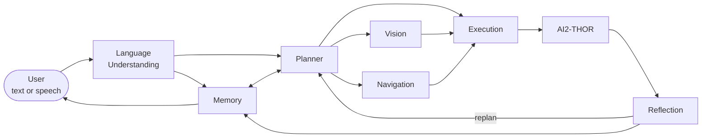

# MILO

**Memory Integrated Language-Oriented Robot**

MILO is a research platform for embodied AI: a natural-language
instruction is understood, planned, and executed by a simulated robot
in [AI2-THOR](https://ai2thor.allenai.org/), with every stage — vision,
language, memory, planning, execution, and reflection — implemented as
an independently testable, swappable module rather than a monolithic
pipeline.

## Overview

Most "vision-language robotics" demos wire a single detector directly
into a single policy, which makes it hard to answer basic research
questions in isolation — does memory actually help planning? does a
different planning strategy change task success? MILO is built the
other way: perception, language understanding, memory, planning,
execution, and reflection are separate modules behind small, consistent
interfaces, so each can be evaluated and swapped independently.

**Research question:** Can a modular embodied agent — with
independently swappable perception, language-understanding, planning,
execution, memory, and reflection stages — perceive an AI2-THOR scene,
understand a natural-language instruction, retrieve and use relevant
past experience, generate and validate a multi-step plan, execute it
with step-by-step precondition/result checking against simulator
ground truth, detect its own execution failures, and replan in
response — producing a structured, traceable record of every decision
along the way?

This is scoped to what the implemented system can actually
demonstrate: it's a question about *architecture and integration*, not
about generalization across many environments (see
[Known Limitations](#known-limitations)).

## What MILO Can Do

- **Perception** — open-vocabulary object detection (Grounding DINO),
  segmentation (SAM2), depth estimation, and a heuristic spatial scene
  graph over live AI2-THOR frames.
- **Spatial/temporal understanding** — 2D→3D object localization,
  cross-frame object tracking, and scene-change detection (new/moved/
  removed/occluded objects).
- **Language understanding** — natural-language instructions parsed
  into structured goals via a real LLM call (not rule-based NLU).
- **Planning** — four interchangeable strategies behind one interface:
  a deterministic rule-based planner, an LLM-driven ReAct planner, a
  Behavior Tree planner, and `HTNPlanner`, a real Hierarchical Task
  Network engine (compound tasks, a state-conditional method library,
  recursive decomposition) — each validated against a symbolic world
  model.
- **Vision-grounded planning** — the planner's world model is grounded
  from a live Vision `Scene` before planning: existence, proximity, and
  containment, plus `is_open` (from a vision open/closed classifier)
  and held-object state (from a depth-proxied heuristic over live
  detections) — not just a symbolic default or a raw simulator scan.
  Held-object grounding has known calibration limits; see
  [Known Limitations](#known-limitations).
- **Execution** — plans are driven step by step through real AI2-THOR,
  with preconditions checked before every action and results validated
  against simulator ground truth, never assumed.
- **Memory** — episodic, semantic, and failure memory, persisted in
  SQLite with ranked vector retrieval, read and written on every real
  task, with a real, confirmed-engaging memory-hint mechanism under
  real AI2-THOR.
- **Reflection & replanning** — execution failures are classified and
  drive a real `continue`/`retry`/`replan`/`abort` decision, bounded to
  avoid infinite loops.
- **Speech** — Whisper (local) and ElevenLabs (cloud) speech-to-text,
  and ElevenLabs text-to-speech for MILO's spoken responses.
- **Frontend dashboard** — a 7-page real-time UI (Home, Mission
  Control, Memory, Activity, About, MILO Lab, Settings) showing live
  backend state, not mocked data.
- **LLM provider abstraction** — OpenAI, Google Gemini, or a local
  Qwen-compatible server (e.g. Ollama, vLLM), selected purely through
  configuration.
- **Two published benchmarks** — `milo_benchmark v1.0` (25 tasks, 5
  scenes) and `v1.1` (54 tasks, 9 scenes) on the Hugging Face Hub, with
  a reproducible runner and real four-planner baselines. See
  [Current Results](#current-results).

Only capabilities that are actually implemented and verified are
listed here — see [Known Limitations](#known-limitations) for what
isn't.

## Tech Stack

**Backend** — Python, FastAPI + Uvicorn (API layer), Pydantic (data
models), AI2-THOR (simulated environment), Grounding DINO (open-vocab
detection), SAM2 (segmentation), CUDA-enabled PyTorch (GPU vision
inference — see [Current Results](#current-results)), SQLite + a
vector store (memory persistence), OpenAI / Google Gemini / local Qwen-
compatible server (pluggable LLM providers), OpenAI Whisper (local
STT), ElevenLabs (cloud STT + TTS), pytest (test suite).

**Frontend** — React + TypeScript, built with Vite, react-router-dom
(routing across 7 pages), Vitest + Testing Library (unit/component
tests), Playwright (real-browser E2E tests). No CSS or UI component
framework — a single hand-authored design system. No state-management
library beyond React Context (six purpose-built polling contexts).

**Infrastructure** — Docker + docker-compose (containerized
backend/frontend), nginx (frontend production serving), GitHub Actions
(CI: format/lint/type-check/test on every push and PR).

**Explicitly not used** — no WebSocket/SSE (all real-time UI updates
are polling-based), no message queue/event bus between agents (direct
method calls through a single `Orchestrator`), no ORM.

Full stack detail: [`docs/application/tech_stack.md`](../docs/application/tech_stack.md).

## Architecture



A single `Orchestrator` runs this loop for every task: parse → retrieve
memory → plan → observe/execute → reflect → replan (bounded) or finish
→ write memory. Every step publishes a real event the frontend polls
and renders live. Before planning, the planner's `WorldState` is
grounded from a live Vision `Scene` — existence, proximity, and
containment, plus `is_open` and held-object state — not just a
symbolic default.

For the full agent/frontend architecture (with diagrams of the real,
verified implementation) see
[`docs/application/architecture.md`](../docs/application/architecture.md).
For the historical Phase 2–5 pipeline design (perception, language,
planning, execution in implementation detail) see
[`docs/architecture/pre_orchestrator_pipeline_snapshot.md`](../docs/architecture/pre_orchestrator_pipeline_snapshot.md).

## Research Contributions

| Type | Contribution |
|---|---|
| Research | A modular agent architecture with an explicit failure taxonomy and a reflection step that decides `continue`/`retry`/`replan`/`abort` from structured execution failures, not a hardcoded retry count |
| Research | A memory system with distinct episodic, semantic, and failure memory types, ranked retrieval (similarity + confidence + recency + provenance + context), and a memory-vs-no-memory ablation confirmed engaging under real AI2-THOR |
| Research | A provider-agnostic LLM abstraction letting the same planner/agent code run against OpenAI, Gemini, or a local OpenAI-compatible server (Ollama, vLLM) purely through configuration |
| Research | [`milo_benchmark`](https://huggingface.co/datasets/naishashetty/milo_benchmark) — two published Hugging Face dataset versions (`v1.0`: 25 tasks/5 scenes; `v1.1`: 54 tasks/9 scenes, all 4 iTHOR room types) with a reproducible runner and real four-planner baselines scored against live post-execution simulator state |
| Engineering | Four interchangeable planner strategies behind one interface — including a real Hierarchical Task Network engine (`HTNPlanner`), not a second implementation reusing another strategy's control flow — with shared plan validation against a symbolic world model |
| Engineering | A real-time frontend driven entirely by backend polling |
| Product | MILO Lab — a research interface exposing perception benchmarks, planner evaluation, and a parse/plan sandbox as real, runnable operations |

See [`docs/phases/phase8_7_final_audit.md`](../docs/phases/phase8_7_final_audit.md)
for the full research-contribution breakdown and final evaluation.

## Current Results

- **Tests**: backend `968 passed, 2 skipped, 0 failed` (~9 seconds; the
  2 skips are LLM smoke tests requiring a live API key); frontend `186
  passed, 0 failed` (29 files, ~3.5s); production build clean.
  `backend/tests/conftest.py` forces `VISION_ENABLE_SIMULATOR=false`
  for the whole suite regardless of a local `.env`'s interactive-dev
  setting — no manual env-var step needed for a clean, fast run.
  Static gates (`black`, `ruff`, `mypy`, `eslint`, `tsc`) all clean;
  CI green on the latest commit (backend, frontend, Docker build, and
  Playwright E2E jobs).
- **`milo_benchmark v1.0`** (25 tasks, 5 scenes, all 4 iTHOR room
  types), scored against live post-execution AI2-THOR state. Published
  on the Hugging Face Hub:
  [huggingface.co/datasets/naishashetty/milo_benchmark](https://huggingface.co/datasets/naishashetty/milo_benchmark)
  — companion leaderboard + episode replay Space (static, pre-recorded;
  AI2-THOR needs a GPU/Unity this Space's free tier doesn't have, so it
  isn't a live demo):
  [huggingface.co/spaces/naishashetty/milo_benchmark_companion](https://huggingface.co/spaces/naishashetty/milo_benchmark_companion).

  | Planner | Goal success | tier1 (locate) | tier2 (pickup) | tier3 (store) |
  |---|---|---|---|---|
  | `rule_based` | 24/25 (96%) | 10/10 | 10/10 | 4/5 |
  | `behavior_tree` | 24/25 (96%) | 10/10 | 10/10 | 4/5 |
  | `htn` | 24/25 (96%) | 10/10 | 10/10 | 4/5 |
  | `react` (`qwen2.5:7b`, local, via Ollama) | 20/25 (80%) | 10/10 | 10/10 | 0/5 |

  All three symbolic planners fail the identical single task
  (`milo-v1-fp301-t3a`) — a real AI2-THOR placement/geometry limit, not
  a planner bug. `htn` matches `rule_based`/`behavior_tree` exactly,
  including that shared failure, at comparable latency (~647ms/episode
  avg vs. ~620–633ms) — a real task-network engine, not a second
  implementation of the same control flow. `react`'s baseline:
  `goal_success`/`execution_success`/`plan_success` agree on every
  episode, zero rate-limit retries needed, reconfirmed unchanged after
  this session's detection/prompt fixes (identical 20/25, identical
  per-task failure signatures). Run locally against `qwen2.5:7b`
  (Q4_K_M) served by Ollama on an RTX 4050 Laptop GPU. All 5 `react`
  failures are genuine multi-step reasoning mistakes (proposing an
  action before its precondition chain is satisfied), not
  infrastructure. Full methodology:
  [`experiments/reports/phase_e_milo_benchmark_report.md`](../experiments/reports/phase_e_milo_benchmark_report.md).

- **`milo_benchmark v1.1`** (54 tasks, 9 scenes, all 4 iTHOR room
  types) — extends `v1.0` with 4 more scenes and a `tier4_multi_step`
  tier (two independent, sequential sub-goals per task against one
  live episode); `v1.0` stays the frozen reference set.

  | Planner | Goal success | tier1 | tier2 | tier3 | tier4 |
  |---|---|---|---|---|---|
  | `rule_based` | 50/54 (92.6%) | 18/18 | 18/18 | 7/9 | 7/9 |
  | `behavior_tree` | 50/54 (92.6%) | 18/18 | 18/18 | 7/9 | 7/9 |
  | `htn` | 43/45 (95.6%)¹ | 18/18 | 18/18 | 7/9 | not attempted¹ |
  | `react` (`qwen2.5:7b`) | 36/54 (66.7%) | 18/18 | 18/18 | 0/9 | 0/9 |

  ¹ `HTNPlanner` is slice 1 — it does not yet support
  `tier4_multi_step`'s multi-subtask decomposition, so those 9 tasks
  were deliberately not attempted, not scored as failures. Its 43/45
  across the 45 non-`tier4` tasks (all 9 scenes) is a generalization
  check on the `v1.0` result above: no new failure mode appeared across
  the 4 additional scenes — both `tier3_store` failures
  (`milo-v1-fp301-t3a`, `milo-v1.1-fp203-t3a`) are the same shared
  placement-geometry limit `rule_based`/`behavior_tree` hit on the
  identical pair. Design-doc detail:
  [`docs/architecture/planning.md`](../docs/architecture/planning.md)'s
  "Generalization check" section.

  Scaling to 9 scenes surfaced a real `WorldState`-reseeding gap in
  `tier4_multi_step`: a failed `place` sub-goal can leave an object
  physically held with no signal to the next sub-goal's planner.
  Investigation traced this to two distinct causes — a Grounding DINO
  multi-phrase joint-prompt confidence drop (confirmed on 2 independent
  objects/frames, unrelated to any scored planning or benchmark path,
  which already query one object name at a time) and a held-object
  depth cutoff calibrated on smaller objects than some real held items.
  One of the two known-failing episodes has its engine-crash symptom
  fixed (demonstrated via targeted re-seeding, not yet merged into the
  production harness); the other remains open on the depth-calibration
  gap, with a concrete next step identified but not implemented. Full
  chain: [`docs/roadmap.md`](../docs/roadmap.md).

- **`react` model comparison, `qwen2.5:3b` vs `qwen2.5:7b`** (same
  v1.1 54-task set): identical aggregate score, 36/54 (66.7%) each,
  confirmed task-for-task identical (0/54 differences) rather than a
  coincidence of totals. `qwen2.5:3b` ran ~2.3x faster (~3.1s vs
  ~7.2s avg/episode) with full GPU residency (vs. `7b`'s partial CPU
  offload) and slightly fewer tokens, at zero accuracy cost. Full
  writeup: Addendum 8 of the
  [benchmark report](../experiments/reports/phase_e_milo_benchmark_report.md).

- **Cost/latency** (v1.0, 25 episodes each): `rule_based` ~620ms,
  `behavior_tree` ~633ms, `htn` ~647ms, `react`/`qwen2.5:7b` ~7.5s
  avg/episode. Plan+execution time only (captured before any
  perception-grounding check runs).
- **Vision inference, CPU vs. GPU** — PyTorch previously resolved to a
  CPU-only build despite the RTX 4050 being present; now fixed. Same
  machine, same image, same code path, 5 iterations (first excluded as
  warmup): `GroundingDINODetector` 6189ms → 511ms (~12.1x), `SAM2Segmenter`
  39120ms → 4734ms (~8.3x). Running vision inference and a loaded
  `qwen2.5:7b` Ollama model concurrently peaks at ~5.9GB of this card's
  6.1GB VRAM (~96%) — fits, with little headroom.

Full detail, methodology, and provenance:
[`docs/phases/phase8_7_final_audit.md`](../docs/phases/phase8_7_final_audit.md).

## Known Limitations

- **AI2-THOR only** — no physical robot validation; all execution
  results are simulator results.
- **Scene diversity validated, not exhaustive** — `milo_benchmark
  v1.1`'s 9-scene sweep (all 4 iTHOR room types, up to 6 tasks each)
  found object resolution, navigation, pickup, and (for the three
  symbolic planners) store generalize cleanly across every new scene;
  9 of ~120 iTHOR scenes is a broader real number than `v1.0`'s
  original 5, still not a statistically powered study. See
  [Current Results](#current-results).
- **Held-object vision grounding has real, measured calibration
  limits** — `is_open` and held-object state are now fused into the
  planner's `WorldState` from live vision (not symbolic-only), but the
  held-object heuristic's depth cutoff was calibrated against smaller
  objects than some real held items measure, and it can misattribute
  "holding" to the nearest detected object rather than the actually-
  held one. Separately, Grounding DINO's confidence measurably drops
  under multi-phrase joint prompts (confirmed on 2 independent
  objects/frames) — this does not affect any scored planning or
  benchmark path (those already query one object name at a time), but
  does affect the frontend's default multi-object Vision-panel prompt
  and several manual demo/verification scripts. See
  [Current Results](#current-results) and `backend/planner/grounding.py`.
- **HTN planning covers tier1-3 only (slice 1)** — `HTNPlanner` matches
  `rule_based`/`behavior_tree` exactly on `v1.0` (24/25, 96%) and
  generalizes cleanly across `v1.1`'s 9 scenes on the same three tiers
  (43/45, 95.6%), but `tier4_multi_step`, `fetch`/`deliver`/
  `navigate_to`, and memory-conditioned methods are explicit next-slice
  work, not yet built.
- **External API dependence** — cloud LLM providers and ElevenLabs are
  paid third-party services; a fully local setup (Ollama/vLLM + local
  Whisper) avoids this but isn't the default.
- **No production authentication, rate limiting, or request quotas**
  on any API route.

Full, honest detail:
[`docs/application/limitations.md`](../docs/application/limitations.md) and
[`docs/phases/phase8_7_final_audit.md`](../docs/phases/phase8_7_final_audit.md).

## Quick Start

```bash
# Backend
cd backend
pip install -r requirements.txt
cp .env.example .env   # fill in an LLM provider key -- see Configuration below
uvicorn api.app:app --reload
# -> http://localhost:8000 (docs at /docs, health at /health)

# Frontend (separate terminal)
cd frontend
npm install
npm run dev
# -> http://localhost:5173

# Tests
cd backend && python -m pytest tests/ -v
cd frontend && npm test && npm run build
```

For the full per-phase test/benchmark command reference and the
Playwright browser E2E suite, see
[`docs/testing/running_tests.md`](../docs/testing/running_tests.md).

## Configuration

The backend reads its configuration from the environment
(`backend/language/config.py`, `backend/voice/config.py`); every
setting has a sensible default except the API key itself.

```bash
# LLM provider -- "openai" (default), "gemini", or "qwen" (local, e.g. Ollama)
export LANGUAGE_LLM_PROVIDER="qwen"
export LANGUAGE_LLM_MODEL="qwen2.5:7b"
export LANGUAGE_LLM_BASE_URL="http://localhost:11434/v1"  # Ollama's OpenAI-compatible endpoint
export QWEN_API_KEY="not-needed"     # or GEMINI_API_KEY for gemini,
                                      # or OPENAI_API_KEY for openai

# AI2-THOR simulator -- off by default (most of the API 503s without it)
export VISION_ENABLE_SIMULATOR="true"

# Speech -- Whisper (local, default) or ElevenLabs (cloud)
export SPEECH_ENABLE_WHISPER="true"
export VOICE_ENABLE_ELEVENLABS="true"
export ELEVENLABS_API_KEY="..."
```

Switching LLM providers is a one-variable change — no planner or
orchestrator code depends on which provider is selected. Local Qwen
(or any OpenAI-API-compatible server, e.g. vLLM/Ollama) reuses the same
client the OpenAI provider uses — this is exactly the setup the real
`react` baseline above was run against.

Full configuration reference (every variable, every default, provider
setup walkthroughs, and the security model):
[`docs/phases/phase8_5_configuration_and_providers.md`](../docs/phases/phase8_5_configuration_and_providers.md).
Deployment/Docker: [`docker/README.md`](../docker/README.md) and
[`deployment/README.md`](../deployment/README.md).

## Deployment

MILO is not currently deployed publicly -- see [Quick Start](#quick-start)
to run it locally, or [`docker/README.md`](../docker/README.md) /
[`deployment/README.md`](../deployment/README.md) for deployment
configuration if you want to host it yourself.

## Project Structure

```
backend/        FastAPI app, agents, orchestration, planner, memory,
                 vision, execution, simulator wrapper, tests,
                 planning_evaluation (milo_benchmark dataset + runner)
frontend/        React + TypeScript dashboard (Vite)
docs/            Architecture, phase history, testing, application docs
datasets/        Language understanding evaluation datasets
models/          Downloaded model weights (gitignored)
experiments/     Research experiment runners and results/reports
benchmarks/      Reproducible evaluation suite entry points
deployment/      Environment/target-specific deployment config
docker/          Container definitions (backend + frontend)
```

Open items and full rationale: [`docs/roadmap.md`](../docs/roadmap.md).

## Documentation

- [`docs/application/architecture.md`](../docs/application/architecture.md) — current system & agent architecture
- [`docs/application/tech_stack.md`](../docs/application/tech_stack.md) — full technology stack
- [`docs/phases/phase8_7_final_audit.md`](../docs/phases/phase8_7_final_audit.md) — final research-readiness audit
- [`backend/planning_evaluation/dataset/v1.0/README.md`](../backend/planning_evaluation/dataset/v1.0/README.md) — `milo_benchmark v1.0` dataset card
- [`backend/planning_evaluation/dataset/v1.1/README.md`](../backend/planning_evaluation/dataset/v1.1/README.md) — `milo_benchmark v1.1` dataset card

More detailed docs in [`docs/`](../docs/).

## Screenshots

All screenshots below are real renders of the actual frontend/backend
code -- see [`docs/screenshots/README.md`](../docs/screenshots/README.md)
for exactly which are captured against a live backend + real AI2-THOR
run versus a mocked API response used to reliably reproduce a specific
UI state (e.g. "plan mid-execution"). Neither category fabricates data
values; the mocked set only fixes *which* real UI state renders.

**A real mission, driven through the actual UI** (live AI2-THOR, real LLM parse, real plan/execution):

| Instruction typed | Executing | Complete |
|---|---|---|
|  |  |  |

**Mission Control** (agent status, live plan, activity feed):


**Memory** (episodic/semantic/failure memory, real retrieval):


**Home**, **Activity**, **MILO Lab**, **About MILO**, **Settings**:

| Home | Activity |
|---|---|
|  |  |

| MILO Lab | Settings |
|---|---|
|  |  |

## License

MIT — see [`LICENSE`](../LICENSE).
