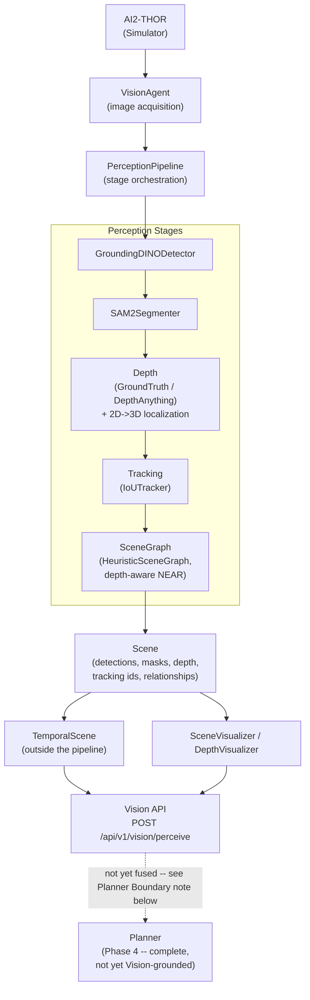
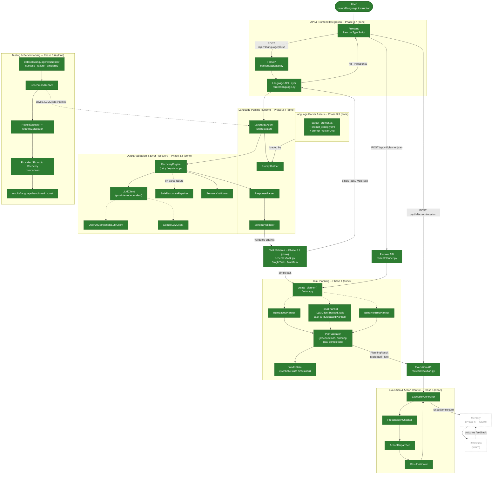
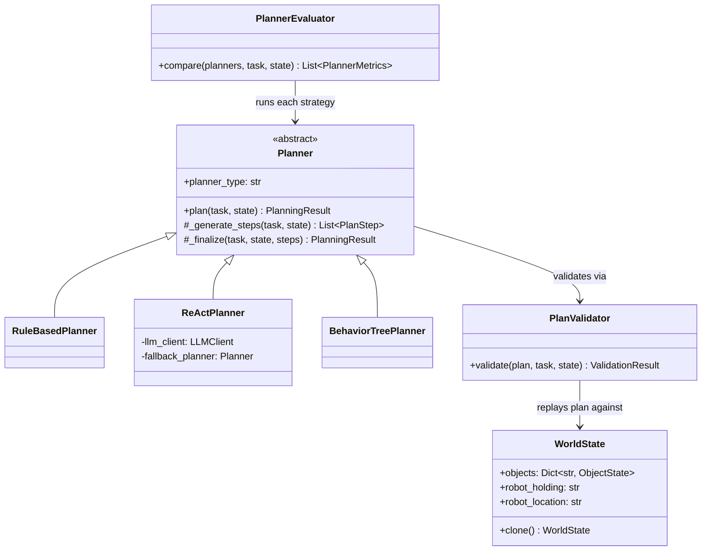
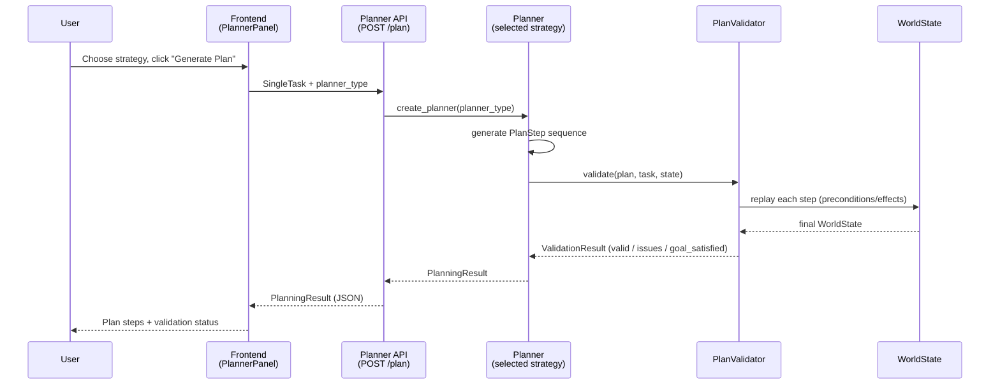
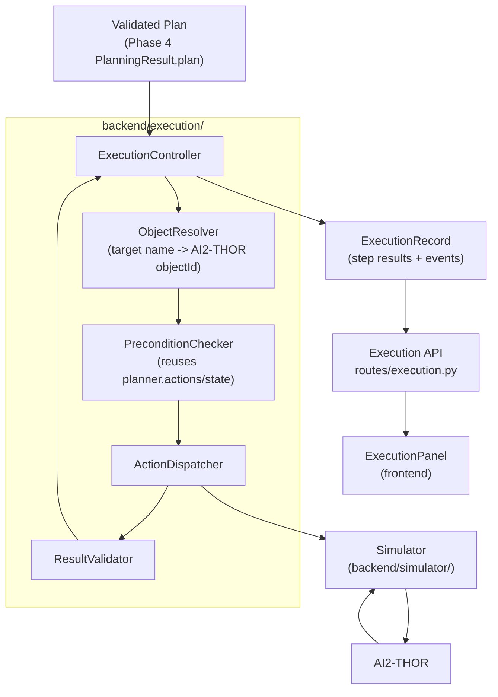
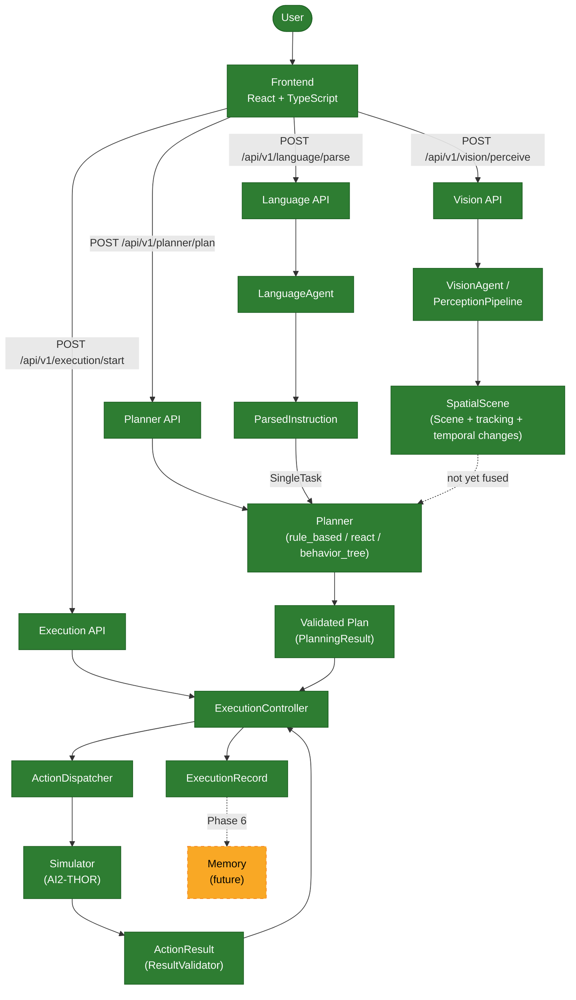

# Vision-Language Robotics

A research-grade platform for embodied AI: a simulated robot that
perceives a scene, understands it in natural language terms, and
(eventually) plans and acts on it.

## Project Overview

This project connects a photorealistic household simulator
([AI2-THOR](https://ai2thor.allenai.org/)) to a modular perception
stack (open-vocabulary detection, segmentation, and spatial scene
understanding), a language-understanding runtime that turns
instructions into structured tasks, and a multi-strategy Task Planning
subsystem (Phase 4, complete) that turns those tasks into validated,
simulator-independent action plans. Execution (Phase 5, complete) drives a validated plan through the
simulator step by step, with explicit state tracking, precondition
checking, and result validation; memory and speech are the next
layers. It is built as a research/benchmarking platform first: every
stage is a swappable module behind a small, consistent interface, not
a monolithic pipeline.

The core research question this platform is built to answer:

```
Perceive  →  Understand  →  Plan  →  Execute
```

Can an embodied agent perceive its environment, understand a natural
language instruction, reason about a validated multi-step plan to
satisfy it -- generating that plan with any of three interchangeable
strategies (a deterministic rule-based planner, an LLM-driven ReAct
planner, and a Behavior Tree planner), checking its preconditions and
postconditions against a symbolic world model, comparing the
strategies against each other on real, measured metrics -- and then
actually carry that plan out inside AI2-THOR, with every step's
preconditions checked, its result validated against simulator ground
truth (never assumed), and a structured, replayable execution record
produced? Phases 1-5 answer "yes" through "Execute" -- see
[Task Planning (Phase 4, complete)](#task-planning-phase-4-complete)
and [Execution (Phase 5, complete)](#execution-phase-5-complete) below
for the full pipeline.

## Motivation

Most "vision-language robotics" demos wire a single detector directly
into a single policy. That makes it hard to answer basic research
questions -- *how much does segmentation quality matter for
grasp planning? does a learned scene graph beat heuristics? does a
different VLM change task success rate?* -- because swapping one
component means rewriting the glue code around it.

This project is built the other way around: a simulator wrapper, a
`Scene` data model that every perception stage reads and writes, and
small modules (`Detector`, `Segmenter`, `SceneGraph`, ...) that all
implement the same `process(image, scene)` contract. Swapping
Grounding DINO for a different detector, or adding depth estimation,
should never require touching the planner, the memory system, or any
other module.

## System Architecture

### Perception (Phase 2, complete + Phase 3.x Spatial & Temporal Perception)



See [`docs/architecture/perception_pipeline.md`](docs/architecture/perception_pipeline.md)
for the Phase 2 pipeline rationale and
[`docs/architecture/spatial_perception.md`](docs/architecture/spatial_perception.md)
for the Phase 3.x depth/localization/tracking/temporal-scene design
(coordinate conventions, depth units, track lifecycle, benchmarking,
limitations).

**Phase 2 API freeze:** `VisionAgent.perceive()`, `PerceptionPipeline.process()`,
the `process(image, scene)` stage contract, and the `Scene`/`Detection`/
`Relationship`/`Mask` data model are frozen as v1.0 public interfaces --
Phase 3.x built entirely by filling in fields/keywords this freeze
already reserved, with zero changes to any of them. Language, Planner,
Memory, Execution, and Frontend modules should depend only on these --
see
[`docs/architecture/api_contracts.md`](docs/architecture/api_contracts.md).
The new `POST /api/v1/vision/perceive` HTTP endpoint is explicitly
**not** part of this freeze (Phase 3.x is still active).

### Language pipeline (Phase 3, in progress)

Implementation status shown explicitly -- solid/filled boxes exist and
are tested today; dashed boxes are planned or future work with no code
written yet:



See [`backend/docs/language_interface_spec.md`](backend/docs/language_interface_spec.md)
(section 7 for the Phase 3.3 asset diagram, section 27 for the Phase
3.4 runtime architecture, section 28 for the Phase 3.5 output
validation & error recovery architecture -- failure taxonomy, retry
policy, safe repair, semantic validation, and the Gemini/OpenAI
provider abstraction; section 29 for the Phase 3.6 evaluation
framework -- benchmark runner, metric definitions, provider/prompt
comparison, and recovery evaluation; section 30 for the Phase 3.7
API/frontend architecture, endpoint contract, error mapping, and
security boundary) for the complete design record.

### Task Planning (Phase 4, complete)

Phase 4 (`backend/planner/`) turns a validated `SingleTask` (Phase 3's
output) into a validated, ordered sequence of **abstract** `PlanStep`s
-- `PlanStep(action="navigate", target="apple")`, never an AI2-THOR
action name (`MoveAhead`, `PickupObject`, ...). This package never
imports `simulator/` and never calls AI2-THOR; that boundary is
load-bearing, not a style preference -- it is what lets every planning
strategy be unit-tested against a purely symbolic `WorldState`, with no
Unity/AI2-THOR process required anywhere in this phase's test suite,
and what lets Phase 5 swap in a different simulator later without
touching this package at all. See
[`backend/planner/__init__.py`](backend/planner/__init__.py) for the
full module map and rationale.

**Three interchangeable planning strategies**, all behind one
`Planner.plan(task, state) -> PlanningResult` interface
(`planner/planner.py`), selected via a single factory
(`planner/factory.py::create_planner()`) so no caller ever branches on
`if planner_type == ...`:

- **`RuleBasedPlanner`** (`rule_based.py`) -- the deterministic
  baseline. A fixed, table-driven expansion from
  `goal`/`object`/`target` into `PlanStep`s, built from a small set of
  reusable primitives (`_locate`, `_navigate`, `_pickup`, `_open`,
  `_close`, `_place`, ...) that each copy their preconditions/effects
  from the action registry rather than inventing them. Zero LLM calls,
  zero randomness -- two identical tasks always produce byte-identical
  plans. Covers every canonical goal in `parser_prompt.txt`'s
  "SUPPORTED GOALS" catalog, falling back to a generic
  perceive-then-act template (never refusing) for anything else.
- **`ReActPlanner`** (`react.py`) -- an LLM-driven iterative strategy
  behind the *same* `Planner` interface: each iteration asks the LLM to
  reason about the current symbolic `WorldState` and propose exactly
  one next action as structured JSON, which is validated against the
  action registry and its preconditions **before** it is ever accepted
  as a `PlanStep` -- the LLM never executes anything, never emits
  Python, and never bypasses the action model. Reuses the existing
  Phase 3.4 `language.llm_client.LLMClient` abstraction (so a
  self-hosted, OpenAI-API-compatible Qwen/Llama server works exactly as
  well as OpenAI/Gemini) instead of inventing a second LLM client. If no
  LLM is configured, the LLM call fails, or the model's output stays
  malformed after a bounded repair-retry budget, it transparently falls
  back to `RuleBasedPlanner` (tagging `Plan.metadata["react_fallback"]
  = True`) -- the project stays fully testable with **no** LLM
  available, per this phase's own requirement.
- **`BehaviorTreePlanner`** (`behavior_tree.py`) -- expands a task into
  a Behavior Tree (`Sequence`, `Selector`/Fallback, `Condition`,
  `Action`, `Retry` node types) built by composing `RuleBasedPlanner`'s
  own goal templates, then "ticks" the tree against a `WorldState` to
  produce the identical `PlanStep` sequence the rule-based planner would
  -- while also exposing the tree itself
  (`Plan.metadata["behavior_tree"]`) for visualization and as a
  foundation for Phase 5's reactive failure handling (Experiment 5,
  below).

**Action model, preconditions, and postconditions** (`actions.py`) --
one `ActionSpec` per abstract action (`locate`, `navigate`, `pickup`,
`open`, `close`, `place`, `put_down`, ...), each declaring named
`Precondition`s (checked against a `WorldState` before the step is
accepted) and an effect function (how the step mutates `WorldState`
once accepted). This is the single source of truth every planner and
the validator read from -- no planner hardcodes "what does `open`
require".

**Plan validation** (`validator.py`) -- `PlanValidator.validate()`
replays every step of a `Plan` against a cloned `WorldState` in order
and reports a structured `ValidationResult`: unrecognized actions,
missing required parameters, unmet preconditions (this is what catches
"Place apple" before "Pickup apple", or "Close refrigerator" before it
was ever opened -- ordering/dependency checking falls directly out of
state simulation, not a separate ad hoc rule), duplicate/redundant
steps (warning, not error), and finally whether the resulting state
actually satisfies the task's goal (`GOAL_CHECKS`, keyed by goal name).
A plan is `valid` iff it has zero `severity="error"` issues.

**Symbolic state simulation** (`state.py`) -- `WorldState` is a
lightweight registry of per-object facts (location, `is_located`,
`is_near_robot`, `is_held`, `is_open`) plus the robot's own
holding/location fields -- just enough to validate this phase's action
vocabulary, deliberately not a full STRIPS/PDDL state representation.
This is what lets the entire planner test suite run with **zero**
AI2-THOR/Unity dependency.

**Evaluation framework** (`evaluation.py`) -- `PlannerEvaluator.compare()`
runs multiple strategies against the identical task/starting state
(cloned per run so no strategy's simulation leaks into another's) and
reports real, freshly measured `PlannerMetrics` for each: success,
validity, goal satisfaction, latency, step count, invalid-action count,
redundant-step count. Every number comes from an actual `PlanningResult`
-- this module never fabricates a metric. This is the foundation for
this project's planned Experiment 1 (Rule-based vs. ReAct vs. Behavior
Tree) and Experiment 6 (latency vs. task complexity).





**API** (`api/routes/planner.py`, prefixed `/api/v1/planner`):

| Endpoint | Purpose |
|----------|---------|
| `POST /plan` | Generate and validate a `Plan` for one `SingleTask` using a chosen strategy (`rule_based` \| `react` \| `behavior_tree`). Returns a `PlanningResult`. |
| `POST /validate` | Validate a caller-supplied `Plan` against a task, independent of how it was generated. |
| `POST /evaluate` | Run every (or a requested subset of) planning strategy against the same task and return measured comparison metrics. |

Every endpoint plans against a fresh `WorldState.initial()` -- grounding
a `WorldState` from Vision's `SpatialScene` is explicitly future work
(see "Planner boundary" in
[`docs/architecture/spatial_perception.md`](docs/architecture/spatial_perception.md)
and [Future Phases](#future-phases) below); Vision and Planning are not
yet fused, matching the same "neither is combined with the other yet"
boundary this README already documents for Vision and Language. This
router never raises for an ordinary "plan is invalid" or "goal
unreachable" result -- those are normal `200` responses a client
inspects via `success`/`valid`, exactly like the Language API's
`needs_clarification` case; the only non-2xx case is an unrecognized
`planner_type` string (`422`).

**Frontend** (`frontend/src/components/PlannerPanel.tsx`,
`PlanStepsList.tsx`, `ValidationPanel.tsx`, `PlannerComparisonTable.tsx`)
-- rendered directly beneath a parsed task's `TaskCard` in
`ResultView.tsx` (for a `MultiTask` result, a subtask selector lets the
user pick which one to plan), demonstrating the Phase 3 → Phase 4
pipeline live: a strategy selector (Rule Based / ReAct / Behavior
Tree), a "Generate Plan" action showing each step with its
action/target/pre-postconditions, a validation panel (✓/✗ per issue,
severity-coded), and a "Compare Strategies" action rendering a live
metrics table across all three strategies for the current task -- never
fabricated placeholder numbers, always a fresh `/evaluate` call.

**Tests** -- 70 backend unit/integration tests with zero AI2-THOR/LLM
dependency (`backend/tests/test_planner_models.py`,
`test_planner_state_actions.py`, `test_planner_rule_based.py`,
`test_planner_validator.py`, `test_planner_react.py` (LLM client
mocked/absent -- exercises both the structured-output path and the
fallback path), `test_planner_behavior_tree.py`,
`test_planner_factory.py`, `test_planner_evaluation.py`,
`test_planner_e2e.py` (Language → Planner → Validator, end to end,
no simulator), `test_api_planner.py`), plus 12 frontend tests
(`frontend/src/api/planner.test.ts`,
`frontend/src/components/PlannerPanel.test.tsx`).

### Execution (Phase 5, complete)

Phase 5 (`backend/execution/`) closes the loop: it takes a validated
Phase 4 `Plan` and actually drives it through AI2-THOR, step by step,
never assuming a dispatched action succeeded just because the
simulator call returned. This is the layer this entire project's
architecture was built to hand off to -- `backend/planner/` never
imports `simulator/` and never calls AI2-THOR; `backend/execution/` is
the *only* package allowed to translate an abstract `PlanStep` into a
concrete simulator action, and it never imports AI2-THOR directly
either (only through `simulator.simulator.Simulator`), so a future
Habitat/Isaac Sim/ROS2 backend could replace `simulator/`'s
implementation without this package, the Planner, or the frontend ever
changing:

```
Planner (Phase 4)              -- WHAT to do      -> abstract PlanStep
Execution (Phase 5, this section) -- HOW to do it  -> concrete Action + dispatch
Simulator (backend/simulator/)  -- perform it      -> AI2-THOR call
```



**Standardized action model** (`execution/models.py`) -- `ActionType`
(`move_ahead`, `move_back`, `rotate_left`, `rotate_right`, `look_up`,
`look_down`, `navigate`, `pickup`, `put`, `open`, `close`, `locate`),
`Action` (serializable, type-safe, simulator-independent parameters),
and `ActionResult` (`success`, `action`, `error`, `error_code`,
`metadata`, `duration_ms`, `retry_count`) -- section 2/7's contract,
usable by the API, the frontend, and tests alike.

**Action dispatcher** (`execution/dispatcher.py`) -- `ActionDispatcher`
is the single centralized boundary translating one `Action` into
exactly one `Simulator` method call (`ActionType.PICKUP ->
Simulator.pickup_object()`, `ActionType.NAVIGATE ->
Simulator.navigate_to()`, ...). No other module ever calls a
`Simulator` method to carry out a plan step. `Simulator`/`AI2ThorEnv`
(`backend/simulator/`) gained the manipulation/navigation methods this
required (`pickup_object`, `put_object`, `open_object`,
`close_object`, `navigate_to`) alongside the pre-existing Phase 1
movement primitives -- `navigate_to()` uses AI2-THOR's own
`GetInteractablePoses` + `TeleportFull` (a standard AI2-THOR idiom for
"get next to an object"), not a path-planning walk; see that method's
docstring for why full navigation research is explicitly out of scope
here.

**Object resolution** (`execution/resolver.py`) -- `ObjectResolver`
translates a `PlanStep`'s human-readable `target` (e.g. `"apple"`) into
a live AI2-THOR `objectId` by reading `Simulator.get_metadata()` --
the one seam that couples an abstract plan to a concrete scene, kept
narrow and swappable (a future Vision-grounded resolver replaces just
this file).

**Preconditions** (`execution/preconditions.py`) -- `PreconditionChecker`
reuses `planner.actions.ACTION_REGISTRY`/`planner.state.WorldState`
directly (the same objects `PlanValidator` already validated the plan
against) for symbolic checks (ordering, held/near/open state), plus
grounded existence checks this package alone can make (does a live
object actually match this step's target right now). The executor
never dispatches an action whose preconditions were not checked.

**Result validation** (`execution/validator.py`) -- `ResultValidator`
never treats a simulator response as automatically successful: it
checks whether the call executed at all, whether AI2-THOR reported
success (`lastActionSuccess`), and -- where this project's action
vocabulary makes it checkable -- whether the expected ground-truth
state change is actually present (`isOpen` for open/close, the agent's
`inventoryObjects` for pickup/put). A step AI2-THOR marks successful
but whose expected state did not change is reported as
`VALIDATION_FAILED`, not success.

**Execution controller** (`execution/controller.py`) -- `ExecutionController`
executes a `Plan` sequentially (resolve -> check preconditions ->
dispatch -> validate -> update `WorldState`/`PlanStep.status` -> next
step), mutating the real `Plan`/`PlanStep.status` fields in place
exactly as `planner/models.py`'s own docstring anticipates. Halts on
the first unrecoverable step failure and marks every remaining step
`SKIPPED` (Phase 4's own preconditions mean they would fail anyway).
Supports bounded, explicit retries (`max_step_retries`, default `0`,
only for transient-looking error codes -- never unbounded), a
per-action timeout (`step_timeout_s`), and cooperative cancellation
(`cancel()`, checked at the next step boundary) -- never an infinite
retry loop, never silent partial-success reporting.

**Execution state** (`execution/models.py`, `planner/models.py`) --
plan-level: `ExecutionStatus` (`PENDING`/`RUNNING`/`SUCCESS`/`FAILED`/
`CANCELLED`, on the Phase-5-owned `ExecutionRecord`) and the mirrored
`PlanStatus` (now including a Phase-5-added `CANCELLED`) on the
`Plan` object itself. Step-level: `StepStatus`
(`PENDING`/`RUNNING`/`COMPLETED`/`FAILED`/`SKIPPED`, plus two Phase-5
additions -- `BLOCKED` for a precondition rejection and `CANCELLED`).
Both are reused from `planner/models.py`, not duplicated, per that
module's own docstring inviting Phase 5 to own these transitions.

**Error taxonomy** (`execution/errors.py`) -- a closed
`ExecutionErrorCode` enum (`INVALID_ACTION`, `INVALID_PARAMETER`,
`PRECONDITION_FAILED`, `OBJECT_NOT_FOUND`, `TARGET_NOT_FOUND`,
`OBJECT_NOT_REACHABLE`, `NAVIGATION_FAILED`, `SIMULATOR_ERROR`,
`ACTION_TIMEOUT`, `EXECUTION_CANCELLED`, `VALIDATION_FAILED`,
`UNKNOWN_ERROR`) and a structured `ExecutionError` (machine-readable
`code`, human-readable `message`, `step_id`, `action`, a `recoverable`
hint for a future replanning layer) -- never an arbitrary string.

**Execution history** (`execution/models.py`'s `ExecutionRecord`) --
every action produces an `ExecutionEvent` (timestamped, with
duration/error code where relevant); `ExecutionRecord` aggregates
per-step results, the full event log, and start/finish timestamps into
one clean, storage-agnostic, JSON-serializable record -- deliberately
not written to a database by this package (a future Phase 6 Memory
Agent owns persistence; this is exactly the shape it is expected to
consume as an episodic experience).

**API** (`api/routes/execution.py`, prefixed `/api/v1/execution`):

| Endpoint | Purpose |
|----------|---------|
| `POST /start` | Begin executing a validated `Plan` (typically `PlanningResult.plan`) on a background thread; returns immediately (202) with the initial `ExecutionRecord`. `503` if no simulator is running, `409` if another execution is already in progress, `422` if the plan is invalid/empty. |
| `GET /{execution_id}` | Current `ExecutionRecord` (status, per-step results, events, error) -- poll this for live progress. |
| `POST /{execution_id}/cancel` | Requests cancellation; takes effect at the next step boundary. |
| `GET /{execution_id}/steps` | Per-step results only. |
| `GET /{execution_id}/events` | The structured execution event log only. |

Like the Vision API, this router requires a running `Simulator`
(`VISION_ENABLE_SIMULATOR=true` + a reachable AI2-THOR binary) and
returns a clean `503 execution_unavailable`, never a crash, when one
is not configured.

**Frontend** (`frontend/src/components/ExecutionPanel.tsx`,
`ExecutionStepsList.tsx`, `ExecutionLog.tsx`) -- rendered by
`PlannerPanel.tsx` directly beneath a generated plan's steps/validation
(mirroring how `PlannerPanel` itself is rendered beneath a parsed
task): an "Execute Plan" action (disabled for an invalid plan), a live
robot-state banner (`PENDING`/`RUNNING`/`SUCCESS`/`FAILED`/
`CANCELLED`), the current plan re-rendered with live per-step status
and errors, a timestamped execution log, and a "Cancel" action while
running. Polls `GET /{execution_id}` on a fixed interval rather than a
websocket/SSE stream -- a simpler transport this research dashboard's
polling need does not require.

**Tests** -- 62 backend unit/integration tests with zero AI2-THOR
dependency (`backend/tests/test_execution_models.py`,
`test_execution_dispatcher.py`, `test_execution_preconditions.py`,
`test_execution_validator.py`, `test_execution_controller.py` (real
Phase 4 `Plan`s executed against a `FakeSimulator` -- success,
unresolvable-target halt-and-skip, simulator-reported failure, bounded
retry recovery, retry ceiling, timeout, cancellation),
`test_api_execution.py` (full Planner -> Execution HTTP flow, 503/404/
409/422 error mapping, concurrent-start rejection, cancel-while-running)),
plus a small opt-in real-AI2THOR end-to-end suite
(`backend/simulator/test_execution_e2e.py`, `RUN_SIMULATOR_TESTS=true`,
never run in CI -- movement, rotation, pickup, open, put, and the full
"store the apple in the refrigerator" task driven through the real
`ExecutionController`), plus 10 frontend tests
(`frontend/src/api/execution.test.ts`,
`frontend/src/components/ExecutionPanel.test.tsx`).

See [`docs/phases/phase5_execution.md`](docs/phases/phase5_execution.md)
for the complete design record: the full architecture map, the action
lifecycle, the failure lifecycle, and every documented limitation.

### Overall architecture

How the Vision, Language, Planner, and Execution subsystems relate to
the frontend and to each other today. Language → Planner → Execution
**is** combined (a parsed task can be planned and then executed
directly from the UI); Vision → Planner/Execution is **not yet
combined** -- a plan is planned and executed against a fresh symbolic
`WorldState`, not one grounded in a live Vision scene (see the
Execution section above):



## Roadmap

| Phase | Description | Status |
|-------|-------------|--------|
| 1 | Simulator & Navigation | ✅ Done |
| 2.1 | Image Acquisition | ✅ Done |
| 2.2 | Grounding DINO Detection | ✅ Done |
| 2.3 | Scene Representation | ✅ Done |
| 2.4 | Model Management | ✅ Done |
| 2.5 | Unified Scene | ✅ Done |
| 2.6 | SAM2 Segmentation | ✅ Done |
| 2.7 | Perception Visualization | ✅ Done |
| 2.8 | Scene Graph Generation | ✅ Done |
| 3.1 | Language Interface Specification | ✅ Done |
| 3.2 | Task Schema & Data Models | ✅ Done |
| 3.3 | Language Parser Assets (prompt package + benchmarks) | ✅ Done |
| 3.4 | Language Parsing Runtime (`LanguageAgent`, prompt/LLM/response/schema pipeline) | ✅ Done |
| 3.5 | Output Validation & Error Recovery (failure taxonomy, retry/repair, semantic checks, Gemini + OpenAI providers) | ✅ Done |
| 3.6 | Testing & Benchmarking (benchmark runner, evaluator, metrics, provider/prompt comparison, recovery evaluation) | ✅ Done |
| 3.7 | API & Frontend Integration (FastAPI + React/TypeScript UI around `LanguageAgent`) | ✅ Done |
| 3.x | Spatial & Temporal Perception (depth, 2D->3D localization, tracking, persistent identity, temporal scene, spatial scene graph, perception benchmarking, dashboard UI) | ✅ Done |
| 4.1 | Planning Data Model (`PlanStep`, `Plan`, `PlanStatus`, `StepStatus`, `ValidationResult`, `PlanningResult`) | ✅ Done |
| 4.2 | Action Model (preconditions/postconditions/effects per abstract action) | ✅ Done |
| 4.3 | Symbolic World State Simulation (`WorldState`, no AI2-THOR required) | ✅ Done |
| 4.4 | Plan Validator (ordering, dependencies, preconditions, goal completion) | ✅ Done |
| 4.5 | Rule-Based Planner (deterministic baseline) | ✅ Done |
| 4.6 | ReAct Planner (LLM-driven, structured-output-validated, rule-based fallback) | ✅ Done |
| 4.7 | Behavior Tree Planner + representation | ✅ Done |
| 4.8 | Planner Factory / Strategy Selection | ✅ Done |
| 4.9 | Planner Evaluation Framework (cross-strategy comparison metrics) | ✅ Done |
| 4.10 | Planning API + Frontend Integration (`/api/v1/planner/*`, `PlannerPanel`) | ✅ Done |
| 5.1 | Standardized Action Model (`ActionType`, `Action`, `ActionResult`) | ✅ Done |
| 5.2 | Simulator manipulation/navigation actions (`pickup_object`, `open_object`, `close_object`, `put_object`, `navigate_to`) | ✅ Done |
| 5.3 | Action Dispatcher (centralized `Action` -> `Simulator` translation) | ✅ Done |
| 5.4 | Object Resolution (`PlanStep.target` -> live AI2-THOR objectId) | ✅ Done |
| 5.5 | Precondition Validation (reuses Phase 4's action registry + symbolic state) | ✅ Done |
| 5.6 | Result Validation (ground-truth postcondition checks, never trusts `lastActionSuccess` alone) | ✅ Done |
| 5.7 | Execution Controller (sequential execution, retries, timeouts, cancellation) | ✅ Done |
| 5.8 | Execution State Machine + Error Taxonomy | ✅ Done |
| 5.9 | Execution API + Frontend Integration (`/api/v1/execution/*`, `ExecutionPanel`) | ✅ Done |
| 6.1 | Memory Foundation (`Memory` domain model, `MemoryStore`/`VectorStore` abstractions, SQLite persistence, `MemoryManager`, configuration) | ✅ Done |
| 6.2 | Memory Intelligence (semantic/episodic/failure/user memory structure, embedding pipeline, `SQLiteVectorStore`, hybrid retrieval + ranking, conflict detection, evaluation harness) | ✅ Done |
| 6.3 | Memory <-> Robot Integration (`MemoryAgent`, memory-conditioned `RuleBasedPlanner`, `TaskRunner` retrieve->plan->execute->remember loop, episodic/failure memory from `ExecutionRecord`, golden memory test) | ✅ Done |
| 6.4 | Evaluation, Hardening & Research Validation (memory-vs-no-memory benchmark suite, experiment runner, stale-memory/pollution/failure-recovery/memory-size experiments, task-level ablation) -- see [`experiments/reports/phase6_4_report.md`](experiments/reports/phase6_4_report.md) | ✅ Done |
| 6.5+ | Reflection, memory-aware `ReActPlanner`/`BehaviorTreePlanner`, learned embeddings, Vision-grounded `WorldState` | 🔜 Planned |
| 7.x | Speech Interface (Whisper) | 🔜 Planned |

## Technology Stack

- **Simulator:** AI2-THOR
- **Detection:** Grounding DINO (open-vocabulary, text-prompted)
- **Segmentation:** SAM2
- **Scene Understanding:** heuristic spatial scene graph (`LEFT_OF`, `INSIDE`, `OVERLAPS`, depth-aware `NEAR`, ...; learned models planned)
- **Depth:** AI2-THOR ground-truth (`renderDepthImage`, metric meters) + Depth Anything V2 Small (learned, relative) behind one `BaseDepthEstimator` interface
- **3D Localization:** pinhole 2D->3D projection (`vision/spatial/`) from depth + AI2-THOR-derived camera intrinsics
- **Tracking:** IoU + optional 3D-proximity matching (Hungarian algorithm via `scipy`), persistent `Track` identity/lifecycle
- **Model loading:** `transformers`, local project-scoped weights via a custom `ModelManager`
- **Rendering:** OpenCV (detections/masks/tracking/depth colormap)
- **Core libs:** PyTorch, NumPy, SciPy, Pillow
- **Language Interface:** Pydantic v2 (validated task schema), `pytest` (unit tests), `mypy --strict` (static typing)
- **Language Parsing Runtime:** provider-independent `LLMClient` protocol over `requests` (OpenAI-compatible chat-completions HTTP contract, and Gemini's native `generateContent` REST contract), `PyYAML` (prompt config), `pydantic.TypeAdapter` (response validation)
- **Output Validation & Error Recovery:** classified failure taxonomy (`FailureCategory`), bounded per-category retry policy, conservative syntactic response repair, lightweight semantic-plausibility checks -- no new third-party dependency
- **Task Planning:** three-strategy `Planner` interface (`backend/planner/`) -- deterministic rule-based, LLM-driven ReAct (reusing the Phase 3.4 `LLMClient` abstraction, no second LLM client), and Behavior Tree; Pydantic v2 data model (`Plan`/`PlanStep`/`PlanningResult`), a symbolic `WorldState` for precondition/effect simulation with no simulator dependency, and a structured `PlanValidator` -- no new third-party dependency
- **Execution & Action Control:** `ExecutionController` (`backend/execution/`) -- a centralized `ActionDispatcher` (the only `Simulator`-calling boundary), a `PreconditionChecker` reusing Phase 4's `ActionSpec` registry/`WorldState`, a `ResultValidator` checking AI2-THOR ground truth (never trusting `lastActionSuccess` alone), bounded retries/timeouts/cancellation, and a closed `ExecutionErrorCode` taxonomy; `Simulator`/`AI2ThorEnv` gained `pickup_object`/`put_object`/`open_object`/`close_object`/`navigate_to` (the latter via AI2-THOR's `GetInteractablePoses`+`TeleportFull`) -- no new third-party dependency
- **API:** FastAPI + Uvicorn (`backend/api/`), a thin HTTP layer around `LanguageAgent`/`VisionSystem`/`Planner`/`ExecutionController` -- see [Repository Structure](#repository-structure) and spec section 30
- **Memory Foundation:** typed `Memory` domain model (Pydantic v2), backend-agnostic `MemoryStore`/`VectorStore` interfaces (`backend/memory/`), `sqlite3` (stdlib, no new dependency) as the authoritative structured persistence layer, `MemoryManager` as the single application-facing entry point (see [docs/phases/phase6_memory.md](docs/phases/phase6_memory.md))
- **Memory Intelligence:** per-type structured memory (`semantics.py`), a deterministic offline `HashingEmbedder` (feature hashing over word tokens + character trigrams, `blake2b`-seeded -- no new third-party dependency), `SQLiteVectorStore` (`sqlite3` + `numpy` brute-force cosine search -- the Phase 6.1 `VectorStore` interface's first concrete implementation), and `RetrievalEngine`: hybrid vector + structured-filter retrieval with configurable similarity/confidence/recency/provenance/context ranking and explainable `MemoryResult`s; `backend/memory_evaluation/` measures Recall@K/Precision@K/MRR/latency against a fixed dataset across four ranking ablations -- standalone, no planner/agent wiring yet
- **Evaluation, Hardening & Research Validation:** a controlled,
  version-controlled benchmark (`backend/memory_evaluation/scenarios.py`,
  five categories) run through `TaskRunner`'s existing `memory_enabled`
  on/off switch; measured, not assumed, result: memory reduced task
  success 90% -> 80% and increased mean actions 2.10 -> 3.10 on this
  benchmark, because `RuleBasedPlanner`'s memory hint adds a step
  rather than replacing one, and because stale memory can block an
  otherwise-succeedable task when the memory-hinted location no longer
  exists in the scene (`WorldState` is never populated from live
  perception in `TaskRunner` today). Full breakdown, every phase-spec-
  required metric, and the honest verdict:
  [`experiments/reports/phase6_4_report.md`](experiments/reports/phase6_4_report.md)
- **Frontend:** React + TypeScript + Vite (`frontend/`), Vitest + Testing Library for tests -- no UI framework beyond React itself

## Repository Structure

```
backend/
    simulator/        AI2-THOR wrapper (Simulator, actions, ground-truth depth)
    scene/             Scene / Detection / Mask / Relationship data model
    config/            Model registry + download/load lifecycle
    vision/
        vision_agent.py        Image acquisition entry point
        factory.py               build_vision_system() -- wires the full Phase 3.x pipeline
        pipeline/               PerceptionPipeline orchestration
        detectors/              Grounding DINO (+ future detectors)
        segmenters/             SAM2 (+ future segmenters)
        depth/                  BaseDepthEstimator, GroundTruth + DepthAnything estimators
        spatial/                CameraIntrinsics, 2D->3D localization (pure functions)
        tracking/                BaseTracker, IoUTracker, Track / TrackStatus
        temporal/                TemporalScene, scene diffing (new/removed/moved/occluded/reappeared)
        scene_graph/            Heuristic (2D + depth-aware NEAR) scene graph
        visualization/          Scene + depth colormap rendering (OpenCV only, no inference)
    vision_evaluation/          Phase 3.x perception benchmark -- synthetic depth/tracking metrics
        models.py, synthetic_data.py, depth_metrics.py, tracking_metrics.py,
        benchmark_runner.py, result_store.py, run_benchmark.py
    prompts/                    Runtime parser assets -- loaded by language/prompt_builder.py
        parser_prompt.txt          LLM system prompt: instruction -> structured JSON (v1.1.0)
        prompt_config.yaml          Decoding params, strictness mode, model compatibility
        prompt_version.md           Prompt changelog, independent of schema versioning
        README.md                   Directory map + runtime-vs-dataset split rationale
    schemas/
        task.py                 Task / SingleTask / MultiTask Language Interface (Pydantic)
        enums.py                 TaskType / TaskPriority / ConstraintType vocabularies
        metadata.py              TaskMetadata (provenance + schema versioning)
        validators.py            Reusable validation/normalization logic for task.py
    language/                   Language Parsing Runtime (Phase 3.4)
        agent.py                    LanguageAgent -- orchestrator: parse(instruction) -> ParsedInstruction
        prompt_builder.py           Loads prompts/ assets, builds an LLMRequest
        llm_client.py                LLMClient protocol + OpenAICompatibleLLMClient
        response_parser.py           Raw LLM text -> Python dict
        schema_validator.py          dict -> validated ParsedInstruction (via schemas/task.py)
        config.py                    Env-driven runtime/deployment configuration
        exceptions.py                 Shared exception vocabulary
    evaluation/                 Phase 3.6 evaluation framework -- benchmarks LanguageAgent, never modifies it
        models.py                    Shared dataclasses/enums for every stage below
        exceptions.py                 Shared exception vocabulary
        dataset_loader.py             Loads datasets/language/evaluation/*.json -> BenchmarkCase
        benchmark_runner.py           Drives cases through a fresh LanguageAgent -> RawBenchmarkRecord
        evaluator.py                  Field-level comparison + outcome classification -> CaseEvaluation
        metrics.py                    Accuracy/latency/retry/failure-distribution aggregation
        provider_comparison.py        Same dataset/rules across multiple LLM providers
        prompt_comparison.py          Same dataset/rules across multiple prompt versions
        recovery_evaluation.py        Phase 3.5 recovery system analyzed independently
        result_store.py                Writes results/language/benchmark_runs/<run_id>/
        run_benchmark.py               CLI; real execution gated behind RUN_LLM_BENCHMARK=true
    planner/                     Task Planning subsystem (Phase 4) -- never imports simulator/, never calls AI2-THOR
        __init__.py                  Module map + the "abstract PlanStep, not simulator action" architectural rule
        models.py                    PlanStep / Plan / PlanStatus / StepStatus / ValidationResult / PlanningResult (Pydantic)
        actions.py                   ActionSpec registry -- preconditions + effects per abstract action
        state.py                     WorldState -- symbolic state simulation, no AI2-THOR required
        validator.py                 PlanValidator -- replays a Plan against a WorldState, reports structured issues
        planner.py                   Planner ABC -- shared plan()/_finalize() template method
        rule_based.py                RuleBasedPlanner -- deterministic baseline
        react.py                     ReActPlanner -- LLM-driven, structured-output-validated, rule-based fallback
        behavior_tree.py             Sequence/Selector/Condition/Action/Retry nodes + BehaviorTreePlanner
        factory.py                   create_planner() / PlannerType -- single planner-selection point
        evaluation.py                 PlannerEvaluator -- cross-strategy metrics, never fabricated
        exceptions.py                 Closed PlanningError hierarchy
    execution/                   Execution & Action Control subsystem (Phase 5) -- the only package allowed to translate a PlanStep into a simulator call
        __init__.py                  Module map + the Planner/Execution/Simulator layering rule
        models.py                    ActionType / Action / ActionResult / ExecutionEvent / ExecutionStatus / ExecutionRecord (Pydantic)
        errors.py                     ExecutionErrorCode (closed taxonomy) + ExecutionError
        resolver.py                   ObjectResolver -- PlanStep target name -> live AI2-THOR objectId
        dispatcher.py                 ActionDispatcher -- centralized Action -> Simulator method translation
        preconditions.py              PreconditionChecker -- reuses planner.actions/planner.state + grounded existence checks
        validator.py                  ResultValidator -- never trusts lastActionSuccess alone, checks ground-truth postconditions
        controller.py                 ExecutionController -- sequential executor: retries, timeouts, cancellation
        exceptions.py                 Closed ExecutionRuntimeError hierarchy
    memory/                       Memory Foundation + Intelligence + Integration (Phase 6.1/6.2/6.3)
        __init__.py                  Module map + the "domain layer never depends on SQLite/ChromaDB directly" rule
        models.py                    Memory / MemoryType / MemoryProvenance / MemoryStatus / Confidence (Pydantic)
        exceptions.py                 Closed MemoryError hierarchy (MemoryNotFoundError, DuplicateMemoryError, MemoryStoreError)
        store.py                     MemoryStore + VectorStore interfaces -- the only abstractions callers depend on
        sqlite_store.py               SQLiteMemoryStore -- authoritative structured persistence (stdlib sqlite3)
        config.py                    MemoryConfig -- env-driven database/vector-store paths, enable flag
        manager.py                    MemoryManager -- single application-facing store/get/update/delete/list API
        semantics.py                  Phase 6.2: SemanticTriple / EpisodicDetails / FailureDetails / UserFact + build_*_memory factories
        representation.py             Phase 6.2: canonical_text() -- deterministic embedding-input builder
        embeddings.py                 Phase 6.2: Embedder interface, HashingEmbedder (deterministic, offline), EmbeddingConfig
        sqlite_vector_store.py        Phase 6.2: SQLiteVectorStore -- concrete VectorStore (sqlite3 + numpy brute-force cosine search)
        retrieval.py                   Phase 6.2: RetrievalEngine, RetrievalContext, RankingWeights, MemoryResult -- hybrid retrieval + ranking
        conflicts.py                   Phase 6.2: detect_relationship / store_semantic_observation -- non-destructive duplicate/conflict tagging
        agent.py                       Phase 6.3: MemoryAgent, MemoryQueryContext, PlannerMemoryContext -- the application-facing boundary Planner/Execution depend on
    memory_evaluation/            Phase 6.2 retrieval-quality eval + Phase 6.4 memory-vs-no-memory benchmark
        dataset.py                    Fixed, deterministic memories + natural-language EVAL_QUERIES
        metrics.py                    Recall@K, Precision@K, MRR
        ablation.py                    Four RankingWeights configs (vector-only -> full hybrid)
        run_evaluation.py              Phase 6.2 CLI report -- python -m memory_evaluation.run_evaluation
        scenarios.py                   Phase 6.4: 5 version-controlled BenchmarkScenarios (categories A-E)
        experiment.py                   Phase 6.4: run_scenario() -- drives TaskRunner under memory_on/off
        memory_size.py                  Phase 6.4: synthetic-distractor memory-size experiment (10/100/1000)
        pollution.py                    Phase 6.4: semantic-memory growth vs successful-episode count
        task_ablation.py                Phase 6.4: RankingWeights ablation at task (not just retrieval) level
        run_benchmark.py                Phase 6.4 CLI -- python -m memory_evaluation.run_benchmark
    orchestration/                Phase 6.3: the only package depending on both execution/ and memory/
        __init__.py                  Why the Planner<->Memory<->Execution translation lives here, not inside any of the three
        task_runner.py                 TaskRunner -- retrieve -> plan (memory-conditioned) -> execute -> remember, one episode_id per run
    tests/
        test_task.py               Language Interface unit tests (70 cases, pytest)
        test_language_*.py          Language Parsing Runtime unit + integration tests (74 cases, pytest, LLM mocked)
        test_evaluation_*.py        Language evaluation framework unit tests (pytest, LLM always faked)
        test_api_language.py         POST /api/v1/language/parse tests (pytest, LanguageAgent mocked)
        test_api_health.py           GET /health tests (pytest, no LLM call)
        test_vision_depth.py, test_vision_localization.py,
        test_vision_tracking.py, test_vision_temporal_scene.py,
        test_vision_scene_graph_spatial.py, test_vision_visualization.py,
        test_vision_factory.py, test_vision_evaluation.py    Phase 3.x unit tests (pytest, synthetic inputs, no AI2-THOR/GPU)
        test_api_vision.py           POST /api/v1/vision/perceive tests (pytest, VisionSystem mocked)
        test_planner_models.py, test_planner_state_actions.py,
        test_planner_rule_based.py, test_planner_validator.py,
        test_planner_react.py, test_planner_behavior_tree.py,
        test_planner_factory.py, test_planner_evaluation.py,
        test_planner_e2e.py    Phase 4 unit + integration tests (70 cases, pytest, zero AI2-THOR/LLM dependency)
        test_api_planner.py          POST /api/v1/planner/{plan,validate,evaluate} tests (pytest, no AI2-THOR/LLM)
        test_execution_models.py, test_execution_dispatcher.py,
        test_execution_preconditions.py, test_execution_validator.py,
        test_execution_controller.py    Phase 5 unit + integration tests (pytest, FakeSimulator, zero AI2-THOR dependency)
        test_api_execution.py        POST/GET /api/v1/execution/* tests (pytest, FakeSimulator via dependency_overrides)
        _execution_test_helpers.py   Shared FakeSimulator/FakeEvent fakes for the Phase 5 test suite (not collected as tests)
        test_memory_models.py, test_memory_store.py, test_memory_sqlite_store.py,
        test_memory_manager.py, test_memory_config.py    Phase 6.1 unit + integration tests (59 cases, pytest, tmp_path-isolated SQLite)
        test_memory_embeddings.py, test_memory_representation.py, test_memory_semantics.py,
        test_memory_sqlite_vector_store.py, test_memory_retrieval.py, test_memory_conflicts.py,
        test_memory_evaluation.py    Phase 6.2 unit + integration tests (166 cases, pytest, deterministic offline embedder)
        test_memory_agent.py, test_planner_memory_context.py,
        test_orchestration_task_runner.py    Phase 6.3 unit + integration + golden end-to-end tests (55 cases, pytest, FakeSimulator, zero AI2-THOR/LLM dependency)
        test_memory_evaluation_benchmark.py    Phase 6.4 benchmark regression tests (18 cases, pytest, FakeSimulator) -- locks in the measured memory-vs-no-memory findings, including the stale-memory task-failure case
    simulator/
        test_execution_e2e.py        Real AI2-THOR end-to-end tests (Phase 5) -- opt-in via RUN_SIMULATOR_TESTS=true, never run in CI
    api/                         Thin HTTP interface -- wraps LanguageAgent, VisionSystem, Planner, and ExecutionController, never duplicates their logic
        app.py                       FastAPI app, CORS, LanguageAgent + Simulator lifecycle (lifespan)
        routes/
            health.py                    GET /health (no LLM call)
            language.py                   POST /api/v1/language/parse + error mapping
            vision.py                     POST /api/v1/vision/perceive + error mapping (Phase 3.x)
            planner.py                     POST /api/v1/planner/{plan,validate,evaluate} (Phase 4)
            execution.py                    POST /api/v1/execution/start, GET/{id}, POST /{id}/cancel, GET /{id}/steps, GET /{id}/events (Phase 5)
        models/
            language.py                   ParseRequest / ParseResponse / ParseDiagnostics / ErrorResponse
            vision.py                      PerceiveRequest / PerceiveResponse / SpatialObject / PerceptionStatus (Phase 3.x)
            planner.py                     PlanRequest / ValidateRequest / EvaluateRequest / EvaluateResponse (Phase 4)
            execution.py                    StartExecutionRequest (Phase 5)
    docs/
        language_interface_spec.md   Language Interface design spec (Phase 3.1-3.7)
    outputs/
        memory/                       SQLiteMemoryStore's default database file + SQLiteVectorStore's vectors.db (backend/outputs/, gitignored)
    agents/                       Reserved for future phases (the Phase 6 Memory Agent, once built on top of memory/)
docs/
    architecture/      Cross-cutting design docs (perception_pipeline.md, spatial_perception.md, api_contracts.md)
    phases/            Per-phase implementation notes (phase1_navigation.md, phase2_vision.md, phase5_execution.md,
                       phase6_memory.md, ...)
datasets/
    language/                   Research/benchmark assets -- NOT loaded by any runtime code
        prompts/
            examples.json           21 few-shot examples, disjoint from parser_prompt.txt's inline ones
            negative_examples.json  10 anti-pattern examples, each traced to the rule it violates
            edge_cases.json          14 structurally tricky-but-valid inputs
        evaluation/
            success_cases.json      15-case correctness benchmark
            failure_cases.json      12-case robustness / hallucination-resistance benchmark
            ambiguity_cases.json    10-case clarification-detection benchmark (precision + recall)
models/                Project-local model weights (gitignored)
frontend/              Vision-Language Robotics dashboard (React + TypeScript + Vite)
    src/
        api/               language.ts / types.ts (Language API), vision.ts / visionTypes.ts (Vision API, Phase 3.x),
                            planner.ts / plannerTypes.ts (Planner API, Phase 4), execution.ts / executionTypes.ts (Execution API, Phase 5)
        components/        InstructionForm, TaskCard, ResultView, ClarificationBanner, ErrorBanner, DiagnosticsPanel (Language);
                            VisionPanel, VisionPromptForm, CameraPanel, DepthPanel, PerceptionStatusPanel,
                            SceneChangesList, ObjectInspectorTable, VisionErrorBanner (Vision, Phase 3.x);
                            PlannerPanel, PlanStepsList, ValidationPanel, PlannerComparisonTable (Planner, Phase 4);
                            ExecutionPanel, ExecutionStepsList, ExecutionLog (Execution, Phase 5)
        App.tsx, main.tsx   Composes the Vision panel + Language panel side by side; PlannerPanel renders inside
                            ResultView beneath a parsed task; ExecutionPanel renders inside PlannerPanel beneath a
                            generated plan, entry point
    README.md               Frontend-specific setup/dev/test/build instructions
benchmarks/            Reproducible evaluation suites; the Phase 3.6 language benchmark lives in
                        backend/evaluation/, the Phase 3.x perception benchmark in backend/vision_evaluation/,
                        and the Phase 4 planner comparison lives in backend/planner/evaluation.py
                        (via POST /api/v1/planner/evaluate) -- each run via its own entry point
experiments/           Exploratory / one-off research work
deployment/            Environment/target-specific deployment config
docker/                Dockerfile for a reproducible backend environment
results/               Benchmark/experiment run outputs (gitignored)
    language/benchmark_runs/<run_id>/     One Phase 3.6 benchmark run's metadata/raw results/metrics/summary
    perception/benchmark_runs/<run_id>/   One Phase 3.x benchmark run's metadata/depth metrics/tracking metrics/summary
.github/
    workflows/ci.yml   CI: format/lint/type-check/test on every push and PR
pyproject.toml         Shared black/ruff/mypy configuration
```

## Current Progress

The perception stack is complete end to end: given a simulator frame
and a text prompt, `VisionAgent` returns a `Scene` populated with
detections (Grounding DINO), pixel masks (SAM2), and spatial
relationships between detected objects (heuristic scene graph --
`LEFT_OF`, `INSIDE`, `OVERLAPS`, ...), routed through a
`PerceptionPipeline` that also has reserved (currently unconfigured)
slots for depth and tracking stages. The result can be rendered to an
annotated image via `SceneVisualizer`.

Phase 3.1-3.3 define and implement the Language Interface -- the data
contract between Language Understanding and every downstream module
(Planner, Execution, Memory, Reflection), plus the complete supporting
asset package for the parser that will produce it. The schema
(`backend/schemas/task.py`, `enums.py`, `metadata.py`, `validators.py`)
enforces its own invariants at validation time -- UUID-based task
identity, closed enum vocabularies, clarification-consistency and
subtask-count checks, and strict rejection of unrecognized fields --
verified by a 70-case unit test suite (`backend/tests/test_task.py`).
Phase 3.3 built the parser prompt itself (`backend/prompts/`, versioned
and configured independently of the schema) and a disjoint,
schema-verified dataset tree (`datasets/language/`) of 21 few-shot
examples, 10 anti-pattern examples, 14 edge cases, and three
evaluation benchmarks (correctness, robustness, ambiguity-detection)
designed to compare GPT, Qwen, Llama, and Phi fairly.

Phase 3.4 (`backend/language/`) builds the runtime that actually calls
an LLM: `LanguageAgent` orchestrates `PromptBuilder` (loads
`backend/prompts/`), a provider-independent `LLMClient`,
`ResponseParser` (raw text -> `dict`), and `SchemaValidator` (`dict` ->
validated `ParsedInstruction`) -- each independently testable, each
raising a shared exception vocabulary (`language.exceptions`) instead
of leaking a library-specific error.

Phase 3.5 (`backend/language/{failures,semantic_validator,repair,
recovery,gemini_client,provider_factory}.py`) hardens that runtime
against real-world LLM failures without changing `LanguageAgent`'s
public contract: a closed `FailureCategory` taxonomy, a bounded
per-category retry policy (`RecoveryEngine`), conservative syntactic
response repair (`SafeResponseRepairer` -- never rewrites field
content, only strips wrapper text), a lightweight semantic-plausibility
layer (`SemanticValidator`), and a second `LLMClient` implementation,
`GeminiLLMClient`, alongside the existing `OpenAICompatibleLLMClient` --
both selected purely through `LANGUAGE_LLM_PROVIDER` configuration
(`provider_factory.create_llm_client()`), never a code change. A
`LanguageAgent` built the exact way Phase 3.4's tests already build it
behaves identically to before; retries, repair, and semantic validation
are opt-in collaborators that `LanguageAgent.from_config()` enables by
default for production use. Verified by 209 unit + integration test
cases (`backend/tests/test_language_*.py`), every one running with the
LLM mocked -- no network access or API key required; an explicitly
opt-in real-API smoke test suite (`test_language_llm_smoke.py`) is
skipped unless `RUN_LLM_SMOKE_TESTS=true` and a credential is present.
See `backend/docs/language_interface_spec.md` section 27 for the full
Phase 3.4 runtime design and section 28 for the Phase 3.5 recovery
design.

Phase 3.6 (`backend/evaluation/`) is a separate evaluation framework
that treats `LanguageAgent` as the system under test: it never modifies
`backend/language/*`. `BenchmarkRunner` drives the Phase 3.3 benchmark
datasets (`datasets/language/evaluation/`) through a fresh
`LanguageAgent` per case (case isolation), `ResultEvaluator` scores
each result field-by-field against a dataset-aware notion of "correct"
(a `failure_cases` case that is correctly rejected is a success, not a
defect), and `MetricsCalculator` aggregates the results into defined,
versioned metrics -- task/goal/object/attribute/location/constraint/
multi-task/clarification accuracy, structural validity, recovery rate,
retry statistics, latency percentiles, and a failure-category
breakdown, reported per dataset category and as a micro/macro overall
rollup. `ProviderComparisonRunner`/`PromptVersionComparisonRunner` run
the identical benchmark against multiple providers or prompt versions
holding everything else constant, and `RecoveryEvaluator` analyzes
Phase 3.5's recovery system independently, broken down by
`FailureCategory`. Every run is persisted to
`results/language/benchmark_runs/<run_id>/`, versioned and never
overwritten. Normal tests never call a real LLM; real-provider
execution requires `RUN_LLM_BENCHMARK=true` explicitly, via
`run_benchmark.py`. See `backend/docs/language_interface_spec.md`
section 29 for the full design, including every metric's exact
definition.

Phase 3.7 (`backend/api/`, `frontend/`) exposes that completed
Language Understanding pipeline over HTTP: a FastAPI service
(`POST /api/v1/language/parse`) that calls the exact same
`LanguageAgent` -- no prompt construction, LLM call, parsing, or
validation logic is duplicated in the API layer -- and maps every
`LanguageRuntimeError` to a safe, credential-free HTTP response (never
a stack trace or raw provider error body). A `needs_clarification`
result is a normal `200` response, not an error, matching section 12's
"Ambiguity Handling" contract. A small React/TypeScript frontend
(`frontend/`) submits an instruction, shows a loading state, and
renders the structured result -- goal, object, attributes, locations,
constraints -- for both `SingleTask` and `MultiTask` responses, plus a
dedicated clarification banner and safe error states. The frontend
never receives an LLM API key; it only ever calls the backend over a
relative URL. See `backend/docs/language_interface_spec.md` section 30
for the complete design, including the error-mapping table and the
explicit production limitations (no auth/rate limiting yet).

Phase 3.x (`backend/vision/{depth,spatial,tracking,temporal}/`,
`backend/vision_evaluation/`, `backend/api/routes/vision.py`,
`frontend/src/components/Vision*.tsx`) extends that completed Phase 2
pipeline with spatial and temporal understanding, filling in fields the
Phase 2 freeze already reserved rather than changing any of them (see
[`docs/architecture/api_contracts.md`](docs/architecture/api_contracts.md)'s
Phase 3.x note). `GroundTruthDepthEstimator` (AI2-THOR, metric meters)
and `DepthAnythingEstimator` (learned, relative) both implement
`BaseDepthEstimator`, filling `Detection.depth` with a robust
mask/bbox-median (never a single bbox-center pixel) and, via
`vision/spatial/localization.py`'s pinhole projection,
`Detection.position_3d` in camera-space meters. `IoUTracker` assigns
and maintains persistent `Detection.tracking_id`s across frames
(IoU + optional 3D-proximity matching, Hungarian assignment), with an
explicit `Track` lifecycle (`NEW -> TRACKED -> TEMPORARILY_LOST ->
REACQUIRED`/`LOST`) that tolerates brief occlusion without inventing a
new identity, while documenting that re-identification after a track
is declared `LOST` is out of scope without appearance features.
`TemporalScene` (deliberately outside the frozen pipeline, since
`Scene` is single-frame) diffs consecutive scenes into
new/removed/moved/occluded/reappeared events. `HeuristicSceneGraph`
gained an additive, depth-aware `NEAR` relationship, byte-for-byte
backward compatible when no depth stage is configured. All of this is
wired together by `vision/factory.py::build_vision_system()` and
exposed over HTTP via `POST /api/v1/vision/perceive`
(`backend/api/routes/vision.py`), which renders annotated camera/depth
images **server-side** so the frontend never touches a model or the
simulator directly, and returns a clean `503` when no simulator
connection exists (`VISION_ENABLE_SIMULATOR`, opt-in, off by default --
launching AI2-THOR can block indefinitely with no display available, so
this is never attempted automatically in CI). A dedicated,
synthetic-data perception benchmark (`backend/vision_evaluation/`,
distinct from the Phase 3.6 language benchmark) measures depth accuracy
(MAE/RMSE/relative error/threshold accuracy, with scale alignment for
relative depth) and tracking quality (ID switches, fragmentation,
recall, tracking success rate) by running the real project code against
deterministic synthetic cases. The frontend (`frontend/src/components/
Vision*.tsx`) gained a Vision panel -- annotated camera view, depth
colormap with an explicit legend, perception status, scene-change feed,
and an object inspector table -- alongside the unchanged Phase 3.7
Language panel; neither panel's result is combined with the other's.
See [`docs/architecture/spatial_perception.md`](docs/architecture/spatial_perception.md)
for the complete design, including coordinate conventions, depth units,
and every documented limitation.

Phase 4 (`backend/planner/`, `backend/api/routes/planner.py`,
`frontend/src/components/Planner*.tsx`) completes the "Plan" stage of
this project's core research question: a validated Phase 3 `SingleTask`
goes in, an ordered sequence of abstract, simulator-independent
`PlanStep`s comes out, checked against a symbolic `WorldState` that
never touches AI2-THOR. Three interchangeable strategies implement the
same `Planner.plan(task, state) -> PlanningResult` interface -- a
deterministic `RuleBasedPlanner` (the baseline every other strategy is
compared against or falls back to), an LLM-driven `ReActPlanner` that
proposes one structured, precondition-checked action per iteration and
reuses the existing Phase 3.4 `LLMClient` abstraction rather than a new
one, and a `BehaviorTreePlanner` that expands the same goal templates
into `Sequence`/`Selector`/`Condition`/`Action`/`Retry` nodes for
Phase 5's future reactive failure handling. A dedicated
`PlanValidator` replays every step against a cloned `WorldState`,
catching out-of-order actions (place before pickup, close before open)
and unmet preconditions as structured, machine-readable issues, and
confirming the final state actually satisfies the task's goal. A
`PlannerEvaluator` runs every strategy against the same task and
reports real, measured success/validity/latency/step-count metrics --
never fabricated. All three strategies, validation, and cross-strategy
comparison are exposed over HTTP (`POST /api/v1/planner/{plan,validate,
evaluate}`) and visualized live in the frontend's Planner panel,
rendered directly beneath a parsed task in the existing Language
result view. See [Task Planning (Phase 4, complete)](#task-planning-phase-4-complete)
above for the complete design.

Phase 5 (`backend/execution/`, `backend/api/routes/execution.py`,
`frontend/src/components/Execution*.tsx`) closes the "Execute" stage:
a validated Phase 4 `Plan` is driven through AI2-THOR step by step by
`ExecutionController`, with every action's preconditions checked
against the same symbolic `WorldState`/`ActionSpec` registry the
Planner already validated against, every simulator result checked
against ground truth rather than trusted blindly, bounded retries and
timeouts, cooperative cancellation, and a structured, replayable
`ExecutionRecord` (per-step results + a timestamped event log) exposed
over HTTP and visualized live in the frontend. See
[Execution (Phase 5, complete)](#execution-phase-5-complete) above and
[`docs/phases/phase5_execution.md`](docs/phases/phase5_execution.md)
for the complete design.

Phase 6.1 (`backend/memory/`) laid the storage foundation Phase 6.2
builds on: a typed `Memory` domain model (closed `MemoryType`/
`MemoryProvenance`/`MemoryStatus` vocabularies, a bounded/validated
`Confidence`), a backend-agnostic `MemoryStore` interface backed by
`SQLiteMemoryStore` (indexed, transactional, survives process
restarts), and `MemoryManager` as the one application-facing entry
point. Phase 6.2 (`backend/memory/semantics.py`, `embeddings.py`,
`sqlite_vector_store.py`, `retrieval.py`, `conflicts.py`) turns that
foundation into a real, standalone retrieval subsystem: type-specific
structure for semantic/episodic/failure/user memories, a deterministic
offline `HashingEmbedder`, `SQLiteVectorStore` (the Phase 6.1
`VectorStore` interface's first concrete implementation -- `sqlite3` +
`numpy` brute-force cosine search, no ChromaDB dependency added), and
`RetrievalEngine.retrieve()`: hybrid vector + structured-filter
retrieval, configurable similarity/confidence/recency/provenance/
context ranking, and explainable `MemoryResult`s. `backend/
memory_evaluation/` measures Recall@K/Precision@K/MRR/latency against
a fixed dataset across four ranking ablations (vector-only through
full hybrid).

Phase 6.3 (`backend/memory/agent.py`, `backend/orchestration/
task_runner.py`) closes the loop: `MemoryAgent` is the application-
facing boundary Planner/Execution now depend on (never `MemoryManager`/
`RetrievalEngine`/SQLite directly), `Planner.plan()` gained an optional
`memory_context` parameter every pre-6.3 call site is unaffected by,
and `RuleBasedPlanner` actually reasons over it -- inserting a
memory-suggested `locate`/`navigate` pair before an object's own
search steps when current perception (`WorldState.is_located`) doesn't
already know where it is, never replacing the object's own final
`locate`/`navigate`, never overriding an explicit user-given
destination. `TaskRunner.run()` is the full retrieve -> plan -> execute
-> remember loop: a successful `ExecutionRecord` becomes one episodic
memory (plus, when AI2-THOR's own `parentReceptacle` ground truth
supports it, exactly one semantic observation); a failed one becomes
one failure memory built only from the actual `ExecutionError` (never
a fabricated cause); a later successful retry of the same task links
back to the earlier failure via `MemoryAgent.link_recovery()`. A
deterministic four-run "golden memory test"
(`tests/test_orchestration_task_runner.py::TestGoldenMemoryTest`)
proves the loop causally, against `FakeSimulator`, across a simulated
process restart: a plan generated after a restart measurably changes
(its first step targets the remembered location) compared to the same
task planned with no prior memory. Memory failures (empty database, a
retrieval exception, a corrupted record, an unconstructible backend)
all degrade to normal planning, never a crash. Still no FastAPI
exposure, no Reflection module, and `ReActPlanner`/`BehaviorTreePlanner`
accept but do not yet reason over retrieved memory -- by design; see
[`docs/phases/phase6_memory.md`](docs/phases/phase6_memory.md) for the
full design, the golden test walkthrough, measured latencies, and
explicit scope boundary, and [Future Phases](#future-phases) below for
what's still ahead. (The speech interface mentioned here as future work
was subsequently built in Phase 7 -- see below.)

Phase 6.4 (`backend/memory_evaluation/{scenarios,experiment,
memory_size,pollution,task_ablation,run_benchmark}.py`) answers, with
controlled experiments rather than architecture diagrams, whether
persistent memory actually helps: a five-category, version-controlled
benchmark suite (object recall, episodic experience, failure recovery,
stale memory, conflicting memory) run through `TaskRunner`'s existing
`memory_enabled` on/off switch -- both conditions run the identical
task/scene/planner/simulator otherwise. **Demonstrated, not
implemented-but-unverified:** on this benchmark, memory reduced task
success 90% -> 80% and increased mean actions 2.10 -> 3.10, because
`RuleBasedPlanner`'s memory hint adds a step rather than replacing one,
and because `TaskRunner` never populates `WorldState` from live
perception -- so the "current perception overrides stale memory"
safeguard (real, unit-tested code) does not fire end-to-end, letting a
stale memory-hinted location that no longer exists in the scene block
the whole plan. The task-level ranking ablation shows confidence
weighting is the specific mechanism that keeps a conflicting-memory
scenario from resolving to the wrong fact by an uninformative
similarity tie. Full methodology, every metric the phase spec
requires, and the complete honest verdict:
[`docs/phases/phase6_memory.md`](docs/phases/phase6_memory.md)'s
Phase 6.4 section and
[`experiments/reports/phase6_4_report.md`](experiments/reports/phase6_4_report.md).
This milestone is a research evaluation -- it measured the existing
system, it did not change planner/execution runtime behavior.

**Phase 7 -- Agent Architecture, Speech, and the MILO Frontend.**
Session 2 replaced the Phase 6 `TaskRunner` with a full multi-agent
`Orchestrator` (`backend/orchestration/orchestrator.py`,
`backend/agents/`): Vision/Memory/Planner/Navigation/Execution/Reflection
agents behind one `AgentRegistry`, a structured failure taxonomy, dynamic
replanning, a task-scoped event system, and a Whisper-backed
`SpeechAgent`, all exposed over `POST/GET /api/v1/tasks`, `GET
/api/v1/agents`, and `POST /api/v1/speech/transcribe`. Session 3 built the
functional frontend on top of that API: a seven-page **MILO** (Memory
Integrated Language Oriented Robot) application -- Home, Mission Control,
Memory, Activity, About MILO, MILO Lab, Settings -- with real task
creation (text and speech), live polling of task/agent/event state, and
memory/activity/metrics views assembled from real per-task data (no
fabricated numbers). The only backend addition this required was one
additive endpoint, `GET /api/v1/tasks` (list), since none of the Phase 7
API existed to enumerate past tasks. See
[`frontend/README.md`](frontend/README.md) for the frontend's
architecture and
[`docs/testing/manual_e2e_checklist.md`](docs/testing/manual_e2e_checklist.md)
for the end-to-end scenarios that require a live simulator/microphone and
so aren't part of the automated suite.

## Quick Start

```bash
# From the repository root
cd backend
pip install -r requirements.txt

# Run the full perception pipeline end to end and save an annotated frame
python -m vision.visualization.test_visualizer

# Run detection + segmentation + scene graph and print the relationships
python -m vision.scene_graph.test_scene_graph

# Run the Language Interface unit tests
python -m pytest tests/test_task.py -v

# Run the Language Parsing Runtime unit + integration tests (LLM mocked,
# no API key or network access required)
python -m pytest tests/test_language_*.py -v

# Run the Phase 3.6 evaluation framework's own tests (LLM always faked,
# no API key or network access required)
python -m pytest tests/test_evaluation_*.py -v

# Run the Phase 3.7 API tests (LanguageAgent mocked, no LLM call)
python -m pytest tests/test_api_language.py tests/test_api_health.py -v

# Run the Phase 3.x Spatial & Temporal Perception unit tests (synthetic
# inputs only -- no AI2-THOR, GPU, or model download required)
python -m pytest tests/test_vision_depth.py tests/test_vision_localization.py \
    tests/test_vision_tracking.py tests/test_vision_temporal_scene.py \
    tests/test_vision_scene_graph_spatial.py tests/test_vision_visualization.py \
    tests/test_vision_factory.py tests/test_vision_evaluation.py \
    tests/test_api_vision.py -v

# Run the Phase 4 Task Planning unit + integration tests (no AI2-THOR,
# no LLM required -- ReActPlanner's tests mock/omit the LLM client)
python -m pytest tests/test_planner_*.py tests/test_api_planner.py -v

# Run the Phase 5 Execution unit + integration tests (FakeSimulator --
# no AI2-THOR/Unity process required)
python -m pytest tests/test_execution_*.py tests/test_api_execution.py -v

# Run the Phase 6.1/6.2 Memory unit + integration tests (pure SQLite +
# a deterministic offline embedder against pytest's tmp_path -- no
# AI2-THOR/LLM/network required)
python -m pytest tests/test_memory_*.py -v

# Run the Phase 6.2 retrieval-quality evaluation report (Recall@K,
# Precision@K, MRR, latency across four ranking ablations)
python -m memory_evaluation.run_evaluation

# Run the Phase 6.3 Memory <-> Robot Integration tests -- MemoryAgent,
# memory-conditioned RuleBasedPlanner, and the TaskRunner golden memory
# test (retrieve -> plan -> execute -> remember -> restart -> retrieve)
python -m pytest tests/test_memory_agent.py tests/test_planner_memory_context.py \
    tests/test_orchestration_task_runner.py -v

# Run the Phase 6.4 benchmark regression tests (locks in the measured
# memory-vs-no-memory findings, incl. the stale-memory failure case)
python -m pytest tests/test_memory_evaluation_benchmark.py -v

# Run the Phase 6.4 full benchmark suite -- memory_on vs memory_off,
# memory-size/pollution/ablation experiments, writes JSON+CSV results
# to experiments/results/ (deterministic, no AI2-THOR/LLM required)
python -m memory_evaluation.run_benchmark

# Or simply run everything under backend/tests/ (what CI runs)
python -m pytest tests/ -v

# Optional: real AI2-THOR end-to-end Execution tests (opt-in, requires a
# reachable AI2-THOR/Unity binary + display -- never run in CI)
RUN_SIMULATOR_TESTS=true python -m pytest simulator/test_execution_e2e.py -v
```

Model weights are downloaded automatically on first run into
`models/<model_name>/` (see [`docs/phases/phase2_vision.md`](docs/phases/phase2_vision.md#modelmanager)).

### Running the API + Frontend (Phase 3.7)

```bash
# Terminal 1 -- backend (see "Language Parsing Runtime configuration"
# below for provider/API-key setup; the API starts fine without a key,
# it only fails at parse time if one is missing)
cd backend
uvicorn api.app:app --reload
# -> http://localhost:8000  (docs at /docs, health at /health)

# Terminal 2 -- frontend
cd frontend
npm install
npm run dev
# -> http://localhost:5173, proxies /api and /health to localhost:8000
```

Example request:

```bash
curl -X POST http://localhost:8000/api/v1/language/parse \
    -H "Content-Type: application/json" \
    -d '{"instruction": "Bring me the red mug."}'
```

Example response:

```json
{
  "status": "ok",
  "result": {
    "task_type": "single",
    "task_id": "b3b7...",
    "goal": "bring",
    "object": "mug",
    "attributes": {"color": "red"},
    "needs_clarification": false,
    "clarification_reason": null
  },
  "diagnostics": {
    "provider": "gemini",
    "model": "gemini-flash-latest",
    "prompt_version": "1.1.0",
    "schema_version": "1.0.0",
    "attempt_count": 1,
    "latency_ms": 742.0,
    "recovered": false
  }
}
```

See `backend/docs/language_interface_spec.md` section 30 for the full
endpoint contract, error-mapping table, and clarification handling.
This API has no authentication, rate limiting, or request quota
enforcement -- it is not intended to be deployed as a publicly
reachable, unauthenticated service (section 30.9).

The Planner API (Phase 4) needs no simulator, LLM, or extra
configuration -- it always plans against a fresh symbolic `WorldState`:

```bash
curl -X POST http://localhost:8000/api/v1/planner/plan \
    -H "Content-Type: application/json" \
    -d '{
      "planner_type": "rule_based",
      "task": {
        "task_type": "single",
        "task_id": "task_001",
        "goal": "store",
        "object": "apple",
        "target": "refrigerator",
        "needs_clarification": false
      }
    }'

# Compare all three strategies on the same task
curl -X POST http://localhost:8000/api/v1/planner/evaluate \
    -H "Content-Type: application/json" \
    -d '{"task": {"task_type": "single", "task_id": "task_001", "goal": "store", "object": "apple", "target": "refrigerator", "needs_clarification": false}}'
```

`"planner_type": "react"` additionally requires an `LLMClient` to be
wired in server-side (this endpoint currently always falls back to
`rule_based` behavior with `Plan.metadata["react_fallback"] = true`,
since no LLM client is constructed by the API layer yet -- see
[Future Phases](#future-phases)). See the
[Task Planning (Phase 4, complete)](#task-planning-phase-4-complete)
section above for the full endpoint contract.

To also exercise the Vision API against a real simulator, start the
backend with `VISION_ENABLE_SIMULATOR=true` (a reachable AI2-THOR/Unity
binary is required -- see
[`docs/architecture/spatial_perception.md`](docs/architecture/spatial_perception.md)'s
"Configuration" section for why this is opt-in):

```bash
VISION_ENABLE_SIMULATOR=true uvicorn api.app:app --reload

curl -X POST http://localhost:8000/api/v1/vision/perceive \
    -H "Content-Type: application/json" \
    -d '{"prompt": "chair. table. mug. apple. bottle. refrigerator."}'
```

**Keep `VISION_ENABLE_SIMULATOR=false` (`backend/.env`'s default) for
normal API development.** `--reload` re-runs FastAPI's startup/shutdown
inside the same Uvicorn worker on every code change; with the simulator
enabled, that means every reload starts (and, since the Phase 4
lifecycle fix below, cleanly stops) a real AI2-THOR/Unity subprocess.
Only set it to `true` for a deliberate, short-lived simulator-backed
session, and prefer *not* reloading repeatedly while it's on.

> **Phase 4 simulator lifecycle fix.** Early Phase 4 development hit a
> bug where `VISION_ENABLE_SIMULATOR=true` plus repeated `--reload`
> cycles launched a new Unity instance on every reload without ever
> stopping the previous one -- 10+ simultaneous AI2-THOR windows
> accumulated and crashed WSL (`Wsl/Service/E_UNEXPECTED`). The root
> cause was that `api/app.py`'s FastAPI lifespan never retained the
> `Simulator` it constructed and never called `.stop()` on shutdown. The
> fix (see `backend/api/app.py`, `backend/simulator/ai2thor_env.py`,
> `backend/simulator/simulator.py`): the lifespan now stores the
> simulator on `app.state.simulator` and always calls
> `app.state.simulator.stop()` during shutdown, and `AI2ThorEnv.start()`/
> `.stop()` are now idempotent (a second `start()` while already running
> is a no-op; `stop()` clears the controller reference so it's safe to
> call more than once) as a second line of defense. Every simulator
> instance now has exactly one owner and a guaranteed release path.

Without `VISION_ENABLE_SIMULATOR=true` (or without a reachable
simulator), the endpoint returns a clean `503 vision_unavailable` --
not a crash -- and the rest of the API (including the Language API)
keeps working normally.

The Execution API (Phase 5) shares that same simulator gate --
`VISION_ENABLE_SIMULATOR=true` and a reachable AI2-THOR binary are
required, since executing a plan means actually driving AI2-THOR. With
the backend running that way, generate a plan and execute it end to
end (the README's headline "store the apple in the refrigerator" task):

```bash
VISION_ENABLE_SIMULATOR=true uvicorn api.app:app --reload

# 1. Generate a validated plan (Phase 4) -- see the Planner API example above
PLAN=$(curl -s -X POST http://localhost:8000/api/v1/planner/plan \
    -H "Content-Type: application/json" \
    -d '{"planner_type": "rule_based", "task": {"task_type": "single", "task_id": "task_001", "goal": "store", "object": "apple", "target": "refrigerator", "needs_clarification": false}}' \
    | python3 -c 'import json,sys; print(json.dumps(json.load(sys.stdin)["plan"]))')

# 2. Execute it (Phase 5) -- runs on a background thread, returns immediately
curl -s -X POST http://localhost:8000/api/v1/execution/start \
    -H "Content-Type: application/json" \
    -d "{\"plan\": $PLAN}"
# -> {"execution_id": "...", "plan_id": "...", "status": "running", ...}

# 3. Poll for progress/completion
curl -s http://localhost:8000/api/v1/execution/<execution_id>

# 4. Per-step results and the structured event log
curl -s http://localhost:8000/api/v1/execution/<execution_id>/steps
curl -s http://localhost:8000/api/v1/execution/<execution_id>/events

# Cancel a running execution
curl -s -X POST http://localhost:8000/api/v1/execution/<execution_id>/cancel
```

Without `VISION_ENABLE_SIMULATOR=true` (or without a reachable
simulator), `POST /api/v1/execution/start` returns a clean
`503 execution_unavailable`, matching the Vision API's own behavior.
See [Execution (Phase 5, complete)](#execution-phase-5-complete) above
for the full endpoint contract.

### Language Parsing Runtime configuration

`LanguageAgent.from_config()` reads its settings from the environment
(`backend/language/config.py`); every variable has a default except the
API key itself. The provider is selected with `LANGUAGE_LLM_PROVIDER`
-- `"openai"` (default) or `"gemini"` -- and every other setting
defaults to a value appropriate for *that* provider, so switching
providers is a one-variable change, never a code change.

**Skip re-exporting these every session** by copying
`backend/.env.example` to `backend/.env` and filling in your key --
`backend/api/app.py` loads it automatically on startup (via
`python-dotenv`) whenever the Phase 3.7 API is run
(`uvicorn api.app:app`), so a plain `export` in your shell is no
longer required. `backend/.env` is gitignored and never baked into the
Docker image; a value already set in your shell or via `docker run -e`
always takes priority over `.env`. This only applies to the API
process -- a bare `python -m pytest ...` or a script that imports
`language` directly still reads only real environment variables, since
`language/config.py` itself has no `.env` awareness (by design, see
`backend/api/app.py`'s docstring).

```bash
cp backend/.env.example backend/.env
# then edit backend/.env with your key
```

#### OpenAI (default)

```bash
export OPENAI_API_KEY="sk-..."
# Optional overrides (defaults shown):
export LANGUAGE_LLM_PROVIDER="openai"
export LANGUAGE_LLM_MODEL="gpt-4o-mini"
export LANGUAGE_LLM_BASE_URL="https://api.openai.com/v1"
export LANGUAGE_LLM_API_KEY_ENV_VAR="OPENAI_API_KEY"
export LANGUAGE_LLM_TIMEOUT_SECONDS="30"
export LANGUAGE_LLM_MAX_RETRIES="2"          # network-transport retries
export LANGUAGE_RUNTIME_MAX_RETRIES="2"      # Phase 3.5 recovery retries
```

#### Gemini (free-tier friendly for development)

1. Create a free-tier Gemini API key in
   [Google AI Studio](https://aistudio.google.com/apikey) (requires a
   Google account; a project is created for you automatically).
2. Export it and select the Gemini provider:

```bash
export GEMINI_API_KEY="..."                  # never commit this value
export LANGUAGE_LLM_PROVIDER="gemini"
# Optional overrides (defaults shown):
export LANGUAGE_LLM_MODEL="gemini-flash-latest"
export LANGUAGE_LLM_BASE_URL="https://generativelanguage.googleapis.com/v1beta"
export LANGUAGE_LLM_API_KEY_ENV_VAR="GEMINI_API_KEY"
export LANGUAGE_LLM_TIMEOUT_SECONDS="30"
export LANGUAGE_LLM_MAX_RETRIES="2"
export LANGUAGE_RUNTIME_MAX_RETRIES="2"
```

`gemini-flash-latest` is a Google-maintained alias for a current
Flash-tier model, chosen so this project does not silently keep
pointing at a model Google has since deprecated -- point
`LANGUAGE_LLM_MODEL` at any other Gemini model without a code change.
**Free-tier quota and model availability are controlled entirely by
Google's current API policies and your own Google AI Studio / Cloud
project eligibility** -- this project makes no pricing or quota
guarantee; check [ai.google.dev/pricing](https://ai.google.dev/pricing)
for current terms before relying on it. Never put the key value itself
in source code, tests, documentation, commit messages, or a
screenshot -- only in an environment variable.

```python
from language import LanguageAgent

agent = LanguageAgent.from_config()
task = agent.parse("Bring me the red mug.")

# Phase 3.5: same contract, plus observability metadata (provider,
# model, attempt count, whether a retry/repair actually recovered the
# result) for a future benchmark harness or API layer to consume.
outcome = agent.parse_with_diagnostics("Bring me the red mug.")
print(outcome.metadata.provider, outcome.metadata.attempt_number)
```

No environment variable is required to run the unit test suite --
every test either injects a fake `LLMClient` or monkeypatches the HTTP
call, per this project's requirement that the unit test suite never
make a real LLM API call.

#### Optional: real API smoke tests

An explicitly opt-in suite (`backend/tests/test_language_llm_smoke.py`)
makes real calls to OpenAI and/or Gemini, skipped by default and
whenever the relevant credential is absent -- normal CI never runs it:

```bash
export RUN_LLM_SMOKE_TESTS=true
export OPENAI_API_KEY="sk-..."      # to run the OpenAI smoke test
export GEMINI_API_KEY="..."         # to run the Gemini smoke test
cd backend && python -m pytest tests/test_language_llm_smoke.py -v
```

### Optional: a real Phase 3.6 benchmark run

`backend/evaluation/run_benchmark.py` scores a real provider against
`datasets/language/evaluation/` and writes a versioned result to
`results/language/benchmark_runs/<run_id>/`. Like the smoke tests
above, it never runs by accident: it requires `RUN_LLM_BENCHMARK=true`
explicitly, independent of whether a provider API key happens to be
set.

```bash
export RUN_LLM_BENCHMARK=true
export OPENAI_API_KEY="sk-..."      # or GEMINI_API_KEY with --provider gemini
cd backend
python -m evaluation.run_benchmark --dataset all --limit 5
```

`--provider`/`--model` override `LANGUAGE_LLM_PROVIDER`/
`LANGUAGE_LLM_MODEL`; `--dataset {all,success,failure,ambiguity}` and
`--limit <n>` bound scope and cost. Every case runs sequentially -- no
concurrency, by design (see spec section 29.10).

### Perception benchmark (Phase 3.x)

Unlike the language benchmark above, this one is fully synthetic/
deterministic (no network, GPU, or cost), so it needs no opt-in gate:

```bash
cd backend
python -m vision_evaluation.run_benchmark
```

Writes a versioned result to
`results/perception/benchmark_runs/<run_id>/` (depth MAE/RMSE/relative
error/threshold accuracy, tracking ID switches/fragmentation/recall/
success rate). See
[`docs/architecture/spatial_perception.md`](docs/architecture/spatial_perception.md)'s
"Benchmarking" section for why this is synthetic rather than based on a
curated labeled dataset.

## Engineering Infrastructure

Two repository-wide practices sit alongside the phased backend work:
continuous integration and container support. Neither changes any
application behavior -- both operate on the code from the outside.

### CI

[`.github/workflows/ci.yml`](.github/workflows/ci.yml) runs on every
push and pull request: it installs `backend/requirements.txt` on
Python 3.9, then runs formatting, linting, type-checking, and the unit
test suite, in that order, failing fast on the first check that fails.
Configuration for the formatter/linter/type-checker lives in one place,
[`pyproject.toml`](pyproject.toml), so local runs and CI always agree.

Run the same checks locally from the repository root:

```bash
black --check backend      # formatting
ruff check backend         # linting
mypy backend                # static typing
cd backend && python -m pytest tests/ -v   # unit tests
```

`black backend` (without `--check`) applies formatting fixes in place.

**Scope note:** only `backend/tests/` are self-contained unit tests.
The other `test_*.py` files scattered through `backend/` (e.g.
`scene/test_scene.py`, `vision/segmenters/test_sam2.py`) are hands-on
integration scripts that launch AI2-THOR/Unity or load multi-GB vision
model weights -- they aren't collected as pytest tests (no `test_*`
functions) and aren't expected to run on a standard CI runner. See
[`.github/README.md`](.github/README.md).

### Docker

[`docker/Dockerfile`](docker/Dockerfile) builds a reproducible backend
environment (Python 3.9, `backend/requirements.txt`, the system
libraries `opencv-python` needs at runtime). Build from the repository
root so the image can see `backend/`:

```bash
docker build -f docker/Dockerfile -t vision-language-robotics-backend .

# Run the Phase 3.7 API (default CMD) -- answers GET /health with no
# key required; POST /api/v1/language/parse needs a provider key:
docker run --rm -p 8000:8000 \
    -e LANGUAGE_LLM_PROVIDER=gemini -e GEMINI_API_KEY="..." \
    vision-language-robotics-backend

# Or run the test suite instead, by overriding CMD:
docker run --rm vision-language-robotics-backend python -m pytest tests/
```

This image installs and packages the backend as it exists today
(Phases 1-3.7 plus Phase 3.x, including the Language Parsing Runtime,
its output validation/error recovery layer, the Spatial & Temporal
Perception Vision subsystem, and both FastAPI services). It runs the
combined API by default (`uvicorn api.app:app --host 0.0.0.0
--port 8000`, `EXPOSE 8000`) -- the container starts and answers
`GET /health` with no provider key present; `POST /api/v1/language/parse`
only fails at request time (a safe `503 configuration_error`, never a
crash) if no key was supplied, and `POST /api/v1/vision/perceive`
similarly degrades to `503 vision_unavailable` unless
`VISION_ENABLE_SIMULATOR=true` is set *and* a reachable AI2-THOR/Unity
binary is available -- this Dockerfile does not bundle or attempt to
run Unity, so the Vision API is expected to stay unavailable in this
image unless a caller specifically integrates a simulator-capable base
image (out of scope for this Dockerfile). The frontend (`frontend/`) is
not built by this image -- it is excluded via
[`.dockerignore`](.dockerignore) and has its own build
(`frontend/README.md`), intended to be served behind the same reverse
proxy as this backend in a real deployment rather than baked into the
same image. Model weights (`models/`) are likewise excluded and remain
download-on-first-run, same as a local checkout. No API key is baked
into the image or required to build it -- `OPENAI_API_KEY`/
`GEMINI_API_KEY` are supplied at `docker run` time via `-e`, exactly
like any other environment variable, and are never written into an
image layer.

## Future Phases

- **Dynamic replanning after an execution failure** (Experiment 5) --
  Phase 5 deliberately detects and reports structured failure
  information (`ExecutionError`, `ExecutionRecord.error`) without
  acting on it (per this project's "do not implement unrestricted
  dynamic replanning yet" boundary). A future replanning layer would
  consume that structured failure plus the `BehaviorTreePlanner`'s tree
  structure (already exposed via `Plan.metadata["behavior_tree"]`) to
  propose a repaired plan through an explicit planner/replanner
  interface.
- **Vision-grounded planning and execution** -- ground
  `WorldState`/`PlanStep.target` (Planner) and `ObjectResolver`
  (Execution, `backend/execution/resolver.py`) against Vision's
  `SpatialScene`/tracked objects (over HTTP via the Vision API, Phase
  3.x) instead of a fresh `WorldState.initial()` and a live AI2-THOR
  metadata scan by object-type name. Today Vision, Planning, and
  Execution exist independently, exactly like Vision and Language do;
  see
  [`docs/architecture/spatial_perception.md`](docs/architecture/spatial_perception.md)'s
  "Planner boundary" section and `execution/resolver.py`'s own
  docstring. This is also the prerequisite for Experiment 4 (planning
  under noisy vision).
- **True path-planning navigation** -- `Simulator.navigate_to()`
  (Phase 5) repositions the agent via AI2-THOR's `GetInteractablePoses`
  + `TeleportFull`, not a walked path -- sufficient for this project's
  current scope but a documented simplification (see that method's
  docstring); a navmesh/path-planning implementation is future
  navigation research, explicitly out of scope per this project's "do
  not overengineer" principle.
- **`ReActPlanner` wired to a live LLM at the API layer** -- the
  Planner API always constructs `ReActPlanner` with no `LLMClient`
  today (`api/routes/planner.py`), so `POST /api/v1/planner/plan` with
  `"planner_type": "react"` currently always falls back to
  `rule_based` behavior (tagged `Plan.metadata["react_fallback"]`);
  wiring a configured `LLMClient` through (mirroring
  `LanguageAgent.from_config()`'s pattern) is what will let the ReAct
  strategy actually call an LLM over HTTP.
- **Planning with and without Memory** (Experiment 2) -- requires
  Phase 6.3's planner <-> memory integration to exist first; Phase 6.2's
  `RetrievalEngine` is a complete standalone subsystem, but nothing yet
  calls it from `backend/planner/`.
- **Learned Scene Graph** -- a model-based `BaseSceneGraph` implementation alongside the heuristic one.
- **Real-scene perception benchmark** -- a curated, labeled AI2-THOR depth/tracking dataset; today's `backend/vision_evaluation/` suite is synthetic (see that package's `__init__.py`).
- **Appearance-based re-identification** -- today's `IoUTracker` never re-matches a track after it's `LOST` (see `vision/tracking/track.py`'s documented limitation).
- **Memory-aware `ReActPlanner`/`BehaviorTreePlanner`, Reflection, Vision-grounded `WorldState` (Phase 6.5+)** -- Phase 6.3 wired `MemoryAgent` into the robot's decision loop end to end (`backend/orchestration/task_runner.py`, [`docs/phases/phase6_memory.md`](docs/phases/phase6_memory.md)), but only `RuleBasedPlanner` reasons over retrieved memory today; `ReActPlanner`/`BehaviorTreePlanner` accept `memory_context` without consuming it, no Reflection module exists, and only the deterministic lexical `HashingEmbedder` exists (no learned/semantic embedding provider). `TaskRunner` always plans against a fresh `WorldState.initial()` -- Phase 6.4's benchmark **empirically confirmed** (not merely predicted) that this means "current perception overrides stale memory" does not fire end to end: a stale memory-hinted location that no longer exists in the scene can block an otherwise-succeedable task (see [`experiments/reports/phase6_4_report.md`](experiments/reports/phase6_4_report.md) section G). Fusing a live Vision scene graph into `WorldState` is the most direct fix, and is now a concretely motivated Phase 6.5+ priority rather than a speculative one. Also the prerequisite for persisting `Scene`s (and Vision's `SpatialScene`/tracked-object history) over time for long-horizon tasks, explicitly distinct from Phase 3.x's short-term `TemporalScene` (see the "Memory boundary" note in `docs/architecture/spatial_perception.md`).
- **Production hardening of the API** -- authentication, rate limiting, and request quotas, none of which exist yet for the Language, Vision, or Planner API (section 30.9); required before any public deployment.
- **Conversational clarification loop** -- the frontend currently only surfaces `clarification_reason`; a follow-up-question flow is out of scope for Phase 3.7 (section 30.6).
