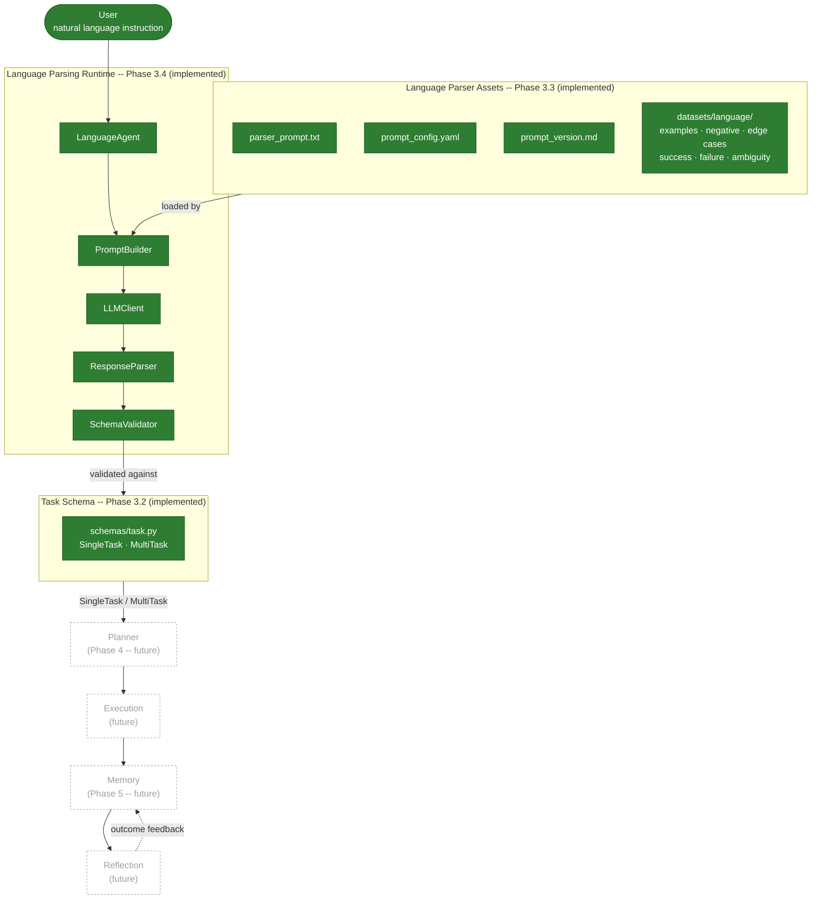
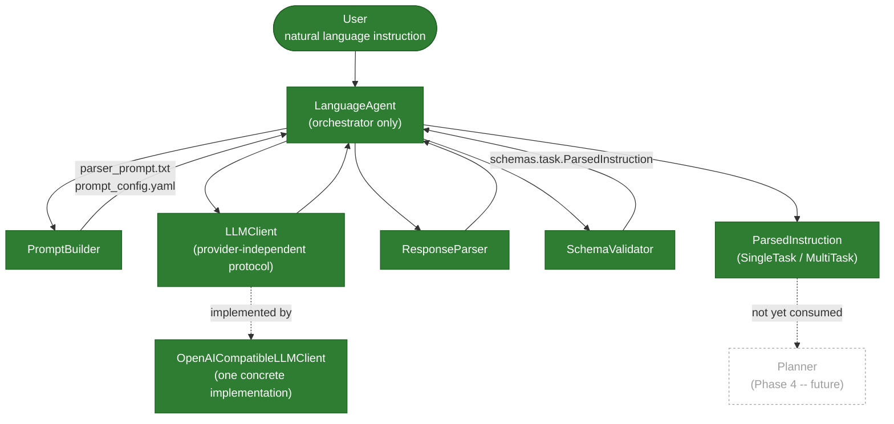
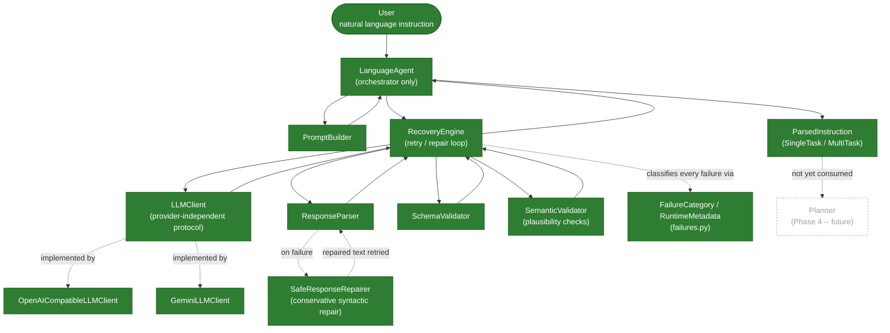
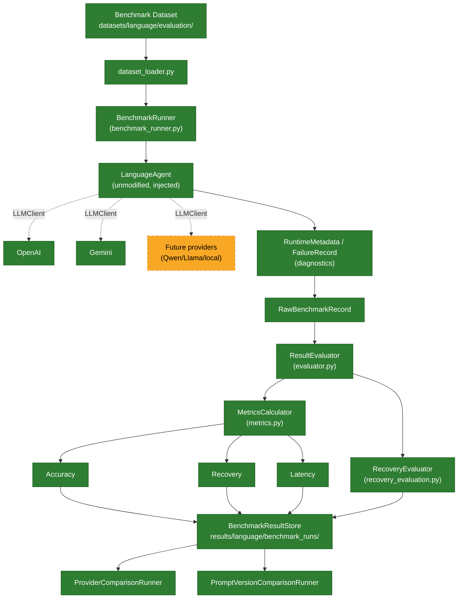
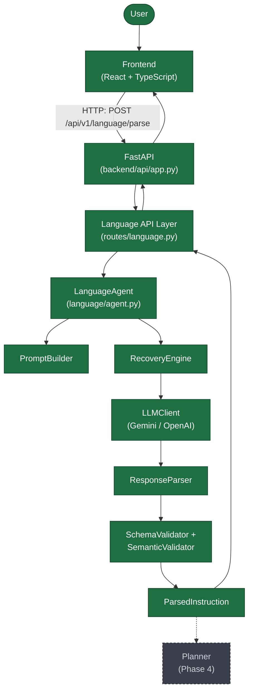

# Language Interface Specification

**Phase:** 3.1 (interface definition) + 3.2 (data-layer hardening) +
3.3 (parser asset package) + 3.4 (parsing runtime) + 3.5 (output
validation & error recovery) + 3.6 (testing & benchmarking) + 3.7
(API & frontend integration)
**Status:** Interface defined and implemented as a validated,
production-quality data layer, paired with a versioned, benchmarkable
parser asset package, a working `LanguageAgent` runtime that calls a
real LLM (OpenAI or Gemini), a bounded retry/repair/semantic
-validation recovery layer on top of it, a reproducible evaluation
framework that scores the whole pipeline against the Phase 3.3
benchmark datasets, and an HTTP API + React/TypeScript frontend that
let a real user submit an instruction and see the validated
`ParsedInstruction`. Planner, Execution, Memory, and Reflection remain
not implemented.
**Files defined by this spec:**
`backend/prompts/parser_prompt.txt`, `backend/prompts/prompt_config.yaml`,
`backend/prompts/prompt_version.md`, `backend/prompts/README.md`
(Phase 3.1 + 3.3);
`backend/schemas/task.py`, `backend/schemas/enums.py`,
`backend/schemas/metadata.py`, `backend/schemas/validators.py`
(Phase 3.1 + 3.2), `backend/tests/test_task.py` (Phase 3.2);
`datasets/language/prompts/{examples,negative_examples,edge_cases}.json`,
`datasets/language/evaluation/{success_cases,failure_cases,ambiguity_cases}.json`
(Phase 3.3);
`backend/language/{agent,prompt_builder,llm_client,response_parser,
schema_validator,config,exceptions}.py` (Phase 3.4);
`backend/language/{failures,semantic_validator,repair,recovery,
gemini_client,provider_factory}.py` (Phase 3.5);
`backend/evaluation/{models,exceptions,dataset_loader,benchmark_runner,
evaluator,metrics,provider_comparison,prompt_comparison,
recovery_evaluation,result_store,run_benchmark}.py` (Phase 3.6);
`backend/api/{app,routes/health,routes/language,models/language}.py`,
`frontend/src/{App,main}.tsx`, `frontend/src/api/{language,types}.ts`,
`frontend/src/components/*.tsx` (Phase 3.7).

This document is the design record for the boundary between the
Language Understanding module and every module downstream of it
(Planner, Execution, Memory, Reflection). It exists so that module can
be implemented, tested, and even swapped out later without any
downstream module changing, in the same way
[`docs/architecture/api_contracts.md`](../../docs/architecture/api_contracts.md)
froze the Vision -> Planner boundary at the end of Phase 2.

Phase 3.1 fixed the interface's *shape*: what fields exist, what they
mean, and how ambiguity/missing data are represented. Phase 3.2 turned
that shape into a production-quality, strongly typed, validated data
layer -- splitting the single `task.py` file by concern
(`enums.py` for closed vocabularies, `metadata.py` for provenance and
schema versioning, `validators.py` for reusable validation logic,
`task.py` for the models themselves), adding runtime invariant
enforcement (clarification consistency, subtask-count minimums, goal
formatting, schema-integrity via `extra="forbid"`), and covering all
of it with a 70-test unit suite (`backend/tests/test_task.py`). Phase
3.3 built the complete non-runtime asset package the future Language
Agent (Phase 3.4) will consume: a versioned, configured
`parser_prompt.txt`, and a research-grade dataset tree
(`datasets/language/`) of few-shot examples, anti-pattern examples,
edge cases, and three disjoint evaluation benchmarks (correctness,
robustness, ambiguity-detection) designed to compare GPT, Qwen, Llama,
and Phi fairly and reproducibly. Every change across all three phases
is additive to the Phase 3.1 JSON contract -- see section 14 for the
Phase 3.2 changes and section 26 for the Phase 3.3 asset package in
full.

---

## 1. Purpose

Define, precisely and in advance of implementation, how a natural
language instruction from a user is represented once it leaves the
Language Understanding module and before it reaches the Planner. This
is an interface specification, not an implementation: it fixes the
*shape* of the data that will flow through the pipeline, so that the
Language Agent (Phase 3.4+), the Planner (Phase 4), Memory (Phase 5),
Execution, and Reflection can all be designed and built against a
stable target.

## 2. Motivation

The perception stack (Phase 2) succeeded specifically because every
stage agreed on one shared data model (`Scene`) instead of passing
ad-hoc dicts between detector, segmenter, and scene-graph stages. Phase
3 begins the same way: the JSON an LLM produces from a raw instruction
string is not a stable interface. It varies by prompt phrasing, by
model, by provider, and it is not typed. If the Planner imported
LLM response dicts directly, a prompt tweak or a model swap would
silently reshape the Planner's inputs. Defining `SingleTask`,
`MultiTask`, and their supporting models *before* any planning logic
exists means the Planner is written against a contract that will not
move under it later.

## 3. Design Goals

- **Stability.** The interface must not need to change when the
  underlying LLM, prompt, or parsing strategy changes.
- **Modularity.** New fields (e.g. a future `deadline` or `robot_id`)
  must be addable without breaking existing consumers -- additive
  change only, never a breaking rename or removal.
- **Explicit ambiguity handling.** The interface must be able to
  represent "I don't know" (`null`) and "this is ambiguous"
  (`needs_clarification`) as first-class, distinguishable states,
  rather than collapsing both into empty strings or omitted keys.
- **No invented information.** The schema and the prompt that produces
  it must never allow fabricated objects or locations to look
  indistinguishable from user-stated ones.
- **Single- and multi-task symmetry.** A multi-step instruction should
  decompose into the same task representation used for a single-step
  instruction, so the Planner has one task shape to reason about, not
  two.
- **Provider independence.** Nothing in this interface should assume a
  specific LLM, prompt-engineering technique, or inference framework.

## 4. Module Responsibilities

| Module | Responsibility | Explicitly NOT responsible for |
|---|---|---|
| Language Understanding | Convert one raw instruction string into a `SingleTask` or `MultiTask` | Planning, sequencing execution, invoking the simulator |
| Planner (Phase 4) | Convert a `Task` into an ordered sequence of executable actions, using `Scene` for grounding | Interpreting natural language, resolving ambiguity |
| Execution | Carry out planned actions against the simulator/robot | Deciding *what* to do, only *how* to do a given action |
| Memory (Phase 5) | Persist `Task` history and outcomes for long-horizon reasoning | Generating new tasks |
| Reflection | Compare `estimated_goal`/`postconditions` against observed outcomes | Re-parsing the original instruction |

This spec governs only the first row's output contract. Every other
row is included so the boundary's downstream obligations are visible,
not because this stage designs their internals.

## 5. Scope

Phase 3.1 defined:

- The system prompt that instructs an LLM to convert instructions to
  structured JSON (`backend/prompts/parser_prompt.txt`).
- The initial Pydantic schema representing that structured JSON.
- This design document.

Phase 3.2 additionally defines:

- `backend/schemas/enums.py` -- `TaskType`, `TaskPriority`,
  `ConstraintType` as closed, validated vocabularies (previously
  inline in `task.py`).
- `backend/schemas/metadata.py` -- `TaskMetadata` (creation timestamp,
  producer, schema version) and the `SCHEMA_VERSION` constant, attached
  to every `Task` as `Task.metadata`.
- `backend/schemas/validators.py` -- the reusable normalization and
  invariant-checking functions every model's field/model validators
  call into (text normalization, snake_case goal validation,
  clarification consistency, minimum-subtask-count enforcement).
- `backend/schemas/task.py` (refactored) -- the model definitions,
  now wired to the three files above, with UUID-based task identity,
  frozen value objects, strict extra-field rejection, and full
  validator coverage.
- `backend/tests/test_task.py` -- a 70-case unit test suite covering
  every validator, every model, serialization/deserialization, and the
  discriminated union.

Phase 3.3 additionally defines:

- `backend/prompts/prompt_config.yaml` -- decoding parameters,
  strictness mode, retry policy, and model-compatibility notes for
  whatever future component calls an LLM with `parser_prompt.txt`.
- `backend/prompts/prompt_version.md` -- semantic-versioned changelog
  for `parser_prompt.txt` itself, independent of `SCHEMA_VERSION`.
- `backend/prompts/README.md` -- map of the runtime asset directory and
  why it is deliberately separate from the dataset tree below.
- `datasets/language/prompts/examples.json` -- a 21-case few-shot
  example library spanning navigation, manipulation, storage,
  inspection, attributes, constraints, multi-step, source/target
  locations, user references, and sequential commands.
- `datasets/language/prompts/negative_examples.json` -- a 10-case
  anti-pattern catalog (Markdown output, embedded reasoning, planner
  output, conversational output, hallucinated objects/locations,
  invalid JSON, wrong field names, missing required fields, unsupported
  actions), each traced to the specific `parser_prompt.txt` rule it
  violates.
- `datasets/language/prompts/edge_cases.json` -- a 14-case library of
  structurally tricky-but-valid inputs (ambiguous referents, unknown
  objects/locations, pronouns, multiple objects, missing targets,
  spatial relations, sequential/reordered instructions, impossible or
  infeasible requests, clarification-required commands).
- `datasets/language/evaluation/success_cases.json`,
  `failure_cases.json`, `ambiguity_cases.json` -- three disjoint
  benchmark datasets (15, 12, and 10 cases respectively) measuring
  correctness, robustness, and clarification-detection independently,
  designed to be re-run unmodified against any future LLM.

See section 26 for the full design rationale behind this split and how
Phase 3.4-3.7 are each expected to consume it.

## 6. Out of Scope

Explicitly **not** part of Phase 3.1, 3.2, or 3.3:

- Implementing a Language Agent class that calls an LLM.
- Any planning, action sequencing, or execution logic.
- A FastAPI (or any other) service layer, or any API route.
- Grounding language output against a live `Scene` (that is Planner
  work, using the Phase 2 frozen interfaces).
- Persisting tasks to Memory.
- Retry, clarification-dialogue, or error-handling runtime behavior --
  Phase 3.3 documents a *retry policy value* in `prompt_config.yaml`
  and documents *expected* validation/repair behavior in section 26,
  but implements no retry, validation, or repair code.
- Any actual LLM inference call, against any provider, for any
  purpose (including generating this phase's own datasets -- every
  example in `datasets/language/` was authored and schema-verified
  directly against `backend/schemas/task.py`, not sampled from a model).

## 7. Language Interface Overview

The end-to-end pipeline this interface sits in, with implementation
status distinguished explicitly -- solid borders and fill are
implemented, dashed borders are planned/future work with no code yet:



Two status tiers now apply, matching what actually exists in this
repository today:

- **Implemented (solid, filled):** the User, the full Phase 3.3 parser
  asset package, the Phase 3.4 Language Parsing Runtime
  (`LanguageAgent` and its four collaborators -- see section 27 for
  the full breakdown), and the Phase 3.2 `Task` schema. Every file in
  these boxes exists, is tested/validated, and is described in this
  document.
- **Future (dashed, gray):** Planner, Execution, Memory, Reflection --
  phases 4+, referenced throughout this document for context but out
  of scope for any work done so far. (Phase 3.5-3.7 -- output
  validation/repair, benchmarking, and API/frontend integration -- sit
  between the runtime and Phase 4 and are documented in section 26 as
  still-planned work, omitted from this diagram to keep it focused on
  what a `parse()` call actually touches today.)

The Language Parsing Runtime (parser assets + `LanguageAgent` and its
collaborators) is the only part of this pipeline that ever sees raw
instruction text or raw LLM output. Everything past `SchemaValidator`
consumes typed `Task` objects (`SingleTask` / `MultiTask`), never
strings, never raw JSON. This is the same "one shared typed model, many
consumers" pattern `Scene` established for perception.

## 8. JSON Contract

Every parser response is exactly one JSON object with a top-level
`"task_type"` discriminator of `"single"` or `"multi"`. No other
top-level shape is valid. The full field list, defaults, and behavior
for missing/ambiguous data are defined in `parser_prompt.txt` and
mirrored exactly by the Pydantic models in `schemas/task.py` --
`ParsedInstruction` is a discriminated union
(`Annotated[Union[SingleTask, MultiTask], Field(discriminator="task_type")]`)
so any conforming JSON payload can be validated directly:

```python
from pydantic import TypeAdapter
from schemas.task import ParsedInstruction

adapter = TypeAdapter(ParsedInstruction)
task = adapter.validate_python(raw_llm_json_dict)  # SingleTask or MultiTask
# or, from a raw JSON string:
task = adapter.validate_json(raw_llm_json_string)
```

A malformed payload -- an invalid `task_type`, an out-of-vocabulary
`priority`, an unknown extra field, a `MultiTask` with fewer than two
subtasks, `needs_clarification=True` with no `clarification_reason` --
raises `pydantic.ValidationError` with a message naming the offending
field and constraint (see section 25 for the full validation rule
catalog added in Phase 3.2).

Because the prompt and the schema are maintained as two independent
files describing the same contract, any future field addition must
update both together -- this document is the place that fact is
recorded so it is not lost between them.

## 9. Field Definitions

| Field | Type | Present on | Meaning |
|---|---|---|---|
| `task_type` | `TaskType` (`"single"` \| `"multi"`) | both | Discriminator selecting the concrete representation. |
| `task_id` | `Optional[str]`, auto-generated UUID4 | both | Stable id. Generated by the schema itself when unset or `null` -- see section 14, change 1. |
| `metadata` | `TaskMetadata` | both | Provenance + schema version, auto-populated. See section 25. |
| `goal` | `Optional[str]`, snake_case-validated | both | Snake_case verb phrase naming the intent (e.g. `pick_and_place`). |
| `object` | `Optional[str]` | `SingleTask` | The primary object acted on, in the user's own words. |
| `target` | `Optional[str]` | `SingleTask` | A secondary object/entity the primary object relates to. |
| `source_location` | `Optional[str]` | `SingleTask` | Where the object is acquired from, if stated. |
| `target_location` | `Optional[str]` | `SingleTask` | Where the object/robot should end up, if stated. |
| `attributes` | `Optional[TaskAttributes]` | both | Descriptive qualifiers (`color`, `size`, `material`, `state`, `quantity`, `descriptors`). |
| `constraints` | `Optional[List[TaskConstraint]]` | both | Explicit constraints, each typed by `ConstraintType`. |
| `priority` | `Optional[TaskPriority]` | both | `low` \| `medium` \| `high` \| `critical`, only when signaled. |
| `preconditions` | `Optional[List[str]]` | both | Conditions required before the task may begin. |
| `postconditions` | `Optional[List[str]]` | both | Conditions defining success beyond the immediate action. |
| `estimated_goal` | `Optional[str]` | both | Natural-language restatement of the success state, derived only from other fields. |
| `needs_clarification` | `bool` | both | Hard signal that this task must not be planned against without resolving ambiguity. Consistency with `clarification_reason` is enforced (section 25). |
| `clarification_reason` | `Optional[str]` | both | Required iff `needs_clarification` is `true`; enforced by validation, not just convention. |
| `subtasks` | `List[SingleTask]`, minimum 2 | `MultiTask` only | Ordered decomposition of a multi-goal instruction. |

`TaskAttributes` and `TaskConstraint` are nested models rather than
flattened fields -- see `schemas/task.py` docstrings for the rationale
(same pattern as `Mask` wrapping segmentation data in the perception
layer instead of flattening it onto `Detection`). Both, along with
`TaskMetadata`, are frozen (immutable) as of Phase 3.2 -- see section
25.

Types are written here using `Optional[X]` / `List[X]` (rather than
`X | None` / `list[X]`) because that is what the implementation
actually uses, for Python 3.9 compatibility -- see section 14's Phase
3.2 changelog for why this matters in practice, not just style.

## 10. Single Task Representation

A `SingleTask` represents exactly one atomic goal: one `goal` value,
at most one primary `object`, and at most one `target`. It is the leaf
representation used both standalone and inside `MultiTask.subtasks`,
so the Planner never needs a second task shape for "a step inside a
larger instruction" versus "a whole instruction."

```json
{
  "task_type": "single",
  "task_id": null,
  "goal": "pick_and_place",
  "object": "red mug",
  "target": null,
  "source_location": "kitchen counter",
  "target_location": "dining table",
  "attributes": {"color": "red", "size": null, "material": null, "state": null, "quantity": null, "descriptors": null},
  "constraints": null,
  "priority": null,
  "preconditions": null,
  "postconditions": null,
  "estimated_goal": "the red mug is on the dining table",
  "needs_clarification": false,
  "clarification_reason": null
}
```

## 11. Multi Task Representation

A `MultiTask` represents an instruction that decomposes into two or
more atomic goals (joined by "and", "then", punctuation, or separate
clauses). `subtasks` preserves the order implied by the user's
wording, since sequencing words like "then" carry ordering meaning the
Planner is expected to honor by default.

```json
{
  "task_type": "multi",
  "task_id": null,
  "goal": null,
  "subtasks": [
    {"task_type": "single", "goal": "pick_up", "object": "blue cup", "source_location": "sink", "...": "..."},
    {"task_type": "single", "goal": "deliver", "object": "blue cup", "target_location": "office", "...": "..."}
  ],
  "priority": null,
  "needs_clarification": false,
  "clarification_reason": null
}
```

`MultiTask` does not encode a dependency graph beyond list order plus
each subtask's own `preconditions` -- richer dependency modeling (e.g.
parallelizable subtasks) is deliberately left to the Planner, which has
`Scene` context this interface does not.

## 12. Ambiguity Handling

Ambiguity (a referent that cannot be resolved, e.g. "put it on the
table" with no antecedent for "it") is represented explicitly via
`needs_clarification: true` plus a human-readable
`clarification_reason`. This is distinct from missing information
(section 13): ambiguity means the instruction *could* mean more than
one thing and guessing risks the wrong action; missing information
means a field is simply unspecified and safe to leave `null`. The
parser prompt requires every other field to still be populated with
the parser's best faithful reading even when `needs_clarification` is
`true`, so a clarifying question can be asked without discarding
everything that *was* understood.

Downstream modules (starting with the Planner) must treat
`needs_clarification: true` as a hard stop -- clarification must be
resolved (typically by returning to the user) before planning proceeds
against that task.

## 13. Missing Information Handling

Every optional field defaults to `null`/`None` when the instruction
does not provide it. This is a deliberate, uniform rule across the
entire schema: no empty strings, no `"N/A"` sentinels, no omitted
keys. A consumer can therefore treat "key present with `None`" as the
single canonical way to test for absence, rather than needing to
special-case multiple placeholder conventions. `attributes` follows the
same rule at the object level -- it is `null` when no qualifiers were
given, not an object with every inner field `null`.

## 14. Future Compatibility

New fields may be added to `Task`, `SingleTask`, `MultiTask`,
`TaskAttributes`, or `TaskConstraint` as optional fields with sensible
defaults (typically `None`). This is additive and therefore
non-breaking: existing producers (older prompt versions) simply omit
the new field, and existing consumers that don't yet read it are
unaffected. What must never happen without a version bump and a
migration note in this document: renaming an existing field, changing
an existing field's type, or removing a field a downstream module
already depends on. This mirrors the freeze policy in
`docs/architecture/api_contracts.md` for the perception layer -- the
Language Interface is expected to reach the same kind of stability once
exercised end to end. `TaskMetadata.schema_version` (section 25) exists
specifically to make this policy enforceable at runtime, not just by
convention: a future Memory module can compare a persisted record's
`schema_version` against the current `SCHEMA_VERSION`
(`schemas/metadata.py`) and decide whether it needs migration.

### Phase 3.2 changelog

Two behavioral changes were made while hardening the Phase 3.1 draft
into a validated data layer. Both are additive against the JSON
contract `parser_prompt.txt` already produces -- neither required a
prompt change.

1. **`task_id` is now auto-generated (UUID4) instead of staying
   `None`.** The Phase 3.1 draft left `task_id` `None` unless the user
   referenced an existing id, on the theory that id assignment was a
   Planner/Memory responsibility. In practice, every module downstream
   of Language Understanding (Execution dispatch, Memory persistence,
   Reflection lookups) needs *some* stable handle on a task from the
   moment it exists, and deferring that assignment just meant every one
   of those future modules would need its own id-generation step
   anyway. The schema layer now owns it: `Task.task_id` generates a
   UUID4 string whenever a producer leaves it unset *or* sends it as an
   explicit `null` -- both cases were verified to behave identically
   (see `TestTaskIdentity` in `tests/test_task.py`), because
   `parser_prompt.txt` always emits `"task_id": null` per its "never
   omit a field" rule, and both code paths had to resolve to a fresh
   id, not just the omitted-key case. This was implemented as a
   `mode="before"` field validator combined with `validate_default=True`
   -- the latter was required after an initial version silently
   returned `None` when `task_id` was omitted entirely, because Pydantic
   skips "before" validators for fields that fall back to their default
   unless `validate_default=True` is set. The `str` vs `Optional[str]`
   distinction in the field's *type annotation* stayed `Optional[str]`
   for consistency with the rest of the schema's Optional-everywhere
   convention, even though the validator guarantees the runtime value is
   never actually `None`.
2. **`extra="forbid"` on every model.** The Phase 3.1 draft left
   Pydantic's default (`extra="ignore"`), which silently drops unknown
   fields. Phase 3.2 makes that a hard validation error instead --
   `parser_prompt.txt`'s field list is a closed contract, and a stray or
   misspelled field from a future prompt revision or a different LLM
   provider should fail loudly at the schema boundary, not be silently
   discarded and debugged three modules downstream.

A third item is a documentation-only correction, not a schema
behavior change: the Phase 3.1 draft used `X | None` / `list[X]` type
syntax (Python 3.10+), which is incompatible with this project's actual
Python 3.9 target (`backend/requirements.txt`) under Pydantic's runtime
type resolution -- confirmed by an actual `TypeError` at import time
under Python 3.9, not just a static-analysis warning. Phase 3.2's
implementation uses `Optional[X]` / `List[X]` / `Union[X, Y]` from
`typing` throughout, matching the convention already used in
`scene/detection.py` and `scene/scene.py`.

## 15. Planner Integration

The Planner (Phase 4) will consume `SingleTask` / `MultiTask` objects
together with a `Scene` (from `VisionAgent.perceive()`) to ground
`object`, `target`, `source_location`, and `target_location` strings
against actual `Detection`s and produce an executable action sequence.
The Planner never needs to know whether a `SingleTask` came from a
standalone instruction or from `MultiTask.subtasks` -- it consumes
`Task` fields uniformly either way (section 4's design goal).

## 16. Vision Integration

This interface is deliberately decoupled from `Scene`: `object`,
`source_location`, and `target_location` are free-text strings as the
user said them, not `Detection` references or scene-graph node ids.
Grounding language against perception (matching `"red mug"` to a
specific `Detection`) is Planner work, performed *after* this
interface's output exists, using the frozen Phase 2 interfaces
documented in
[`docs/architecture/api_contracts.md`](../../docs/architecture/api_contracts.md).
Keeping this separation means the Language Understanding module can be
built, tested, and evaluated entirely offline, without a live `Scene`.

**Phase 3.x update:** Vision now also exposes an HTTP surface
(`POST /api/v1/vision/perceive`, see
[`docs/architecture/spatial_perception.md`](../../docs/architecture/spatial_perception.md))
producing a `SpatialObject`-enriched view of `Scene` (depth, 3D
position, tracking identity, temporal changes) alongside the existing
`VisionAgent.perceive()` Python interface. This section's separation
still holds unchanged: nothing in Language reads a `Scene`/`SpatialObject`,
and nothing in Vision reads a `ParsedInstruction`. The Planner (section
15, Phase 4) is still the only place these two are meant to meet.

## 17. Memory Integration

`Task` objects, each with a stable `task_id` guaranteed present from
construction (section 14, change 1), are the natural unit Memory
(Phase 5) will persist: what was asked, what the estimated success
state was (`estimated_goal`), and -- once Execution and Reflection
report back -- what actually happened. Because `Task` is already typed
and serializable (`model_dump_json()` / `model_validate_json()`,
section 25), Memory can store and retrieve it without a bespoke
serialization layer. `Task.metadata.schema_version` and
`Task.metadata.created_at` (`schemas/metadata.py`) give Memory exactly
the two pieces of provenance it needs to reason about historical
records: which schema revision to interpret a stored record against,
and when it was created, without either being conflated with the
task's own semantic fields.

## 18. Execution Integration

Execution consumes the Planner's output, not `Task` objects directly
-- but `preconditions` and `postconditions` on the originating `Task`
remain available to Execution for runtime checks (e.g. verifying a
stated precondition still holds immediately before acting).

## 19. Reflection Integration

`estimated_goal` and `postconditions` are the fields Reflection is
expected to compare against observed post-execution `Scene` state to
judge task success. They are written by the Language Understanding
module strictly from the user's stated intent (never inferred beyond
it), so Reflection's success judgment stays traceable back to what the
user actually asked for.

## 20. Assumptions

- Exactly one instruction is parsed per call to the Language
  Understanding module; multi-turn dialogue state is out of scope here.
- The producing LLM can reliably emit well-formed JSON when instructed
  as in `parser_prompt.txt`; enforcement/repair of malformed output is
  a Language Agent implementation concern (Phase 3.4+), not part of
  this interface.
- English-language instructions are assumed for the initial version;
  nothing in the schema is English-specific, but the example prompt is.

## 21. Limitations

- The schema does not model conditional/branching instructions (e.g.
  "if the door is locked, knock instead") beyond `preconditions` /
  `constraints` free text -- a future phase may need a richer
  conditional-task model.
- `subtasks` ordering is a simple list, not a dependency graph;
  instructions implying parallel or conditional subtask execution are
  not distinguishable from strictly sequential ones at this layer.
- There is no confidence score on individual fields, only the binary
  `needs_clarification` signal at the whole-task level.

## 22. Future Extensions

Anticipated additive extensions, none of which require breaking this
interface (section 14):

- `deadline` / `time_window` fields for temporally scoped tasks.
- `robot_id` for multi-robot coordination.
- A `confidence` field per task or per ambiguous field.
- A `dependency_graph` field on `MultiTask` for non-sequential subtask
  relationships.
- A `source_utterance` field preserving the original instruction text
  alongside the structured result, for audit/replay in Memory.

## 23. Example Inputs

```text
"Pick up the red mug from the kitchen counter and place it on the dining table."
"Bring me the milk."
"Put it on the table."
"Pick up the blue cup from the sink, then take it to the office, and after that turn off the lights in the kitchen."
"Quickly grab my laptop from the bedroom, but don't make any noise -- the baby is sleeping."
```

## 24. Example Outputs

See `backend/prompts/parser_prompt.txt`'s Examples section for the full
JSON output corresponding to each input above -- those examples are the
canonical reference and are kept in sync with `schemas/task.py` rather
than duplicated here, so there is exactly one place they can drift out
of agreement.

## 25. Data-Layer Architecture & Validation Rules (Phase 3.2)

### File responsibilities

| File | Owns | Never owns |
|---|---|---|
| `schemas/enums.py` | Closed vocabularies: `TaskType`, `TaskPriority`, `ConstraintType` | Field definitions, validation logic |
| `schemas/metadata.py` | `TaskMetadata` (provenance/versioning), `SCHEMA_VERSION` | Task semantic fields |
| `schemas/validators.py` | Reusable normalization + invariant-checking functions | Model/field definitions |
| `schemas/task.py` | `TaskConstraint`, `TaskAttributes`, `Task`, `SingleTask`, `MultiTask`, `ParsedInstruction` | Enum vocabularies, provenance modeling, standalone validation logic (imports all three from the files above instead) |
| `tests/test_task.py` | Executable verification that every invariant below actually holds | Any production code path |

This split exists so a change to one concern -- e.g. adding a new
`ConstraintType` member -- touches exactly one file's diff, and so a
future module that only needs the vocabulary (e.g. a Planner branching
on `ConstraintType`) can import `schemas.enums` without pulling in the
full model graph.

### Validation rule catalog

| Rule | Enforced by | Failure mode |
|---|---|---|
| `task_type` must be a known `TaskType` member | Pydantic enum validation | `ValidationError` |
| `priority` must be a known `TaskPriority` member | Pydantic enum validation | `ValidationError` |
| `constraint_type` must be a known `ConstraintType` member | Pydantic enum validation | `ValidationError` |
| `TaskConstraint.description` must be non-empty after stripping | `validators.require_non_empty_text` | `ValidationError` |
| `TaskAttributes.quantity` must be `>= 1` when present | Pydantic `Field(ge=1)` | `ValidationError` |
| `goal` must be a lowercase snake_case verb phrase | `validators.validate_snake_case_goal` | `ValidationError` |
| `needs_clarification=True` requires non-empty `clarification_reason`, and vice versa | `validators.validate_clarification_consistency` (model-level) | `ValidationError` |
| `MultiTask.subtasks` must contain at least 2 entries | `validators.validate_subtask_count` | `ValidationError` |
| No field beyond the documented schema is accepted | `model_config = ConfigDict(extra="forbid")` on every model | `ValidationError` |
| Empty/whitespace-only optional text collapses to `None`, never an error | `validators.normalize_optional_text` / `normalize_text_list` | Silently repaired, not rejected |
| `task_id` is never `None` after validation | `Task._assign_task_id_if_missing` (`mode="before"`, `validate_default=True`) | Auto-repaired, not rejected |

The last two rows are a deliberate split: **formatting noise** (an
empty string an LLM emitted instead of `null`, a missing `task_id`) is
*repaired*, because rejecting an otherwise-valid task over a producer's
minor formatting slip would make the schema more brittle than useful.
**Structural invariant violations** (a `MultiTask` with one subtask, a
`TaskConstraint` with no description) are *rejected*, because those
indicate the payload cannot be trusted to mean what its shape claims.
See `validators.py`'s module docstring, "Design principle: normalize
permissively, validate strictly," for the full rationale.

### Model configuration

- **Frozen (immutable):** `TaskAttributes`, `TaskConstraint`,
  `TaskMetadata` -- pure value objects describing facts fixed at parse
  time.
- **Mutable:** `Task`, `SingleTask`, `MultiTask` -- aggregate roots that
  future Planner/Execution/Memory/Reflection modules are expected to
  enrich over a task's lifecycle (e.g. attaching a plan reference or
  execution status) once those modules exist. `validate_assignment=True`
  ensures any such future mutation is validated exactly like
  construction, not exempted from it.
- **Every model:** `extra="forbid"` (schema-integrity), and
  `str_strip_whitespace=True` where text fields exist (whitespace
  noise handled once, at the config level, rather than per field).

### Serialization / deserialization

No custom serialization code was written -- Pydantic v2's built-in
`model_dump()` / `model_dump_json()` (Python object / JSON string out)
and `model_validate()` / `model_validate_json()` (Python object / JSON
string in) are the supported path, exercised directly by
`TestSerialization` in `tests/test_task.py`, including round-tripping
through the `ParsedInstruction` discriminated union via
`TypeAdapter.dump_json()` / `.validate_python()`. `TaskPriority` and
`ConstraintType` subclassing `str` (section on `enums.py`) means JSON
output contains plain strings (`"priority": "high"`), not a nested enum
representation -- no downstream consumer needs to know these fields are
backed by an enum at all unless it wants the extra type safety.

### Testing

`backend/tests/test_task.py` is a 70-case `pytest` suite, organized by
model/invariant (mirroring this section's rule catalog), covering valid
and invalid single- and multi-task construction, every validation rule
above, UUID generation (both the omitted-key and explicit-`null`
cases), serialization/deserialization round-trips, and edge cases
(deeply nested `MultiTask` serialization, the `Task` base class's own
required-field behavior). Run with:

```bash
cd backend
python -m pytest tests/test_task.py -v
```

## 26. Language Parser Assets (Phase 3.3)

Phase 3.3 built every non-runtime asset the Language Parsing Runtime
(Phase 3.4, `backend/language/`) needs, split across two trees for a
deliberate reason: one holds what a *running* `LanguageAgent` loads,
the other holds *research and benchmark data* that outlives any single
prompt version. See
`backend/prompts/README.md` for the full rationale; summarized here for
completeness.

### 26.1 Runtime asset tree -- `backend/prompts/`

| File | Contents |
|---|---|
| [`parser_prompt.txt`](../prompts/parser_prompt.txt) | The system prompt (v1.1.0): role, output format, core principles, single/multi-task handling, field definitions, a SUPPORTED GOALS catalog (open vocabulary, not a closed enum), five worked examples, and an EXTENSION GUIDANCE section. |
| [`prompt_config.yaml`](../prompts/prompt_config.yaml) | Decoding parameters (low temperature/top_p for reproducibility), strict-JSON-mode preference, retry policy, and a model-compatibility statement covering OpenAI, Anthropic, Qwen, Llama, and Phi families. |
| [`prompt_version.md`](../prompts/prompt_version.md) | Semantic-versioned changelog for `parser_prompt.txt`, independent of `SCHEMA_VERSION` -- see its own versioning policy for how prompt changes are classified major/minor/patch. |
| [`README.md`](../prompts/README.md) | Directory map and the runtime-vs-dataset split rationale. |

### 26.2 Research/benchmark dataset tree -- `datasets/language/`

| File | Cases | Purpose |
|---|---|---|
| [`prompts/examples.json`](../../datasets/language/prompts/examples.json) | 21 | Few-shot example library, disjoint from `parser_prompt.txt`'s inline examples, spanning every required category (navigation, pickup, place, store, find, inspect, multi-step, attributes, constraints, source/target locations, user references, sequential commands). |
| [`prompts/negative_examples.json`](../../datasets/language/prompts/negative_examples.json) | 10 | Anti-pattern catalog, each entry tracing a `bad_output` to the specific `parser_prompt.txt` rule it violates, with a `corrected_output`. Documents the split between *syntactic* failures (schema-validator-verifiable, confirmed directly against `schemas.task.ParsedInstruction`) and *semantic* failures (hallucination -- schema-valid but content-wrong, unverifiable by any validator, only by a future consistency check). |
| [`prompts/edge_cases.json`](../../datasets/language/prompts/edge_cases.json) | 14 | Structurally tricky-but-valid inputs: ambiguous referents, unknown objects/locations (parsed faithfully, not flagged -- unfamiliarity is a Planner/Scene-grounding concern), pronouns, multiple objects (single vs. multi-task depending on phrasing), missing targets, spatial relations, sequence-reordering ("before X, do Y"), impossible/infeasible requests (parsed faithfully; feasibility is a Planner/Execution concern), and clarification-required commands. |
| [`evaluation/success_cases.json`](../../datasets/language/evaluation/success_cases.json) | 15 | Correctness benchmark. Disjoint from every other file's inputs -- scores generalization, not memorization. |
| [`evaluation/failure_cases.json`](../../datasets/language/evaluation/failure_cases.json) | 12 | Robustness benchmark: candidate (possibly malformed) outputs paired with an `expected_validation_result` (`reject_syntactic`, `reject_semantic`, or `accept`), every `reject_syntactic`/`accept` verdict confirmed directly against `schemas.task.ParsedInstruction`. Includes a true-negative case (unusual but valid formatting) to catch an over-strict validator, not just an under-strict one. |
| [`evaluation/ambiguity_cases.json`](../../datasets/language/evaluation/ambiguity_cases.json) | 10 | Clarification-detection benchmark, with both true positives (genuine ambiguity) and true negatives (looks underspecified but is actually resolvable, e.g. "put the plate back where you found it") -- exists specifically to penalize a parser that over-flags everything as ambiguous. |

All 82 dataset inputs across both trees, plus the 5 inline
`parser_prompt.txt` examples, were checked programmatically to be
mutually disjoint (no instruction string repeated across any file), and
every `expected_output` / `corrected_output` / `accept`-labeled
`candidate_output` in every file was validated directly against
`pydantic.TypeAdapter(ParsedInstruction)` at authoring time -- these
datasets are not aspirational, they are confirmed to actually match the
Phase 3.2 schema as it exists today.

### 26.3 Phase 3.4 -- Language Parsing Runtime (implemented)

**Implemented.** See section 27 below for the full design record. This
subsection is kept as a pointer for readers arriving via section 26's
original Phase 3.3 narrative.

Summary of what changed from the original plan sketched here: a
`LanguageAgent` class exposing `parse(instruction: str) ->
ParsedInstruction` was built essentially as originally described, but
at `backend/language/agent.py` rather than the originally proposed
`backend/agents/language_agent.py` -- the strict separation-of-concerns
requirement for this phase (`PromptBuilder`, `LLMClient`,
`ResponseParser`, `SchemaValidator` as independently testable
collaborators, not just one class) needed a dedicated package, and
`backend/agents/` remains reserved rather than repurposed for it. Every
other expectation held: exactly one LLM call per `parse()`, validation
via `pydantic.TypeAdapter(ParsedInstruction)`, no Planner/`Scene`
access, and no retry-and-repair loop (still correctly deferred to Phase
3.5 -- see section 26.4, unchanged).

### 26.4 Phase 3.5 -- Output Validation & Error Recovery (implemented)

**Implemented.** See section 28 below for the full design record. This
subsection is kept as a pointer for readers arriving via section 26's
original Phase 3.3 narrative, mirroring how 26.3 points at section 27
for Phase 3.4.

Summary of what changed from the original plan sketched here: syntactic
validation, a bounded retry loop, a conservative safe-repair step, and
a lightweight semantic-plausibility layer were all built essentially as
originally described. Two refinements the original sketch didn't
anticipate: (1) retry-with-a-corrected-prompt was not built --
`recovery.py` retries with the *same* request rather than appending the
validation error to a follow-up prompt, since a fresh sample at low
temperature already recovers the common transient cases without the
added complexity of a second prompt-construction path; and (2) semantic
validation ended up narrower than "hallucination detection against
source-instruction tokens" -- it checks structural plausibility
(an object-requiring goal with no object/target, an object equal to its
own target, contradictory clarification state) rather than token-level
grounding, which is closer to what Phase 3.2's Pydantic layer already
does well and avoids a fuzzy-matching heuristic that could reject valid
paraphrases. Every other expectation held, including that
`needs_clarification=true` remains a successful parse, never an error.

### 26.5 Phase 3.6 -- Testing & Benchmarking (implemented)

**Implemented.** See section 29 for the full design. The evaluation
harness sketched below was built essentially as described, as a
separate `backend/evaluation/` package rather than inline scripts, with
one refinement the original sketch didn't anticipate: `failure_cases.json`
turned out to require its own deterministic `LLMClient` fixture
(`StaticResponseLLMClient`) rather than being run against a real model,
since no real provider can be asked to reproduce a specific syntax
error on demand -- see section 29.4.

<details>
<summary>Original Phase 3.3 sketch (superseded by section 29)</summary>

- Load `backend/prompts/prompt_config.yaml` to tag a benchmark run with
  the exact `prompt_version`/`schema_version` pair under test.
- Run every case in `datasets/language/evaluation/success_cases.json`
  through a candidate `LanguageAgent` + LLM pairing; score per the
  three-tier method already specified in that file's
  `$comment_scoring` field (schema validity, structural field match,
  free-text semantic similarity).
- Run `failure_cases.json` and score pass/fail against each case's
  `expected_validation_result`, once Phase 3.5's validation pipeline
  exists to produce a verdict to score.
- Run `ambiguity_cases.json` and report precision/recall on
  `needs_clarification` against `expected_needs_clarification`,
  reported as a separate metric from correctness -- never averaged into
  one aggregate score, per that file's own `$comment_scoring` note.
- Repeat across every model in `prompt_config.yaml`'s
  `model_compatibility` list (and beyond) to produce the GPT / Qwen /
  Llama / Phi comparison this dataset tree was explicitly designed to
  support, updating that list's `notes` fields with real scores as they
  become available.

</details>

### 26.6 Preparation for Phase 3.7 -- API & Frontend Integration

**Implemented.** See section 30 for the full design. Built essentially
as sketched below, with two refinements: the endpoint path is
`/api/v1/language/parse` rather than `/api/language/parse` (see
section 30.2's versioning note), and clarification is surfaced as
`status: "clarification_required"` on the response body rather than
relying on the client to check `result.needs_clarification` itself --
the sketch's other points (200 for clarification, structured
`ParsedInstruction` passthrough, a parser-visualization frontend view)
match the implementation as built.

<details>
<summary>Original Phase 3.6 sketch (superseded by section 30)</summary>

- A REST endpoint (e.g. `POST /api/language/parse`) accepting
  `{"instruction": "<raw text>"}` and returning the `SingleTask` /
  `MultiTask` JSON produced by the Phase 3.4 Language Agent (post
  Phase 3.5 validation) -- the response shape is exactly
  `ParsedInstruction`'s JSON serialization, so the frontend never needs
  a second schema to understand it.
- A `needs_clarification: true` response is not an HTTP error status --
  it is a normal `200` response the frontend renders as a follow-up
  question, using `clarification_reason` directly.
- A frontend "parser visualization" view rendering a parsed `Task`
  (or `MultiTask.subtasks` as an ordered list) as structured UI --
  goal, object, locations, attributes, constraints each in their own
  labeled field -- rather than a raw JSON dump, so a researcher can
  visually audit parser output during evaluation sessions.
- Integration point with `datasets/language/evaluation/`: a frontend
  "benchmark runner" view could plausibly submit every case in
  `success_cases.json` through this same endpoint and render a
  pass/fail grid, reusing the exact scoring method section 26.5
  specifies, without any duplicate logic between the CLI benchmarking
  harness and the frontend.

</details>

---

## 27. Language Parsing Runtime (Phase 3.4)

### 27.1 Purpose

Phases 3.1-3.3 built the *contract* (`ParsedInstruction`) and its
*supporting assets* (`parser_prompt.txt`, `prompt_config.yaml`) but
deliberately contained no code that ever called an LLM. Phase 3.4
(`backend/language/`) is the runtime layer that closes that gap: it
takes a raw natural language instruction, calls a configured LLM with
the Phase 3.3 prompt, and returns a Phase 3.2-validated
`SingleTask`/`MultiTask` -- with no planning, execution, memory, or
vision logic anywhere in it.

### 27.2 Architecture



This supersedes the Phase 3 diagram in the root `README.md`'s
"Language pipeline" section, which is updated to match -- see that
file for the single up-to-date rendering; this copy documents the
*rationale* behind each box.

### 27.3 Component responsibilities

| Component | File | Responsibility | Must never do |
|---|---|---|---|
| `LanguageAgent` | [`backend/language/agent.py`](../language/agent.py) | Orchestrates the other four components in order; exposes `parse(instruction: str) -> ParsedInstruction`. | Build prompts, call a provider API directly, parse JSON, or validate a schema. |
| `PromptBuilder` | [`backend/language/prompt_builder.py`](../language/prompt_builder.py) | Loads `parser_prompt.txt` + `prompt_config.yaml`, optionally injects few-shot examples when explicitly configured, assembles an `LLMRequest`. | Call an LLM, parse a response, validate a task. |
| `LLMClient` (protocol) + `OpenAICompatibleLLMClient` | [`backend/language/llm_client.py`](../language/llm_client.py) | Sends a prepared request to a configured, OpenAI-API-compatible provider and returns the raw text response. | Parse JSON, validate a schema, build a prompt. |
| `ResponseParser` | [`backend/language/response_parser.py`](../language/response_parser.py) | Converts raw LLM text into a Python `dict` (JSON parsing, markdown-fence stripping). | Call an LLM, perform semantic/schema validation. |
| `SchemaValidator` | [`backend/language/schema_validator.py`](../language/schema_validator.py) | Validates a `dict` against Phase 3.2's `ParsedInstruction` via a cached `TypeAdapter`. | Re-implement any Phase 3.2 validation rule. |
| `config.py` | [`backend/language/config.py`](../language/config.py) | Environment-driven runtime settings: provider, model, credential env-var name, timeout, network retries, prompt asset paths. | Hold decoding parameters (owned by `prompt_config.yaml`) or a secret value itself. |
| `exceptions.py` | [`backend/language/exceptions.py`](../language/exceptions.py) | The closed exception vocabulary every component above raises instead of a third-party library exception. | -- |

### 27.4 Dependency flow

```
User Command
      |
      v
LanguageAgent.parse(instruction)
      |
      v
PromptBuilder.build(instruction)          <- parser_prompt.txt, prompt_config.yaml
      |
      v
LLMRequest
      |
      v
LLMClient.complete(request)               <- config.py: provider, model, credentials, timeout
      |
      v
LLMResponse (raw text)
      |
      v
ResponseParser.parse(response)
      |
      v
dict
      |
      v
SchemaValidator.validate(dict)            <- schemas.task.ParsedInstruction (Phase 3.2)
      |
      v
ParsedInstruction (SingleTask | MultiTask)
      |
      v
Future Planner (Phase 4 -- not implemented)
```

### 27.5 Error flow

Every component raises a subclass of `language.exceptions.LanguageRuntimeError`
(never a bare `requests`/`json`/`pydantic` exception) and `LanguageAgent`
never catches and swallows or re-wraps one -- see `agent.py`'s
`parse()` for where each stage's exception is allowed to propagate
unmodified, with only a structured log line attached first.

| Failure | Raised by | Exception |
|---|---|---|
| Missing/malformed `parser_prompt.txt` or `prompt_config.yaml` | `PromptBuilder` | `PromptLoadError` |
| Missing API key / malformed numeric env var | `config.py` / `OpenAICompatibleLLMClient` | `ConfigurationError` |
| Non-2xx response, malformed envelope, network error | `OpenAICompatibleLLMClient` | `LLMProviderError` |
| No response within the configured timeout | `OpenAICompatibleLLMClient` | `LLMTimeoutError` (subclass of `LLMProviderError`) |
| Empty, malformed, or non-object JSON output | `ResponseParser` | `ResponseParsingError` |
| Schema/invariant violation (e.g. `needs_clarification` inconsistency) | `SchemaValidator` | `TaskValidationError` (wraps the original `pydantic.ValidationError`) |

A result with `needs_clarification=True` is **not** an error -- it is a
valid `SingleTask` the schema explicitly allows to represent "the robot
needs more information" (see section 12, "Ambiguity Handling"). Routing
it to a clarification flow is the caller's responsibility.

### 27.6 Configuration flow

Two configuration sources are deliberately kept separate (see
`config.py`'s module docstring for the full rationale):

- **Prompt configuration** (`backend/prompts/prompt_config.yaml`,
  Phase 3.3) -- decoding parameters (temperature, top_p, max_tokens,
  ...), `strict_json_mode` preference, and `prompt_version`/
  `schema_version`. Read only by `PromptBuilder`.
- **Runtime/deployment configuration** (`backend/language/config.py`,
  environment-driven) -- which provider/model to call, the *name* of
  the environment variable holding the API key (never the key itself),
  timeout, and network-retry count. Read by `LanguageAgent.from_config()`
  to wire up `PromptBuilder` and `OpenAICompatibleLLMClient`.

No value is duplicated between the two: `config.py` stores only the
*path* to `prompt_config.yaml`, never a copy of its contents.

### 27.7 Provider abstraction

`LLMClient` (`llm_client.py`) is a `typing.Protocol`; `LanguageAgent`
depends only on it, never on a concrete provider. The one concrete
implementation in this phase, `OpenAICompatibleLLMClient`, targets any
provider speaking the OpenAI chat-completions HTTP contract -- OpenAI
itself, or a self-hosted OpenAI-API-compatible server fronting Qwen,
Llama, or Phi (matching `prompt_config.yaml`'s `model_compatibility`
list without a per-provider SDK). Adding a genuinely incompatible
provider later means adding one more class satisfying `LLMClient`; it
never requires a `LanguageAgent` change.

### 27.8 Testing strategy

Every component has a dedicated unit test file under `backend/tests/`
(`test_language_config.py`, `test_language_prompt_builder.py`,
`test_language_llm_client.py`, `test_language_response_parser.py`,
`test_language_schema_validator.py`, `test_language_agent.py`), plus
`test_language_integration.py`: one end-to-end test wiring the *real*
`PromptBuilder`/`ResponseParser`/`SchemaValidator` against this
repository's actual `backend/prompts/` assets, with only `LLMClient`
replaced by a hand-written fake. No test in this suite makes a network
call or requires an API key -- `OpenAICompatibleLLMClient`'s own tests
monkeypatch `requests.post`. See "Final Verification" commands in the
root `README.md` for how to run this suite.

### 27.9 Runtime asset usage

`PromptBuilder` loads `backend/prompts/parser_prompt.txt` and
`prompt_config.yaml` exactly as section 26.1 describes -- no change.
Few-shot injection from `datasets/language/prompts/examples.json`
(section 26.2) is implemented but **opt-in only**: it activates solely
when `PromptAssetPaths.few_shot_examples_path` is explicitly set (via
`LANGUAGE_FEWSHOT_EXAMPLES_PATH`), never by default, preserving
`backend/prompts/README.md`'s runtime-vs-dataset split.

---

## 28. Output Validation & Error Recovery (Phase 3.5)

### 28.1 Purpose

Phase 3.4's `LanguageAgent` made exactly one LLM call per `parse()`
and let any failure -- malformed JSON, a schema violation, a provider
timeout -- propagate immediately. That is correct behavior for a
runtime whose job was "prove the pipeline works end to end", but it is
not robust enough for real-world LLM traffic, where a single-digit
percentage of calls fail for reasons a second attempt often fixes.
Phase 3.5 adds a bounded, classified, provider-independent recovery
layer on top of the unchanged Phase 3.4 pipeline -- see
`backend/language/recovery.py`'s module docstring for the full
rationale, and this section 28 for the design record.

### 28.2 Architecture



This supersedes section 27.2's Phase 3.4 diagram and the root
`README.md`'s "Language pipeline" section, which is updated to match.
`LanguageAgent` itself did not grow new logic -- it gained one new
collaborator (`RecoveryEngine`) constructed the same dependency
-injected way as its Phase 3.4 collaborators. See `agent.py`'s module
docstring.

### 28.3 Failure taxonomy

`backend/language/failures.py`'s `FailureCategory` enum is the closed,
exhaustive vocabulary every recovery decision is made from:

| Category | Stage | Retried by default? |
|---|---|---|
| `INVALID_JSON` | `ResponseParser` | Yes |
| `EMPTY_RESPONSE` | `ResponseParser` | Yes |
| `UNSUPPORTED_RESPONSE` | `ResponseParser` | Yes |
| `SCHEMA_VALIDATION_ERROR` | `SchemaValidator` | Yes |
| `SEMANTIC_VALIDATION_ERROR` | `SemanticValidator` | Yes |
| `LLM_TIMEOUT` | `LLMClient` | Yes |
| `LLM_PROVIDER_ERROR` | `LLMClient` | Yes |
| `LLM_CONFIGURATION_ERROR` | `config.py` / `LLMClient` | **No -- fails immediately** |
| `SAFE_REPAIR_FAILED` | `recovery.py` | **No** |
| `RETRY_EXHAUSTED` | `recovery.py` | Terminal by definition |
| `AMBIGUOUS_COMMAND` | n/a | Not a failure -- see 28.6 |

`failures.is_retryable()` is the single source of truth for the
"Retried by default?" column -- no call site duplicates this policy.
Every `FailureRecord`/`RuntimeMetadata` is a plain, credential-free
dataclass (see `failures.py`'s Security note), suitable for logging,
testing, and future Phase 3.6 benchmarking without modification.

### 28.4 Retry policy

`recovery.RetryPolicy(max_retries: int)` governs how many additional
attempts `RecoveryEngine.run()` makes after a retryable failure.
`max_retries=0` (the constructor default, and what a bare
`LanguageAgent(...)` still gets) reproduces Phase 3.4's exact
single-attempt behavior byte-for-byte, including re-raising the
original exception type unmodified -- see `recovery.py`'s module
docstring, "The one behavior this module is built to preserve
exactly". `LanguageAgent.from_config()` reads the production default
(2) from `RecoveryConfig`/`LANGUAGE_RUNTIME_MAX_RETRIES`.
`RetryExhaustedError` is only ever raised once a genuine retry has
already happened and still failed -- never on a single-attempt
failure, which always propagates as its original, specific exception
type.

### 28.5 Safe response repair

`backend/language/repair.py`'s `SafeResponseRepairer` is tried exactly
once, only after `ResponseParser.parse()` has already failed, and only
ever removes *wrapper* text around a JSON object it can independently
verify is valid, standalone JSON (a markdown fence anywhere in the
response, or a single balanced `{...}` substring with no leftover
content before/after it). It never rewrites a single character inside
the recovered object -- see that module's docstring for the full
SAFE/UNSAFE boundary and the two strategies' refusal conditions
(multiple candidates, a truncated response, trailing content). A model
output like `{"object": "blue bottle"}` is never rewritten to say
`"red mug"`, no matter what the user asked for -- only formatting noise
is ever discarded.

### 28.6 Semantic validation & clarification handling

`backend/language/semantic_validator.py`'s `SemanticValidator` runs
after `SchemaValidator` on an already structurally-valid
`ParsedInstruction` and rejects a narrow, curated set of implausible
combinations (an object-manipulation goal with neither `object` nor
`target` set, an `object` equal to its own `target`, a `MultiTask`
whose own `needs_clarification=False` contradicts every one of its
subtasks independently claiming ambiguity) -- see that module's
docstring for why the rule set is deliberately narrow rather than
general-purpose "world reasoning".

Crucially, a model-declared `needs_clarification=True` result is
**never** treated as a semantic-validation failure -- `SemanticValidator`
never overrides or second-guesses it, and `recovery.py` never invents a
clarification on the model's behalf. This preserves section 12's
"Ambiguity Handling" rule unchanged: `needs_clarification=True` remains
a successful parse, and Phase 3.5 adds no user-facing conversation loop
(that is explicitly out of scope, deferred to a future phase alongside
Phase 3.7's API integration).

### 28.7 Provider abstraction: Gemini + OpenAI

`LLMClient` (`llm_client.py`, unchanged from Phase 3.4) gained a second
concrete implementation, `GeminiLLMClient` (`gemini_client.py`),
targeting Google's Gemini API natively (its own `generateContent` REST
contract, not an OpenAI-compatibility shim) so Gemini-specific
structured-output controls remain reachable without ever touching
`LanguageAgent`. `provider_factory.create_llm_client()` is the one new
function that selects between them based on
`LLMRuntimeConfig.provider`; `LanguageAgent.from_config()` calls it
instead of hardcoding `OpenAICompatibleLLMClient` as Phase 3.4 did.
Both clients share `llm_client.py`'s `post_json_with_retries`/`redact`/
`safe_error_detail` helpers rather than duplicating the HTTP-retry and
credential-redaction logic, and both normalize every provider-specific
failure into the same `ConfigurationError`/`LLMTimeoutError`/
`LLMProviderError` vocabulary `recovery.py` classifies from -- a Gemini
timeout and an OpenAI timeout both become `FailureCategory.LLM_TIMEOUT`
indistinguishably from `recovery.py`'s perspective.

### 28.8 Configuration

`LLMRuntimeConfig.from_env()` (`config.py`) now resolves its defaults
(model, base URL, credential env-var name) based on
`LANGUAGE_LLM_PROVIDER`: `"openai"` (the default, unchanged) or
`"gemini"`. A new `RecoveryConfig` (`LANGUAGE_RUNTIME_MAX_RETRIES`,
default 2) governs the Phase 3.5 retry loop -- deliberately a separate
setting from both `LLMRuntimeConfig.max_retries` (network-transport
retries within one HTTP call) and `prompt_config.yaml`'s
`output.max_retries` (prompt-asset configuration, not deployment
configuration), per this project's requirement that prompt decoding
configuration and provider/deployment configuration stay conceptually
separate. See the root `README.md` for the full environment-variable
reference and Gemini free-tier setup instructions.

### 28.9 Security

No credential is ever logged, included in an exception message, or
present in a `FailureRecord`/`RuntimeMetadata` -- both `GeminiLLMClient`
and `OpenAICompatibleLLMClient` resolve their API key at call time from
an environment variable named by (never stored as) config, and route
every error message through `llm_client.py`'s shared `redact`/
`safe_error_detail` helpers before it can reach an exception. See
`test_language_gemini_client.py`'s `TestNoCredentialLeakage` and
`test_language_llm_client.py`'s equivalent suite for the executable
proof.

### 28.10 Testing strategy

Every new component has its own dedicated unit test file, all
deterministic and network-free (`requests.post` is monkeypatched in the
provider client tests; every other test injects fakes/mocks exactly
like Phase 3.4's suite): `test_language_failures.py`,
`test_language_semantic_validator.py`, `test_language_repair.py`,
`test_language_recovery.py`, `test_language_gemini_client.py`,
`test_language_provider_factory.py`, plus expanded cases in
`test_language_config.py` and `test_language_agent.py` covering the new
opt-in `retry_policy`/`semantic_validator` collaborators and
`parse_with_diagnostics()`. `test_language_llm_smoke.py` adds an
explicitly opt-in (`RUN_LLM_SMOKE_TESTS=true`) real-API smoke test for
each provider, skipped by default and whenever its credential is
absent, so CI never makes a network call.

---

## 29. Testing & Benchmarking (Phase 3.6)

### 29.1 Purpose

Phases 3.1-3.5 built and hardened the Language Parsing Runtime.
Phase 3.6 answers a different question: *how good is it, measured
reproducibly?* `backend/evaluation/` is a separate package that treats
`LanguageAgent` as the system under test -- it drives the three
benchmark datasets built in Phase 3.3 (`datasets/language/evaluation/`)
through `LanguageAgent.parse_with_diagnostics()`, scores the results
field-by-field, and produces versioned, machine-readable metrics
(accuracy, recovery rate, latency, provider comparisons, prompt-version
comparisons). It never modifies `backend/language/*`, never injects
benchmark-specific behavior into the runtime, and never makes a real
API call unless explicitly told to.

### 29.2 Architecture



### 29.3 Component responsibilities

| Component | File | Responsibility |
|---|---|---|
| Dataset loading | `dataset_loader.py` | Normalizes the three dataset JSON shapes into one `BenchmarkCase`; preserves case IDs/order verbatim |
| Benchmark execution | `benchmark_runner.py` | Drives each case through a fresh `LanguageAgent`; records raw, unscored `RawBenchmarkRecord`s; no metric logic |
| Result evaluation | `evaluator.py` | Field-level comparison + dataset-aware correctness verdict (`EvaluationOutcome`) per case |
| Metrics | `metrics.py` | Aggregates `CaseEvaluation`s into defined, per-category and overall `MetricsReport` |
| Provider comparison | `provider_comparison.py` | Same dataset/rules across multiple `LLMClient` configurations |
| Prompt comparison | `prompt_comparison.py` | Same dataset/rules across multiple prompt-asset versions |
| Recovery evaluation | `recovery_evaluation.py` | Phase 3.5 recovery system analyzed independently, broken down by `FailureCategory` |
| Result persistence | `result_store.py` | Writes `results/language/benchmark_runs/<run_id>/` -- the only filesystem-writing module |
| Real-execution CLI | `run_benchmark.py` | The one place real-provider execution is gated behind `RUN_LLM_BENCHMARK=true` |

### 29.4 Data flow and case isolation

`BenchmarkRunner` asks a `LanguageAgentFactory` for a **fresh**
`LanguageAgent` for every case (same `PromptBuilder`/`ResponseParser`/
`SchemaValidator`/`SemanticValidator`/`RetryPolicy`/repairer; only the
`LLMClient` may vary), so no case's prompt, response, or failure
history can influence a later case. `failure_cases.json` pairs each
instruction with a `candidate_output` engineered to exercise one
specific validation/repair failure mode -- no real model can be asked
to reproduce a specific syntax error on demand, and doing so would not
be testing the model anyway. Those cases are always driven through
`StaticResponseLLMClient`, a structural `LLMClient` fixture (defined in
`backend/evaluation/`, never in `backend/language/`) that returns
`candidate_output` verbatim, so the real, unmodified parsing/
validation/repair pipeline is exercised deterministically.
`success_cases.json`/`ambiguity_cases.json` run through whichever
`LLMClient` the harness was actually given -- a real provider client
for research runs, or a fixture for framework tests.

### 29.5 Evaluation outcomes and correctness

`ResultEvaluator` classifies every case into an `EvaluationOutcome`:
`SUCCESS`, `EXPECTED_FAILURE` (a `failure_cases` case correctly
rejected -- the *correct* outcome, not a defect), `UNEXPECTED_FAILURE`,
`EXPECTED_CLARIFICATION`, `UNEXPECTED_CLARIFICATION`,
`RECOVERED_FAILURE`, `UNRECOVERED_FAILURE`, plus two extensions the
spec's metric requirements need: `MISSED_CLARIFICATION` (an ambiguity
case that should have triggered clarification but didn't) and
`INCORRECT_OUTPUT` (a structurally valid but field-wrong result --
never conflated with a pipeline failure), and `INVALID_ACCEPTANCE` (a
`failure_cases` case that should have been rejected but was accepted).
Field-level comparison (`compare_task`) walks a case's expected output
against the actual `SingleTask`/`MultiTask`, comparing `goal`, `object`,
`target`, `source_location`, `target_location`, `attributes.*`,
`constraints[*]`, `priority`, `preconditions`, `postconditions`,
`estimated_goal`, `needs_clarification`, `clarification_reason`, and
(for `MultiTask`) subtask count/order/fields recursively -- never a
single pass/fail boolean.

### 29.6 Metric definitions

Every metric is a `MetricValue` (`name`, `definition`, `numerator`,
`denominator`, `interpretation`, and a `value` property that is `None`
-- never a misleading `0.0` -- when `denominator == 0`). `metrics.py`
computes, per dataset category and as an overall rollup:

| Metric | Definition | Interpretation |
|---|---|---|
| `task_accuracy` | Correct cases / total cases | Primary correctness score for the category |
| `goal_accuracy` / `object_accuracy` | Matching `goal`/`object` fields / applicable fields | Action-verb / primary-object identification quality |
| `attribute_accuracy` | Matching `attributes.*` fields / applicable fields | Descriptive-qualifier capture quality |
| `location_accuracy` | Matching `source_location`/`target_location` / applicable | Spatial grounding quality |
| `constraint_accuracy` | Matching `constraints` (count + fields) / applicable | Constraint-preservation quality |
| `multi_task_accuracy` | Fully-correct multi-subtask cases / multi-subtask cases | Instruction decomposition quality |
| `clarification_accuracy` / `missed_clarification_rate` / `unnecessary_clarification_rate` | `needs_clarification` agreement / applicable cases | Calibration on when to ask for help, both directions |
| `valid_first_attempt_rate` / `valid_after_recovery_rate` / `never_valid_rate` | Structural validity by attempt | First-try vs. recovery-dependent vs. irrecoverable structural reliability |
| `recovery_rate` | Recovered cases / cases where a retry was attempted | Effectiveness of Phase 3.5 recovery, conditioned on being invoked |
| `initial_failure_rate` / `final_failure_rate` | Cases failing on attempt 1 / cases never producing a result | Baseline vs. irrecoverable reliability |
| retry stats (`retry_rate`, average/max/distribution) | Retries needed per case | Cost of recovery in additional LLM calls |
| latency stats (avg/median/min/max/p95) | `RawBenchmarkRecord.total_latency_ms` (whole-call wall clock, measured by the runner) | End-to-end cost including any retries |
| failure distribution | Occurrences per `FailureCategory` (`language/failures.py`'s closed set -- never invented) | Where the pipeline actually breaks |

**Micro vs. macro:** `task_accuracy_micro` pools every case from every
category into one ratio; `task_accuracy_macro` averages each
category's own accuracy unweighted, so `success_cases` (15 cases)
cannot silently dominate `ambiguity_cases` (10) or `failure_cases`
(12). Both are always reported side by side.

### 29.7 Provider and prompt-version comparison

`ProviderComparisonRunner`/`PromptVersionComparisonRunner` run the
identical dataset, through identical evaluation rules, against
multiple `LanguageAgentFactory` configurations that differ in exactly
one thing (the `LLMClient` for providers; the `PromptBuilder`/prompt
asset paths for prompt versions) -- every other variable (dataset,
schema version, recovery policy, metric definitions) is held constant
by construction, since a spec object carries a full factory rather than
loose overrides. No case a provider fails on is ever dropped from the
comparison table; it is scored the same way any other failure is
scored. The architecture accepts any `LLMClient`, so a future Qwen/
Llama/local provider (`provider_factory.py`, section 27.7) is added
without changing this framework.

### 29.8 Recovery evaluation

`RecoveryEvaluator` analyzes Phase 3.5's recovery system independently
of general accuracy, across all three datasets (recovery is
cross-cutting -- a real, flaky provider can need a retry on any case,
not only `failure_cases`): initial vs. final success rate, recovery
attempt/success rate, average retries for recovered cases, an
approximate recovery latency overhead (mean whole-call latency of
recovered cases minus clean-first-attempt cases), and a breakdown of
recovered/unrecovered outcomes by `FailureCategory`. A case counts as
recovered only when a retry actually happened **and** the final result
matches the case's expected behavior -- a second attempt that is still
wrong is never counted as recovered.

### 29.9 Result storage and reproducibility

Every run writes `results/language/benchmark_runs/<run_id>/`:
`metadata.json` (`RunMetadata` -- provider, model, prompt/schema/
benchmark version, dataset versions, recovery config, decoding
parameters, case counts, `run_mode`), `raw_results.json` (every
`RawBenchmarkRecord`), `metrics.json` (the full `MetricsReport`),
`summary.json` (a human-scannable digest), and `recovery.json` when a
`RecoveryReport` was computed. `run_id` is time-sortable and
collision-resistant (`models.generate_run_id`); `BenchmarkResultStore`
refuses to overwrite an existing run directory. `BENCHMARK_VERSION`
(`models.py`, currently `0.1.0`) is tracked independently of
`prompt_version` and `schema_version` -- bumped only when scoring
rules or result shape change in a way that makes two runs'
numbers not directly comparable. No API key, credential, or
authorization header is ever written to a result file.

### 29.10 Real vs. mocked execution, and cost/safety

Normal tests (`backend/tests/test_evaluation_*.py`) never make a real
API call -- every `LLMClient` they use is a hand-written fixture
(`StaticResponseLLMClient`, or a scripted queue fake), following the
same convention as `test_language_integration.py`. Real execution goes
through `run_benchmark.py`, the one script allowed to decide "spend
real API calls now" -- and it refuses to unless `RUN_LLM_BENCHMARK=true`
is set explicitly, independent of whether a provider API key happens
to be present (`_require_real_execution_enabled`). `run_benchmark.py`
supports `--provider`, `--model`, `--dataset`, and `--limit` for
configurable scope, and runs every case sequentially -- no concurrency,
per this project's explicit warning against uncontrolled parallel API
requests (a deliberate v1 scope limitation).

### 29.11 Testing strategy

`backend/tests/test_evaluation_dataset_loader.py`,
`test_evaluation_benchmark_runner.py`, `test_evaluation_evaluator.py`,
`test_evaluation_metrics.py`, `test_evaluation_provider_comparison.py`,
`test_evaluation_prompt_comparison.py`,
`test_evaluation_recovery_evaluation.py`,
`test_evaluation_result_store.py`, and `test_evaluation_run_benchmark.py`
cover dataset loading/ordering/ID-preservation, agent invocation and
failure handling (both the `RetryExhaustedError`-wrapped and
unwrapped-exception paths), case isolation, field-level comparison
(exact/partial/incorrect/null-handling/multi-task), every outcome
classification, metric arithmetic (accuracy, category breakdown,
micro/macro, latency/retry aggregation, failure distribution),
provider/prompt comparison wiring, recovery evaluation (recovered/
unrecovered/retry counting/latency overhead), result persistence
(file set, JSON validity, no-overwrite, no-credential-leakage), and the
real-execution gate itself (without ever calling a real provider). All
run against this repository's real `datasets/language/evaluation/`
files and real `backend/prompts/` assets, with only the `LLMClient`
faked -- the same "real everything except the network" convention
`test_language_integration.py` established in Phase 3.4.

---

## 30. API & Frontend Integration (Phase 3.7)

### 30.1 Purpose

Phases 3.1-3.6 built a complete, tested, benchmarked pipeline from raw
instruction text to a validated `ParsedInstruction`, entirely inside
Python. Nothing outside a Python process could reach it. Phase 3.7
(`backend/api/`, `frontend/`) closes that gap with the thinnest
possible HTTP interface: a FastAPI service that calls the existing
`LanguageAgent` and serializes its result, and a small React/TypeScript
UI that calls that service and renders the result as structured
fields. Phase 3.7 adds no language understanding of its own -- every
requirement in sections 1-29 above still fully describes how an
instruction actually gets parsed.

### 30.2 Endpoint contract

```
POST /api/v1/language/parse
Content-Type: application/json

{"instruction": "Bring me the red mug."}
```

Returns `200` with:

```json
{
  "status": "ok",
  "result": { "task_type": "single", "goal": "bring", "object": "mug", "...": "..." },
  "diagnostics": {
    "provider": "gemini",
    "model": "gemini-flash-latest",
    "prompt_version": "1.1.0",
    "schema_version": "1.0.0",
    "attempt_count": 1,
    "latency_ms": 742.0,
    "recovered": false
  }
}
```

`result` is the real `ParsedInstruction` (`SingleTask` or `MultiTask`)
serialized exactly as `SchemaValidator` produced it -- `backend/api/models/language.py`'s
`ParseResponse.result` is typed as `schemas.task.ParsedInstruction`
itself, not a hand-copied shape, so this can never silently drift from
section 9's field definitions. `diagnostics` mirrors
`language/failures.py`'s `RuntimeMetadata` field-for-field and is
never omitted on success.

**Versioning:** the path is `/api/v1/...` rather than `/api/...`
(the path section 26.6's original sketch used) specifically so a
future, incompatible Phase 4 Planner API (or a breaking Phase 3.8
change to this contract) can be introduced as `/api/v2/...` without
either breaking every existing frontend build or requiring this
contract to grow backward-compatibility branches inside one route
handler. No other versioning mechanism (header-based, query-param) was
introduced -- one URL prefix is enough for a project with exactly one
versioned contract today, per this project's "don't design for
hypothetical future requirements" principle.

`GET /health` returns `{"status": "ok", "llm_provider_configured": bool}`
without ever calling the configured LLM provider -- see
`backend/api/routes/health.py`'s docstring for why a liveness check
must stay local and free.

### 30.3 Architecture



`backend/api/` depends on `backend/language/` and `backend/schemas/`;
neither of those packages imports anything from `backend/api/`, and
`frontend/` imports nothing from `backend/` at all -- it only knows
the JSON contract above. This is the dependency direction section 4
("Module Responsibilities") and this document's architectural
boundary already required; Phase 3.7 is additive, not a restructuring.

### 30.4 Backend structure

```
backend/api/
  app.py                 # FastAPI app, CORS, LanguageAgent lifecycle (lifespan)
  routes/
    health.py             # GET /health
    language.py            # POST /api/v1/language/parse + error mapping
  models/
    language.py             # ParseRequest, ParseResponse, ParseDiagnostics, ErrorResponse
```

### 30.5 LanguageAgent lifecycle

`LanguageAgent.from_config()` is called exactly once, inside
`app.py`'s `lifespan` context manager, and stored on `app.state`. Every
request reads it back via a FastAPI dependency
(`routes/language.py`'s `get_language_agent`) rather than constructing
a new one -- re-running `from_config()` per request would re-read
`prompt_config.yaml` and re-resolve provider configuration for no
benefit, since none of that is per-request state (see `agent.py`'s own
docstring on `from_config` being a factory, not a per-call
constructor). The same dependency-injection point is what
`backend/tests/test_api_language.py` overrides
(`app.dependency_overrides[get_language_agent]`) to substitute a fake
agent with zero network access.

### 30.6 Clarification handling

`needs_clarification=True` is a *successful* parse (section 12,
"Ambiguity Handling") -- the API returns `200` with
`status: "clarification_required"` on `ParseResponse`, never an error
status. The frontend's `ClarificationBanner` renders
`clarification_reason` verbatim. No follow-up question flow, no
multi-turn conversation state, and no clarification-choice UI exist
yet -- consistent with section 6 ("Out of Scope") and section 26.6's
original scope note; the conversational loop remains a future phase.

### 30.7 Error handling

`routes/language.py`'s `_map_language_runtime_error` maps every
`LanguageRuntimeError` subclass (section 27.5, "Error flow") to one
HTTP status and one stable `category` string:

| Exception | Status | Category |
|---|---|---|
| `LLMTimeoutError` | 504 | `timeout` |
| `LLMProviderError` | 503 | `provider_unavailable` |
| `ConfigurationError` | 503 | `configuration_error` |
| `PromptLoadError` | 500 | `internal_error` |
| `ResponseParsingError` / `TaskValidationError` / `SemanticValidationError` | 502 | `upstream_invalid_response` |
| `RetryExhaustedError` | mapped from `last_failure.category` (falls back to 502 `upstream_invalid_response`) | see above |
| Request body validation (`ParseRequest`) | 422 | `invalid_request` |
| Any other exception (a bug in this API layer) | 500 | `internal_error` |

Every error response has the same JSON shape --
`{"category": "...", "message": "..."}` -- via `api/app.py`'s
`HTTPException`/`RequestValidationError`/catch-all `Exception`
handlers, which flatten FastAPI's default `{"detail": ...}` wrapping so
a client only ever needs to branch on one field. `message` is always
one of a small set of static, pre-written strings
(`routes/language.py`'s `_SAFE_MESSAGES`) -- the original exception's
`str()` is never forwarded to a client, and every route is covered by
`test_api_language.py`'s credential-leakage assertions.

### 30.8 Frontend integration

```
frontend/src/
  api/
    language.ts   # the only module that calls fetch() -- parseInstruction(), checkHealth()
    types.ts       # TypeScript view of this section's contract (not a full schema port)
  components/      # InstructionForm, TaskCard, ResultView, ClarificationBanner, ErrorBanner, DiagnosticsPanel
  App.tsx          # idle -> loading -> success/error request-state machine
```

No component outside `src/api/` constructs a `fetch()` call or knows
an HTTP status code exists -- `App.tsx` calls `parseInstruction()` and
branches on its resolved `ParseResponse` or thrown `LanguageApiError`.
No component, anywhere in `frontend/`, imports or references Gemini,
OpenAI, a prompt, or a schema validator; the frontend's only source of
truth is the JSON contract in section 30.2. See `frontend/README.md`
for run/build/test instructions.

### 30.9 Configuration & security boundary

The frontend never receives, stores, or reads an LLM API key -- there
is no `VITE_GEMINI_API_KEY`/`VITE_OPENAI_API_KEY` anywhere in this
codebase, and `frontend/src/api/language.ts` only ever calls a
relative, same-origin backend path. All provider credentials stay
server-side, resolved exactly where section 27.6/28.8 already
describe (`os.environ`, read inside `llm_client.py`/`gemini_client.py`
at call time). `api/app.py`'s CORS policy is driven by
`API_ALLOWED_ORIGINS` (comma-separated), defaulting to the Vite dev
server's origin (`http://localhost:5173`) -- never `allow_origins=["*"]`.

**Production limitations, stated explicitly:** this API has no
authentication, no rate limiting, and no request quota enforcement.
It is not intended to be deployed as a publicly reachable, unauthenticated
service. A public deployment requires adding all three before this
API leaves a trusted network -- Phase 3.7 does not attempt to build
placeholder versions of them, per this project's "don't pretend a
phase is production-ready when it isn't" principle.

**Local developer convenience:** `api/app.py` loads `backend/.env`
(gitignored, templated by `backend/.env.example`) via `python-dotenv`
at process startup, purely so a developer does not need to
`export OPENAI_API_KEY=...` in every new shell. This is strictly an
API-process convenience, not a new configuration mechanism:
`load_dotenv()` only fills gaps in `os.environ` (a value already set
by the shell or `docker run -e` always wins), `language/config.py`
itself has no `.env` awareness, and the file is never read by the
Docker image, a test run, or any other entry point -- see
`api/app.py`'s own docstring for the full rationale.

### 30.10 Testing strategy

`backend/tests/test_api_language.py` and `test_api_health.py` cover
every case section 19's requirements list: valid/empty/whitespace-only/
missing/non-string/oversized requests, `SingleTask`/`MultiTask`/
clarification responses, every `LanguageRuntimeError` mapping (table
above), `RetryExhaustedError` with and without a timeout/provider
override, an unhandled exception's generic 500, and explicit
credential-non-leakage assertions -- all against a `LanguageAgent`
injected via `app.dependency_overrides`, never a real one (same "LLM
calls stay mocked" convention as every other test suite in this
project).

`frontend/src/App.test.tsx` and `src/api/language.test.ts` (Vitest +
Testing Library) cover input/submit/loading/success/multi-task/
clarification/error/network-failure states, entirely against a mocked
`src/api/language.ts` or a mocked `fetch` -- no test in either suite
makes a real network request or a real LLM call, matching section 20's
requirement.

### 30.11 Development workflow

```bash
# Terminal 1 -- backend
cd backend
uvicorn api.app:app --reload

# Terminal 2 -- frontend
cd frontend
npm install
npm run dev
```

See the root README's "Quick Start" for environment variable setup
(`LANGUAGE_LLM_PROVIDER`, `GEMINI_API_KEY`/`OPENAI_API_KEY`) and this
section's Testing subsection for running each suite without any real
provider call.

---

## Summary

| Deliverable | File | Defines |
|---|---|---|
| Parser prompt | [`backend/prompts/parser_prompt.txt`](../prompts/parser_prompt.txt) | How raw instruction text becomes the JSON contract |
| Prompt config | [`backend/prompts/prompt_config.yaml`](../prompts/prompt_config.yaml) | Decoding parameters, strictness mode, model compatibility |
| Prompt changelog | [`backend/prompts/prompt_version.md`](../prompts/prompt_version.md) | Version history for `parser_prompt.txt` |
| Prompt asset map | [`backend/prompts/README.md`](../prompts/README.md) | Directory guide + runtime-vs-dataset split rationale |
| Enum vocabularies | [`backend/schemas/enums.py`](../schemas/enums.py) | `TaskType`, `TaskPriority`, `ConstraintType` |
| Provenance/versioning | [`backend/schemas/metadata.py`](../schemas/metadata.py) | `TaskMetadata`, `SCHEMA_VERSION` |
| Validation logic | [`backend/schemas/validators.py`](../schemas/validators.py) | Reusable normalization + invariant functions |
| Task schema | [`backend/schemas/task.py`](../schemas/task.py) | The typed Python contract every downstream module imports |
| Schema unit tests | [`backend/tests/test_task.py`](../tests/test_task.py) | Executable proof the contract's invariants hold |
| Few-shot / negative / edge-case datasets | [`datasets/language/prompts/`](../../datasets/language/prompts/) | Prompt review, regression, and opt-in few-shot sourcing material |
| Evaluation benchmarks | [`datasets/language/evaluation/`](../../datasets/language/evaluation/) | Correctness, robustness, and ambiguity-detection benchmarks, reusable across LLM providers |
| Language Parsing Runtime | [`backend/language/`](../language/) | `LanguageAgent`, `PromptBuilder`, `LLMClient`, `ResponseParser`, `SchemaValidator`, `config.py`, `exceptions.py` -- see section 27 |
| Output Validation & Error Recovery | [`backend/language/`](../language/) | `RecoveryEngine`, `RetryPolicy`, `FailureCategory`/`RuntimeMetadata`, `SemanticValidator`, `SafeResponseRepairer`, `GeminiLLMClient`, `provider_factory.py` -- see section 28 |
| Runtime unit + integration tests | [`backend/tests/test_language_*.py`](../tests/) | Executable proof the runtime pipeline (Phase 3.4) and recovery layer (Phase 3.5) work end to end, LLM mocked; `test_language_llm_smoke.py` is the opt-in real-API exception |
| Evaluation framework | [`backend/evaluation/`](../evaluation/) | `BenchmarkRunner`, `ResultEvaluator`, `MetricsCalculator`, `ProviderComparisonRunner`, `PromptVersionComparisonRunner`, `RecoveryEvaluator`, `BenchmarkResultStore`, `run_benchmark.py` -- see section 29 |
| Evaluation framework tests | [`backend/tests/test_evaluation_*.py`](../tests/) | Executable proof the benchmark/metrics/comparison/recovery logic is correct, LLM always faked |
| Benchmark result storage | [`results/language/benchmark_runs/`](../../results/language/) | Versioned, reproducible output of each benchmark run (gitignored except structure docs) |
| API & Frontend Integration | [`backend/api/`](../api/), [`frontend/`](../../frontend/) | FastAPI HTTP interface + React/TypeScript UI around `LanguageAgent` -- see section 30 |
| API tests | [`backend/tests/test_api_language.py`](../tests/test_api_language.py), [`test_api_health.py`](../tests/test_api_health.py) | Executable proof the HTTP layer maps every runtime outcome to a safe response, `LanguageAgent` mocked |
| Frontend tests | [`frontend/src/App.test.tsx`](../../frontend/src/App.test.tsx), [`src/api/language.test.ts`](../../frontend/src/api/language.test.ts) | Executable proof the UI renders every response/error state, API client mocked |
| This document | `backend/docs/language_interface_spec.md` | Why the contract is shaped this way, and its integration surface |

Phases 3.1-3.7 are now complete: the contract (`ParsedInstruction`),
its complete supporting asset package, the runtime that connects it to
an LLM (OpenAI or Gemini), a bounded retry/repair/semantic-validation
recovery layer on top of that runtime, a reproducible evaluation
framework (section 29) that scores the whole pipeline against the
Phase 3.3 benchmark datasets, and an HTTP + frontend interface (section
30) that lets a real user submit an instruction and see the validated
result -- accuracy, recovery rate, latency, provider comparisons, and
prompt-version comparisons all remain versioned and auditable
end-to-end through the API's `diagnostics` field. The Planner (Phase 4)
can now be built against a real, working, recovery-hardened
`LanguageAgent.parse() -> ParsedInstruction`, reachable over HTTP, with
a benchmark suite in place to measure any future change against.
