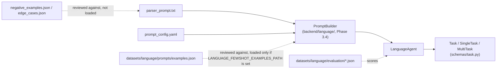

# backend/prompts/ -- Language Parser Runtime Assets

**Why this directory exists:** this is everything the Language Parsing
Runtime (Phase 3.4, `backend/language/`) loads directly, at runtime, to
turn a raw natural language instruction into a `SingleTask` or
`MultiTask` (`backend/schemas/task.py`). Nothing in this directory
calls an LLM -- Phase 3.3 builds the assets; `backend/language/`'s
`PromptBuilder` and `LLMClient` are what actually invoke a model with
them (see `backend/docs/language_interface_spec.md` section 27 for the
full runtime design).

## Directory contents

| File | What it is | Read by |
|---|---|---|
| [`parser_prompt.txt`](parser_prompt.txt) | The system prompt itself -- role, rules, field definitions, and a handful of canonical worked examples | `backend/language/prompt_builder.py`'s `PromptBuilder`, verbatim, as the LLM system message |
| [`prompt_config.yaml`](prompt_config.yaml) | Decoding parameters, strictness mode, retry policy, model compatibility notes | `PromptBuilder`, to configure each LLM call |
| [`prompt_version.md`](prompt_version.md) | Version history and changelog for `parser_prompt.txt` | Engineers reviewing or authoring a prompt change; Phase 3.6 benchmarking, to tag results by prompt version |
| `README.md` (this file) | Map of this directory and how it relates to `datasets/language/` | Anyone orienting themselves in the parser asset package |

## Why this is *not* where examples and benchmarks live

An earlier draft of this phase put few-shot examples, negative
examples, edge cases, and evaluation sets under
`backend/prompts/evaluation/`. That was deliberately restructured: this
directory holds only what a running Language Agent needs to load to
make one LLM call. Few-shot examples used for dynamic prompt
construction, negative/edge-case libraries used for prompt review and
regression testing, and evaluation benchmarks used to score parser
accuracy are all *data*, not runtime configuration -- and critically,
they are data that outlives any single prompt version and gets reused
for research purposes (comparing prompt versions, comparing LLM
providers, ablation studies) that have nothing to do with a live
Language Agent process.

That data now lives under
[`datasets/language/`](../../datasets/language/) at the repository
root, alongside (eventually) other non-language benchmark datasets this
project accumulates -- keeping "assets a running service loads" and
"datasets used for evaluation and research" in separate top-level
trees, the same way `models/` (weights) is already kept separate from
`backend/config/` (the code that loads them).

```
backend/prompts/                    <- runtime assets (this directory)
    parser_prompt.txt
    prompt_config.yaml
    prompt_version.md
    README.md

datasets/language/                  <- research & benchmark assets
    prompts/
        examples.json                Few-shot examples (diverse valid commands)
        negative_examples.json       Anti-pattern outputs the parser must never produce
        edge_cases.json               Ambiguous / unknown / pronoun / spatial edge cases
    evaluation/
        success_cases.json           Correctness benchmark
        failure_cases.json           Robustness / hallucination-resistance benchmark
        ambiguity_cases.json         Clarification-detection benchmark
```

See [`datasets/language/`](../../datasets/language/) directly for the
data itself, and
[`backend/docs/language_interface_spec.md`](../docs/language_interface_spec.md)
(section 26, "Language Parser Assets") for the full design rationale
behind every file in both trees, including how Phase 3.4-3.7 are
expected to consume them.

## How the pieces fit together



The dotted lines matter: `negative_examples.json` and `edge_cases.json`
are what a prompt engineer reviews `parser_prompt.txt` against when
authoring a change -- they are never loaded by any runtime code.
`examples.json` is reviewed the same way by default, but `PromptBuilder`
*can* load it for dynamic few-shot injection -- opt-in only, via
`PromptAssetPaths.few_shot_examples_path`
(`backend/language/config.py`'s `LANGUAGE_FEWSHOT_EXAMPLES_PATH`), never
by default. See `backend/docs/language_interface_spec.md` section 27.9.
`evaluation/*.json` scores the Language Agent's actual behavior; it is
never consulted by the prompt or the agent while running, only by
whatever benchmarking harness Phase 3.6 builds.

## Extending this package

- **Changing prompt wording or adding an example to `parser_prompt.txt`
  itself:** update `prompt_version.md` with a new entry (see its
  versioning policy) and bump `prompt_config.yaml`'s `prompt_version`
  to match.
- **Adding a new few-shot, negative, or edge-case example:** add it to
  the relevant file under `datasets/language/prompts/`, not to this
  directory -- see that directory's own documentation for the required
  shape.
- **Adding a new evaluation case:** add it to the relevant file under
  `datasets/language/evaluation/`, keeping it disjoint from every
  example already in `parser_prompt.txt` and
  `datasets/language/prompts/` (an evaluation case that the model has
  already seen verbatim in-prompt does not measure generalization).
- **Adding a new field to the JSON contract:** the schema
  (`backend/schemas/task.py`) changes first, then `parser_prompt.txt`
  is updated to describe and demonstrate the new field, then this
  directory's version files are updated to record both. See
  `parser_prompt.txt`'s own EXTENSION GUIDANCE section for the full
  ordering rule.
