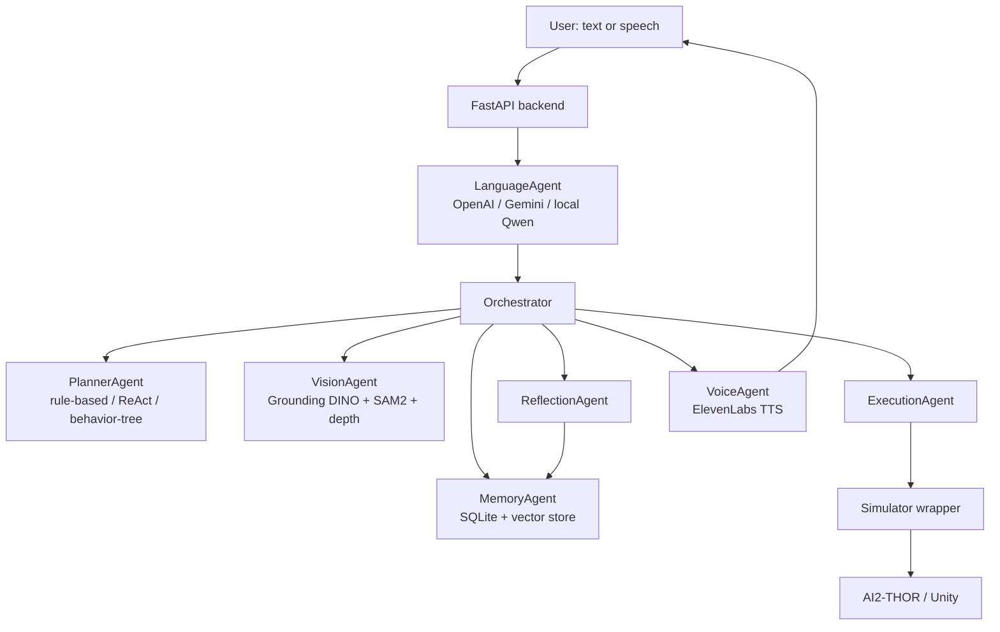
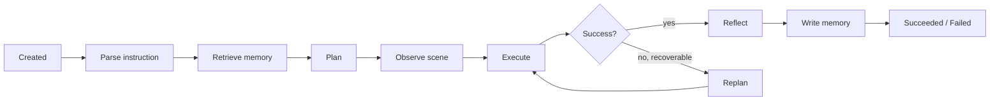
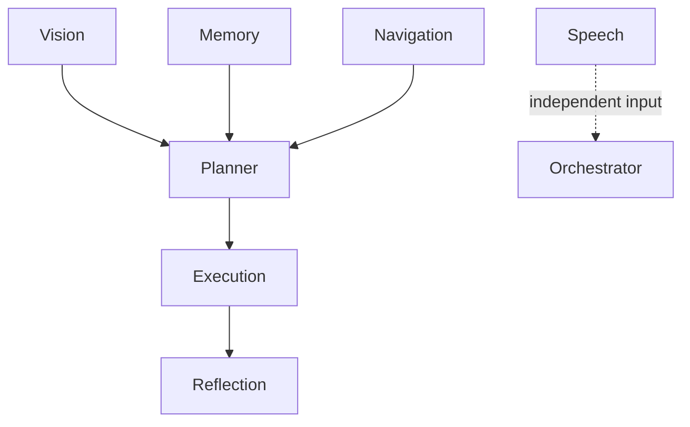

# MILO — Architecture

These diagrams describe the *actual* implemented architecture, verified
against the backend source during Phase 8.6 (not the illustrative pipeline
sketched in early planning docs). Where the two differ, this document is
correct.

## System architecture

The `Orchestrator` (`backend/orchestration/orchestrator.py`) is a single,
process-wide instance built once at startup — it does not use a
message bus or pub/sub between agents; every step is a direct, typed
method call it makes on each agent wrapper, in a fixed sequence (see
below). It also publishes an append-only event log
(`backend/agents/events.py`) as it goes, which is what the frontend's
Activity feed and per-task event log poll.

## Task lifecycle (real, from `Orchestrator.run()`)

Replanning is bounded (`DEFAULT_MAX_REPLANS = 2`) — a task that keeps
failing terminates as `failed`, it does not loop forever. This maps
directly onto `TaskStatus`: `created → parsing → retrieving_memory →
planning → executing → reflecting → replanning → succeeded | failed |
cancelled`.

## Agent architecture (real, from `backend/agents/*.py`)

Registered agent names (exactly what `GET /api/v1/agents` reports, and
what the frontend's `AgentArchitectureDiagram`/`AgentStatusList`
render): `vision`, `memory`, `planner`, `navigation`, `execution`,
`reflection`, `speech`. Each agent's state (`idle | active | thinking |
waiting | error | shutdown`) is real, backend-tracked state — never a
frontend-derived approximation.

## Frontend state architecture

Six React contexts compose the frontend's picture of MILO, each a thin
polling wrapper around a real backend endpoint (no WebSocket/SSE exists
anywhere in this stack — polling, via a shared `usePolling` hook, is the
real-time mechanism throughout):

| Context | Backend source | What it holds |
|---|---|---|
| `TaskContext` | `GET/POST /api/v1/tasks*` | active task, plan, events, robot state, task history |
| `AgentsContext` | `GET /api/v1/agents` | per-agent live state |
| `SpeechContext` | `GET/POST /api/v1/speech*` | mic capture + STT lifecycle |
| `VoiceContext` | `GET/POST /api/v1/voice*` | ElevenLabs TTS playback |
| `MiloStateContext` | derived from the four above | one canonical `MiloState` for every avatar/indicator on the page |
| `SettingsContext` | `localStorage` only | user preferences (no backend) |

`MiloStateContext` is the single source of truth for MILO's visual
state — every page reads it via `useMiloState()` rather than deriving
its own approximation (see `docs/architecture/milo_state_system.md`).

## Simulator

`backend/simulator/simulator.py` is the only interface the rest of the
codebase is allowed to call into AI2-THOR through
(`backend/simulator/ai2thor_env.py` is the sole place that imports
`ai2thor.controller.Controller`). It is off by default
(`VISION_ENABLE_SIMULATOR=false`) — enabling it launches a real Unity
subprocess. `navigate_to()` is deliberately teleport-based (uses
AI2-THOR's `GetInteractablePoses` + `TeleportFull`, not a path-planning
walk) — a documented scope limit, not a hidden shortcut.
