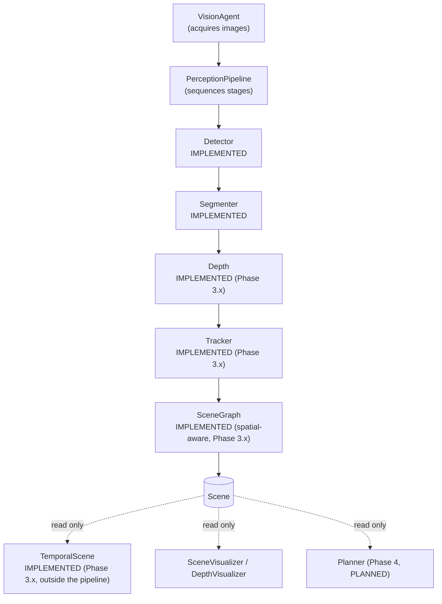

# Architecture: The Perception Pipeline

This document explains *why* the perception system is shaped the way
it is. It is not a how-to-run-it guide -- see
[`docs/phases/phase2_vision.md`](../phases/phase2_vision.md) for what
each module does, and the module docstrings for implementation
detail.

## The shape of the problem

A perception stack for an embodied agent is not one model -- it's a
growing list of them: detection, segmentation, depth, tracking, scene
understanding, and eventually learned variants of each. Two forces are
in tension:

- Every new capability should be addable without a cascade of edits
  to unrelated files.
- Every downstream consumer (a renderer, a planner, a benchmark
  script) should be able to depend on "the current perception result"
  without knowing which specific models produced it.

The architecture below is the answer to both: a shared data structure
(`Scene`) that stages enrich through a uniform interface
(`process(image, scene)`), sequenced by a dedicated orchestrator
(`PerceptionPipeline`) that a thin `VisionAgent` delegates to.

**Phase 3.x update:** `depth=`/`tracker=` are no longer reserved-but-empty
-- see `vision/depth/`, `vision/tracking/`, and
[`docs/architecture/spatial_perception.md`](spatial_perception.md) for
the full depth/tracking/temporal-scene architecture. `TemporalScene`
(multi-frame diffing) is explicitly **not** a pipeline stage -- `Scene`
stays single-frame by design; see that document's "Temporal Scene"
section for why.

## Why `VisionAgent` is now thin

`VisionAgent` used to do two unrelated things: acquire frames from the
`Simulator`, and hardcode the perception stage sequence
(`scene = detector.process(...); scene = segmenter.process(...)`).
Those two responsibilities change for different reasons and at
different rates -- image acquisition has been stable since Phase 2.1,
while the stage list has grown every phase since (detector -> +segmenter
-> +visualization -> soon +scene graph) and will keep growing (depth,
tracking).

Mixing them meant every new perception capability required editing
`VisionAgent`, even though `VisionAgent` itself had nothing to do with
that capability. Today `VisionAgent` does exactly one thing --
`get_rgb_image()` / `save_image()` -- plus constructing a
`PerceptionPipeline` from whichever stage keywords it's given and
delegating to it in `perceive()`. It knows that *a* pipeline runs, not
what's in it.

## Why `PerceptionPipeline` exists

`PerceptionPipeline` owns exactly one thing: given `(image, scene)`,
call `process` on each configured stage, in a fixed order, and return
the result. It holds an ordered list of optional stages
(`detector, segmenter, depth, tracker, scene_graph`) and skips any
that are `None`.

This isolates "what order do stages run in, and which are enabled"
from both "how do I get an image" (`VisionAgent`) and "what does each
individual stage do" (the stages themselves). Adding depth estimation
later is `PerceptionPipeline(depth=DepthAnything())` -- a new
constructor argument passed to an existing class, not new
orchestration logic and not an edit to `VisionAgent`, `Scene`, or any
existing stage.

## Why every module follows `process(image, scene)`

Every stage -- detector, segmenter, and future depth/tracking/scene-graph
stages -- exposes the exact same signature: take the current frame and
the `Scene` built so far, enrich it, return it. Concretely, this
means:

- `PerceptionPipeline` can treat every stage identically -- no
  `if isinstance(stage, Detector): ... elif isinstance(stage, Segmenter): ...`
  branching. Iterating the stage list and calling `.process(image, scene)`
  is the entire orchestration loop.
- A stage that needs *upstream* output (a segmenter needs the
  detector's boxes; a scene graph stage needs objects with boxes/masks
  already in place) gets it for free, because `scene` already carries
  whatever earlier stages added -- there's no separate return value to
  thread through.
- A detector-specific need (a text prompt) doesn't break the shared
  signature: it travels as `scene.metadata[SceneMetadata.DETECTION_PROMPT]`
  instead of becoming a third positional argument only detectors have.

## Why `Scene` is the shared data structure

Without a shared structure, each stage would invent its own return
shape -- a list of boxes here, a raw mask array there -- and every
consumer would need to know the specific shape each specific model
produces. `Scene` (and its `Detection`/`Mask` fields) is the one
object every stage reads from and writes to, and the one object every
downstream consumer (visualizer, planner, memory, a benchmark script)
depends on. A consumer written against `Scene` keeps working
regardless of which detector, segmenter, or scene-graph implementation
actually produced it.

This is also why `Scene`'s not-yet-implemented fields (`robot_state`,
`relationships`, `Detection.depth`, `Detection.tracking_id`) are
declared as placeholders now rather than added when their producing
stage lands: it lets stages that already exist be written against the
*final* shape of `Scene`, so wiring in a real depth or scene-graph
stage later is filling in a field, not a breaking schema change for
every existing consumer.

## Why modules never communicate directly

No stage imports another stage. `SAM2Segmenter` does not import
`GroundingDINODetector`; a future scene-graph stage will not import
`SAM2Segmenter`. Every stage's only dependency is the `Scene`
(and `Detection`/`Mask`) data model. This is what makes each stage
independently swappable and independently testable: `SAM2Segmenter`
can be replaced by a different segmenter, or removed entirely by
passing `segmenter=None`, and no other stage's code needs to know that
happened, because no other stage ever referenced it -- only the
`Scene` it left behind.

## Why visualization is separate

`SceneVisualizer` is not a pipeline stage. It depends on `Scene` like
every stage does, but it never runs inference and never mutates
`Scene` or the image it's given -- it only reads a finished `Scene`
and produces a new rendered image. Keeping it outside
`PerceptionPipeline` (called by a caller *after* `pipeline.process(...)`
returns, not by the pipeline itself) enforces that boundary
structurally: rendering code can depend on OpenCV, but no perception
stage's inference code should ever depend on drawing calls, and a
`Scene` should always remain safe to keep using for planning after
it's been rendered.

## How future modules plug into the pipeline

Adding a new stage (a real depth estimator, a tracker, a learned scene
graph model) means:

1. Implement a `Base<Stage>` ABC (mirroring `BaseDetector`/
   `BaseSegmenter`/`BaseSceneGraph`) declaring `process(image, scene) -> Scene`.
2. Implement the concrete class, owning only that stage's inference
   logic -- weight loading goes through `ModelManager`, same as every
   existing stage.
3. Pass an instance to `PerceptionPipeline`'s matching constructor
   keyword (already reserved: `depth=`, `tracker=`, `scene_graph=`).

No change to `VisionAgent`, `PerceptionPipeline`'s orchestration logic,
`Scene`, or any other existing stage is required. This is the
architecture's central bet: growth happens by adding files and
constructor arguments, not by editing what already works.

This was proven, not just designed: `vision/scene_graph/base_scene_graph.py`
and `heuristic_scene_graph.py` (Phase 2.8) were added after
`PerceptionPipeline` and `VisionAgent` already reserved a
`scene_graph=` slot, and wiring `HeuristicSceneGraph` in required
editing neither -- only constructing
`PerceptionPipeline(scene_graph=HeuristicSceneGraph())`. Phase 3.x
proved it again for `depth=` and `tracker=`: `vision/factory.py`
constructs `GroundTruthDepthEstimator`/`DepthAnythingEstimator` and
`IoUTracker` and passes them into those same reserved constructor
keywords -- again, zero changes to `VisionAgent`, `PerceptionPipeline`,
`Scene`, or any existing stage.

## Phase 3.x additions (see `spatial_perception.md` for full detail)

- **2D -> 3D localization** is *not* a 6th pipeline stage -- it's a pure
  function (`vision/spatial/localization.py`) called from inside the
  depth stage's `process()`, since it has no model/state of its own and
  adding a stage would mean changing `PerceptionPipeline.__init__`'s
  frozen signature for no benefit.
- **Persistent object identity** (`vision/tracking/track.py`'s `Track`)
  lives in the tracker's own state, not on `Detection` -- `Detection`'s
  frozen schema only gained a *filled-in* `tracking_id`, never a new
  field.
- **Temporal scene representation** (`vision/temporal/`) is a new
  orchestration object built *outside* `vision/pipeline/`, wrapping
  repeated `VisionAgent.perceive()` calls -- because `Scene` is
  single-frame by design and its schema is frozen.
- **Scene-graph relationships** gained a depth-aware `NEAR` predicate,
  additive to the existing 2D predicates (`scene/relationship.py`) --
  when no depth stage is configured, `HeuristicSceneGraph`'s output is
  byte-for-byte the same as Phase 2.
