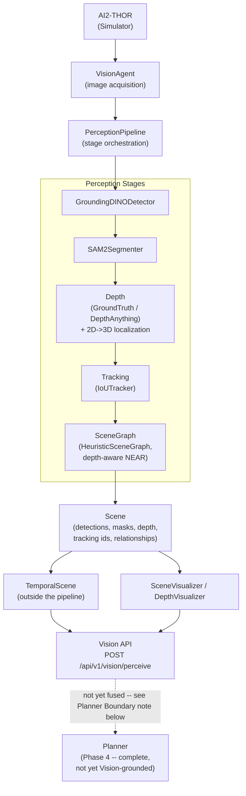
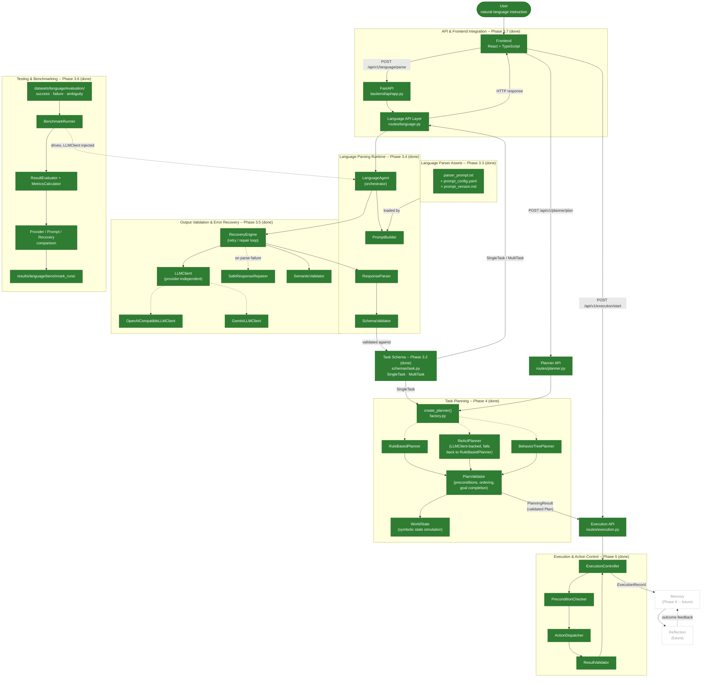
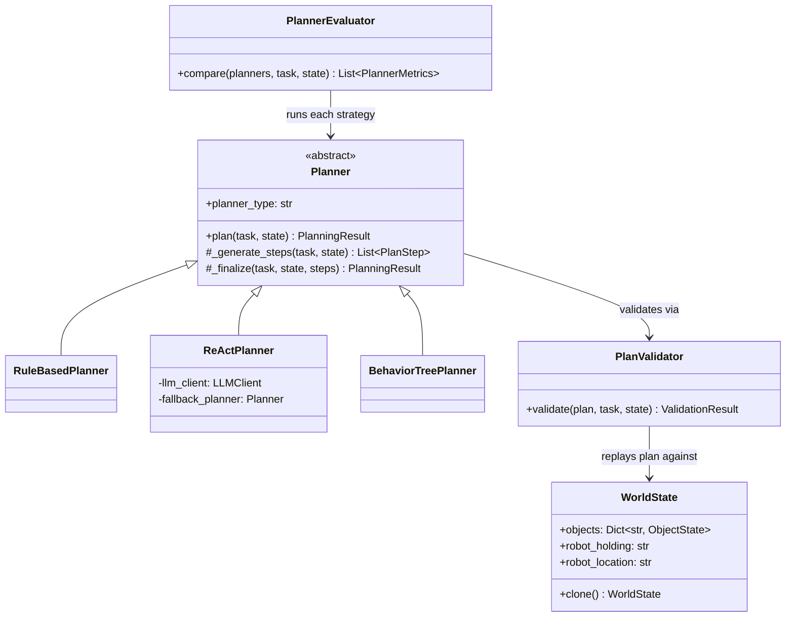
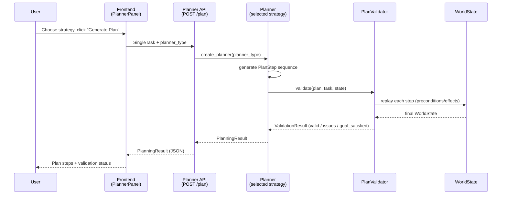
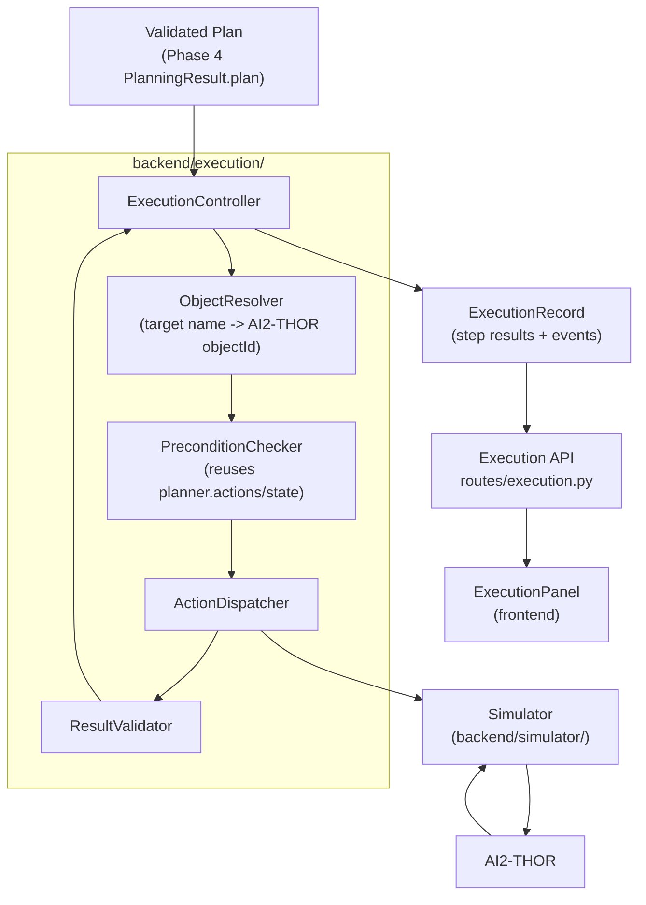
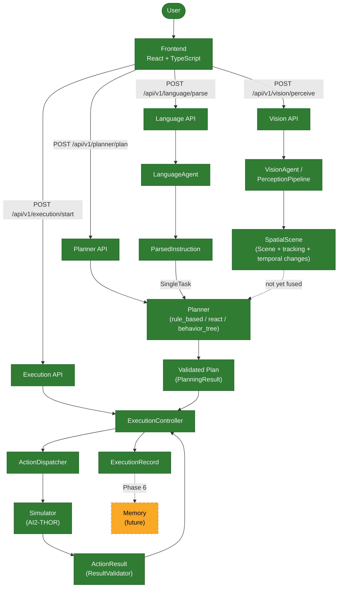

# Pre-Orchestrator Pipeline Architecture (Historical Snapshot, Phases 2–5)

> **Historical document.** This captures the system architecture as
> it existed through Phase 5 (Perception, Language pipeline, Task
> Planning, Execution) — before the Phase 7 `Orchestrator`/agent
> rewrite added Memory, Reflection, and dynamic replanning. Where this
> document says something is "future" (e.g. Memory, Reflection), that
> is now superseded — see
> [`docs/application/architecture.md`](../application/architecture.md)
> for the current architecture and
> [`phase8_7_final_audit.md`](../phases/phase8_7_final_audit.md) for current
> verified status. Kept for its detailed, accurate implementation-level
> record of Phases 2–5 (class diagrams, sequence diagrams, API
> contracts, module-by-module rationale).

### Perception (Phase 2, complete + Phase 3.x Spatial & Temporal Perception)



See [`docs/architecture/perception_pipeline.md`](perception_pipeline.md)
for the Phase 2 pipeline rationale and
[`docs/architecture/spatial_perception.md`](spatial_perception.md)
for the Phase 3.x depth/localization/tracking/temporal-scene design
(coordinate conventions, depth units, track lifecycle, benchmarking,
limitations).

**Phase 2 API freeze:** `VisionAgent.perceive()`, `PerceptionPipeline.process()`,
the `process(image, scene)` stage contract, and the `Scene`/`Detection`/
`Relationship`/`Mask` data model are frozen as v1.0 public interfaces --
Phase 3.x built entirely by filling in fields/keywords this freeze
already reserved, with zero changes to any of them. Language, Planner,
Memory, Execution, and Frontend modules should depend only on these --
see
[`docs/architecture/api_contracts.md`](api_contracts.md).
The new `POST /api/v1/vision/perceive` HTTP endpoint is explicitly
**not** part of this freeze (Phase 3.x is still active).

### Language pipeline (Phase 3, in progress)

Implementation status shown explicitly -- solid/filled boxes exist and
are tested today; dashed boxes are planned or future work with no code
written yet:



See [`backend/docs/language_interface_spec.md`](../../backend/docs/language_interface_spec.md)
(section 7 for the Phase 3.3 asset diagram, section 27 for the Phase
3.4 runtime architecture, section 28 for the Phase 3.5 output
validation & error recovery architecture -- failure taxonomy, retry
policy, safe repair, semantic validation, and the Gemini/OpenAI
provider abstraction; section 29 for the Phase 3.6 evaluation
framework -- benchmark runner, metric definitions, provider/prompt
comparison, and recovery evaluation; section 30 for the Phase 3.7
API/frontend architecture, endpoint contract, error mapping, and
security boundary) for the complete design record.

### Task Planning (Phase 4, complete)

Phase 4 (`backend/planner/`) turns a validated `SingleTask` (Phase 3's
output) into a validated, ordered sequence of **abstract** `PlanStep`s
-- `PlanStep(action="navigate", target="apple")`, never an AI2-THOR
action name (`MoveAhead`, `PickupObject`, ...). This package never
imports `simulator/` and never calls AI2-THOR; that boundary is
load-bearing, not a style preference -- it is what lets every planning
strategy be unit-tested against a purely symbolic `WorldState`, with no
Unity/AI2-THOR process required anywhere in this phase's test suite,
and what lets Phase 5 swap in a different simulator later without
touching this package at all. See
[`backend/planner/__init__.py`](backend/planner/__init__.py) for the
full module map and rationale.

**Three interchangeable planning strategies**, all behind one
`Planner.plan(task, state) -> PlanningResult` interface
(`planner/planner.py`), selected via a single factory
(`planner/factory.py::create_planner()`) so no caller ever branches on
`if planner_type == ...`:

- **`RuleBasedPlanner`** (`rule_based.py`) -- the deterministic
  baseline. A fixed, table-driven expansion from
  `goal`/`object`/`target` into `PlanStep`s, built from a small set of
  reusable primitives (`_locate`, `_navigate`, `_pickup`, `_open`,
  `_close`, `_place`, ...) that each copy their preconditions/effects
  from the action registry rather than inventing them. Zero LLM calls,
  zero randomness -- two identical tasks always produce byte-identical
  plans. Covers every canonical goal in `parser_prompt.txt`'s
  "SUPPORTED GOALS" catalog, falling back to a generic
  perceive-then-act template (never refusing) for anything else.
- **`ReActPlanner`** (`react.py`) -- an LLM-driven iterative strategy
  behind the *same* `Planner` interface: each iteration asks the LLM to
  reason about the current symbolic `WorldState` and propose exactly
  one next action as structured JSON, which is validated against the
  action registry and its preconditions **before** it is ever accepted
  as a `PlanStep` -- the LLM never executes anything, never emits
  Python, and never bypasses the action model. Reuses the existing
  Phase 3.4 `language.llm_client.LLMClient` abstraction (so a
  self-hosted, OpenAI-API-compatible Qwen/Llama server works exactly as
  well as OpenAI/Gemini) instead of inventing a second LLM client. If no
  LLM is configured, the LLM call fails, or the model's output stays
  malformed after a bounded repair-retry budget, it transparently falls
  back to `RuleBasedPlanner` (tagging `Plan.metadata["react_fallback"]
  = True`) -- the project stays fully testable with **no** LLM
  available, per this phase's own requirement.
- **`BehaviorTreePlanner`** (`behavior_tree.py`) -- expands a task into
  a Behavior Tree (`Sequence`, `Selector`/Fallback, `Condition`,
  `Action`, `Retry` node types) built by composing `RuleBasedPlanner`'s
  own goal templates, then "ticks" the tree against a `WorldState` to
  produce the identical `PlanStep` sequence the rule-based planner would
  -- while also exposing the tree itself
  (`Plan.metadata["behavior_tree"]`) for visualization and as a
  foundation for Phase 5's reactive failure handling (Experiment 5,
  below).

**Action model, preconditions, and postconditions** (`actions.py`) --
one `ActionSpec` per abstract action (`locate`, `navigate`, `pickup`,
`open`, `close`, `place`, `put_down`, ...), each declaring named
`Precondition`s (checked against a `WorldState` before the step is
accepted) and an effect function (how the step mutates `WorldState`
once accepted). This is the single source of truth every planner and
the validator read from -- no planner hardcodes "what does `open`
require".

**Plan validation** (`validator.py`) -- `PlanValidator.validate()`
replays every step of a `Plan` against a cloned `WorldState` in order
and reports a structured `ValidationResult`: unrecognized actions,
missing required parameters, unmet preconditions (this is what catches
"Place apple" before "Pickup apple", or "Close refrigerator" before it
was ever opened -- ordering/dependency checking falls directly out of
state simulation, not a separate ad hoc rule), duplicate/redundant
steps (warning, not error), and finally whether the resulting state
actually satisfies the task's goal (`GOAL_CHECKS`, keyed by goal name).
A plan is `valid` iff it has zero `severity="error"` issues.

**Symbolic state simulation** (`state.py`) -- `WorldState` is a
lightweight registry of per-object facts (location, `is_located`,
`is_near_robot`, `is_held`, `is_open`) plus the robot's own
holding/location fields -- just enough to validate this phase's action
vocabulary, deliberately not a full STRIPS/PDDL state representation.
This is what lets the entire planner test suite run with **zero**
AI2-THOR/Unity dependency.

**Evaluation framework** (`evaluation.py`) -- `PlannerEvaluator.compare()`
runs multiple strategies against the identical task/starting state
(cloned per run so no strategy's simulation leaks into another's) and
reports real, freshly measured `PlannerMetrics` for each: success,
validity, goal satisfaction, latency, step count, invalid-action count,
redundant-step count. Every number comes from an actual `PlanningResult`
-- this module never fabricates a metric. This is the foundation for
this project's planned Experiment 1 (Rule-based vs. ReAct vs. Behavior
Tree) and Experiment 6 (latency vs. task complexity).





**API** (`api/routes/planner.py`, prefixed `/api/v1/planner`):

| Endpoint | Purpose |
|----------|---------|
| `POST /plan` | Generate and validate a `Plan` for one `SingleTask` using a chosen strategy (`rule_based` \| `react` \| `behavior_tree`). Returns a `PlanningResult`. |
| `POST /validate` | Validate a caller-supplied `Plan` against a task, independent of how it was generated. |
| `POST /evaluate` | Run every (or a requested subset of) planning strategy against the same task and return measured comparison metrics. |

Every endpoint plans against a fresh `WorldState.initial()` -- grounding
a `WorldState` from Vision's `SpatialScene` is explicitly future work
(see "Planner boundary" in
[`docs/architecture/spatial_perception.md`](spatial_perception.md)
and [Future Phases](#future-phases) below); Vision and Planning are not
yet fused, matching the same "neither is combined with the other yet"
boundary this README already documents for Vision and Language. This
router never raises for an ordinary "plan is invalid" or "goal
unreachable" result -- those are normal `200` responses a client
inspects via `success`/`valid`, exactly like the Language API's
`needs_clarification` case; the only non-2xx case is an unrecognized
`planner_type` string (`422`).

**Frontend** (`frontend/src/components/PlannerPanel.tsx`,
`PlanStepsList.tsx`, `ValidationPanel.tsx`, `PlannerComparisonTable.tsx`)
-- rendered directly beneath a parsed task's `TaskCard` in
`ResultView.tsx` (for a `MultiTask` result, a subtask selector lets the
user pick which one to plan), demonstrating the Phase 3 → Phase 4
pipeline live: a strategy selector (Rule Based / ReAct / Behavior
Tree), a "Generate Plan" action showing each step with its
action/target/pre-postconditions, a validation panel (✓/✗ per issue,
severity-coded), and a "Compare Strategies" action rendering a live
metrics table across all three strategies for the current task -- never
fabricated placeholder numbers, always a fresh `/evaluate` call.

**Tests** -- 70 backend unit/integration tests with zero AI2-THOR/LLM
dependency (`backend/tests/test_planner_models.py`,
`test_planner_state_actions.py`, `test_planner_rule_based.py`,
`test_planner_validator.py`, `test_planner_react.py` (LLM client
mocked/absent -- exercises both the structured-output path and the
fallback path), `test_planner_behavior_tree.py`,
`test_planner_factory.py`, `test_planner_evaluation.py`,
`test_planner_e2e.py` (Language → Planner → Validator, end to end,
no simulator), `test_api_planner.py`), plus 12 frontend tests
(`frontend/src/api/planner.test.ts`,
`frontend/src/components/PlannerPanel.test.tsx`).

### Execution (Phase 5, complete)

Phase 5 (`backend/execution/`) closes the loop: it takes a validated
Phase 4 `Plan` and actually drives it through AI2-THOR, step by step,
never assuming a dispatched action succeeded just because the
simulator call returned. This is the layer this entire project's
architecture was built to hand off to -- `backend/planner/` never
imports `simulator/` and never calls AI2-THOR; `backend/execution/` is
the *only* package allowed to translate an abstract `PlanStep` into a
concrete simulator action, and it never imports AI2-THOR directly
either (only through `simulator.simulator.Simulator`), so a future
Habitat/Isaac Sim/ROS2 backend could replace `simulator/`'s
implementation without this package, the Planner, or the frontend ever
changing:

```
Planner (Phase 4)              -- WHAT to do      -> abstract PlanStep
Execution (Phase 5, this section) -- HOW to do it  -> concrete Action + dispatch
Simulator (backend/simulator/)  -- perform it      -> AI2-THOR call
```



**Standardized action model** (`execution/models.py`) -- `ActionType`
(`move_ahead`, `move_back`, `rotate_left`, `rotate_right`, `look_up`,
`look_down`, `navigate`, `pickup`, `put`, `open`, `close`, `locate`),
`Action` (serializable, type-safe, simulator-independent parameters),
and `ActionResult` (`success`, `action`, `error`, `error_code`,
`metadata`, `duration_ms`, `retry_count`) -- section 2/7's contract,
usable by the API, the frontend, and tests alike.

**Action dispatcher** (`execution/dispatcher.py`) -- `ActionDispatcher`
is the single centralized boundary translating one `Action` into
exactly one `Simulator` method call (`ActionType.PICKUP ->
Simulator.pickup_object()`, `ActionType.NAVIGATE ->
Simulator.navigate_to()`, ...). No other module ever calls a
`Simulator` method to carry out a plan step. `Simulator`/`AI2ThorEnv`
(`backend/simulator/`) gained the manipulation/navigation methods this
required (`pickup_object`, `put_object`, `open_object`,
`close_object`, `navigate_to`) alongside the pre-existing Phase 1
movement primitives -- `navigate_to()` uses AI2-THOR's own
`GetInteractablePoses` + `TeleportFull` (a standard AI2-THOR idiom for
"get next to an object"), not a path-planning walk; see that method's
docstring for why full navigation research is explicitly out of scope
here.

**Object resolution** (`execution/resolver.py`) -- `ObjectResolver`
translates a `PlanStep`'s human-readable `target` (e.g. `"apple"`) into
a live AI2-THOR `objectId` by reading `Simulator.get_metadata()` --
the one seam that couples an abstract plan to a concrete scene, kept
narrow and swappable (a future Vision-grounded resolver replaces just
this file).

**Preconditions** (`execution/preconditions.py`) -- `PreconditionChecker`
reuses `planner.actions.ACTION_REGISTRY`/`planner.state.WorldState`
directly (the same objects `PlanValidator` already validated the plan
against) for symbolic checks (ordering, held/near/open state), plus
grounded existence checks this package alone can make (does a live
object actually match this step's target right now). The executor
never dispatches an action whose preconditions were not checked.

**Result validation** (`execution/validator.py`) -- `ResultValidator`
never treats a simulator response as automatically successful: it
checks whether the call executed at all, whether AI2-THOR reported
success (`lastActionSuccess`), and -- where this project's action
vocabulary makes it checkable -- whether the expected ground-truth
state change is actually present (`isOpen` for open/close, the agent's
`inventoryObjects` for pickup/put). A step AI2-THOR marks successful
but whose expected state did not change is reported as
`VALIDATION_FAILED`, not success.

**Execution controller** (`execution/controller.py`) -- `ExecutionController`
executes a `Plan` sequentially (resolve -> check preconditions ->
dispatch -> validate -> update `WorldState`/`PlanStep.status` -> next
step), mutating the real `Plan`/`PlanStep.status` fields in place
exactly as `planner/models.py`'s own docstring anticipates. Halts on
the first unrecoverable step failure and marks every remaining step
`SKIPPED` (Phase 4's own preconditions mean they would fail anyway).
Supports bounded, explicit retries (`max_step_retries`, default `0`,
only for transient-looking error codes -- never unbounded), a
per-action timeout (`step_timeout_s`), and cooperative cancellation
(`cancel()`, checked at the next step boundary) -- never an infinite
retry loop, never silent partial-success reporting.

**Execution state** (`execution/models.py`, `planner/models.py`) --
plan-level: `ExecutionStatus` (`PENDING`/`RUNNING`/`SUCCESS`/`FAILED`/
`CANCELLED`, on the Phase-5-owned `ExecutionRecord`) and the mirrored
`PlanStatus` (now including a Phase-5-added `CANCELLED`) on the
`Plan` object itself. Step-level: `StepStatus`
(`PENDING`/`RUNNING`/`COMPLETED`/`FAILED`/`SKIPPED`, plus two Phase-5
additions -- `BLOCKED` for a precondition rejection and `CANCELLED`).
Both are reused from `planner/models.py`, not duplicated, per that
module's own docstring inviting Phase 5 to own these transitions.

**Error taxonomy** (`execution/errors.py`) -- a closed
`ExecutionErrorCode` enum (`INVALID_ACTION`, `INVALID_PARAMETER`,
`PRECONDITION_FAILED`, `OBJECT_NOT_FOUND`, `TARGET_NOT_FOUND`,
`OBJECT_NOT_REACHABLE`, `NAVIGATION_FAILED`, `SIMULATOR_ERROR`,
`ACTION_TIMEOUT`, `EXECUTION_CANCELLED`, `VALIDATION_FAILED`,
`UNKNOWN_ERROR`) and a structured `ExecutionError` (machine-readable
`code`, human-readable `message`, `step_id`, `action`, a `recoverable`
hint for a future replanning layer) -- never an arbitrary string.

**Execution history** (`execution/models.py`'s `ExecutionRecord`) --
every action produces an `ExecutionEvent` (timestamped, with
duration/error code where relevant); `ExecutionRecord` aggregates
per-step results, the full event log, and start/finish timestamps into
one clean, storage-agnostic, JSON-serializable record -- deliberately
not written to a database by this package (a future Phase 6 Memory
Agent owns persistence; this is exactly the shape it is expected to
consume as an episodic experience).

**API** (`api/routes/execution.py`, prefixed `/api/v1/execution`):

| Endpoint | Purpose |
|----------|---------|
| `POST /start` | Begin executing a validated `Plan` (typically `PlanningResult.plan`) on a background thread; returns immediately (202) with the initial `ExecutionRecord`. `503` if no simulator is running, `409` if another execution is already in progress, `422` if the plan is invalid/empty. |
| `GET /{execution_id}` | Current `ExecutionRecord` (status, per-step results, events, error) -- poll this for live progress. |
| `POST /{execution_id}/cancel` | Requests cancellation; takes effect at the next step boundary. |
| `GET /{execution_id}/steps` | Per-step results only. |
| `GET /{execution_id}/events` | The structured execution event log only. |

Like the Vision API, this router requires a running `Simulator`
(`VISION_ENABLE_SIMULATOR=true` + a reachable AI2-THOR binary) and
returns a clean `503 execution_unavailable`, never a crash, when one
is not configured.

**Frontend** (`frontend/src/components/ExecutionPanel.tsx`,
`ExecutionStepsList.tsx`, `ExecutionLog.tsx`) -- rendered by
`PlannerPanel.tsx` directly beneath a generated plan's steps/validation
(mirroring how `PlannerPanel` itself is rendered beneath a parsed
task): an "Execute Plan" action (disabled for an invalid plan), a live
robot-state banner (`PENDING`/`RUNNING`/`SUCCESS`/`FAILED`/
`CANCELLED`), the current plan re-rendered with live per-step status
and errors, a timestamped execution log, and a "Cancel" action while
running. Polls `GET /{execution_id}` on a fixed interval rather than a
websocket/SSE stream -- a simpler transport this research dashboard's
polling need does not require.

**Tests** -- 62 backend unit/integration tests with zero AI2-THOR
dependency (`backend/tests/test_execution_models.py`,
`test_execution_dispatcher.py`, `test_execution_preconditions.py`,
`test_execution_validator.py`, `test_execution_controller.py` (real
Phase 4 `Plan`s executed against a `FakeSimulator` -- success,
unresolvable-target halt-and-skip, simulator-reported failure, bounded
retry recovery, retry ceiling, timeout, cancellation),
`test_api_execution.py` (full Planner -> Execution HTTP flow, 503/404/
409/422 error mapping, concurrent-start rejection, cancel-while-running)),
plus a small opt-in real-AI2THOR end-to-end suite
(`backend/simulator/test_execution_e2e.py`, `RUN_SIMULATOR_TESTS=true`,
never run in CI -- movement, rotation, pickup, open, put, and the full
"store the apple in the refrigerator" task driven through the real
`ExecutionController`), plus 10 frontend tests
(`frontend/src/api/execution.test.ts`,
`frontend/src/components/ExecutionPanel.test.tsx`).

See [`docs/phases/phase5_execution.md`](../phases/phase5_execution.md)
for the complete design record: the full architecture map, the action
lifecycle, the failure lifecycle, and every documented limitation.

### Overall architecture

How the Vision, Language, Planner, and Execution subsystems relate to
the frontend and to each other today. Language → Planner → Execution
**is** combined (a parsed task can be planned and then executed
directly from the UI); Vision → Planner/Execution is **not yet
combined** -- a plan is planned and executed against a fresh symbolic
`WorldState`, not one grounded in a live Vision scene (see the
Execution section above):



