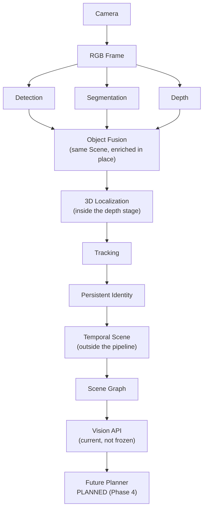
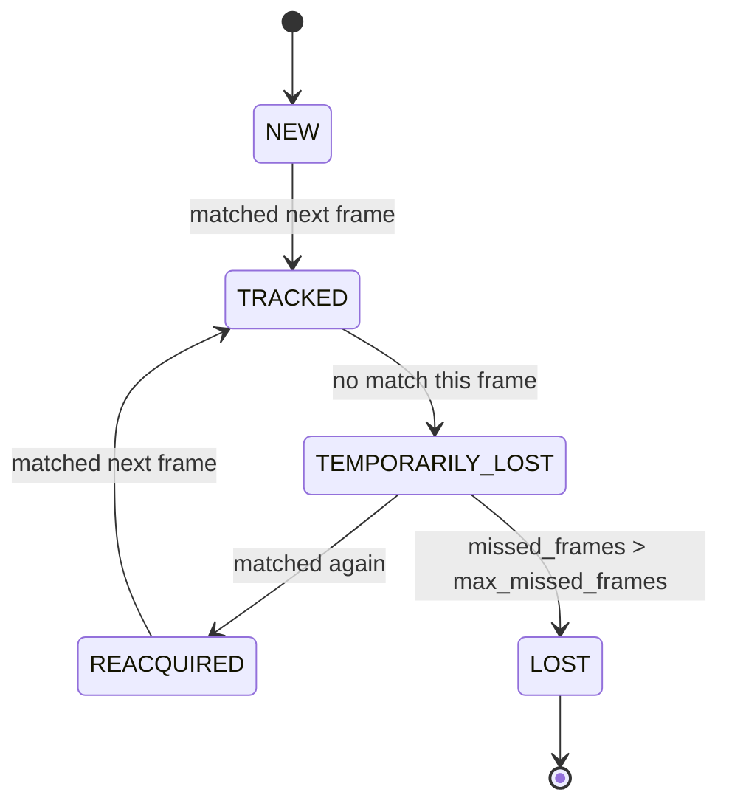

# Architecture: Spatial & Temporal Perception (Phase 3.x)

This document explains the depth, 3D localization, tracking, and
temporal-scene subsystems added on top of the Phase 2 perception
pipeline (see [`perception_pipeline.md`](perception_pipeline.md) and
[`api_contracts.md`](api_contracts.md) for that foundation, which this
phase extends without modifying). It answers the questions the
[README](../../.github/README.md) lists for Phase 3.x:

1. What objects are present? -- Phase 2 (unchanged).
2. Where are they in the image? -- Phase 2 (unchanged).
3. How far away are they? -- [Depth](#depth-estimation).
4. Where are they in 3D? -- [2D -> 3D Localization](#2d--3d-localization).
5. Is this the same object seen previously? -- [Tracking](#object-tracking--persistent-identity).
6. Where did the object move? -- [Temporal Scene](#temporal-scene-representation).
7. Which objects are currently visible? -- `Scene.detections` this frame.
8. Which objects temporarily disappeared? -- [Temporal Scene](#temporal-scene-representation) (`OCCLUDED`).
9. What can the future planner consume? -- [Planner boundary](#planner-boundary).



## Depth estimation

**Files:** `backend/vision/depth/`

Two interchangeable sources, both implementing `BaseDepthEstimator`:

| | `GroundTruthDepthEstimator` | `DepthAnythingEstimator` |
|---|---|---|
| Source | AI2-THOR `renderDepthImage` | Depth-Anything-V2-Small-hf |
| Scale | **Metric (meters)** | **Relative** (no fixed scale) |
| `SceneMetadata.DEPTH_SOURCE` | `"ground_truth"` | `"depth_anything"` |
| Requires | `Simulator(render_depth=True)` | Model download (`ModelManager`) |

**Never conflate the two.** Every `Scene` a depth stage touches is
stamped with `scene.metadata[SceneMetadata.DEPTH_SOURCE]`, and
`DepthAnythingEstimator`'s docstring documents in detail why its output
must never be labeled in meters or compared directly against ground
truth without the benchmark's `align_scale` (median-ratio) step first
(`backend/vision_evaluation/depth_metrics.py`).

### Object-level depth: robust, not bbox-center

`BaseDepthEstimator._extract_object_depth` takes the **median** depth
over all valid pixels in `detection.mask.binary` (preferred) or the
bbox region (fallback, before a segmenter has run) -- never a single
bbox-center pixel. "Valid" means finite, positive, and
`<= DepthConfig.max_plausible_depth_meters`. If fewer than
`DepthConfig.min_valid_pixel_ratio` of sampled pixels are valid,
`Detection.depth` is left `None` -- an explicit missing/invalid state,
never a guess from mostly-bad data. Both thresholds are configurable
(`VISION_MIN_VALID_DEPTH_RATIO`, `VISION_MAX_PLAUSIBLE_DEPTH_METERS`).

### Depth units

**Meters**, for ground-truth depth and `Detection.depth`/
`Scene.depth_image` in general -- this is the project-wide convention.
Depth-Anything's *pseudo-depth* is the one documented exception (see
table above): it is inverted (`1 / (relative + epsilon)`) so smaller
values still mean "closer" (matching meters' ordering), but it carries
no physical unit. `DepthConfig`/units are never silently mixed across
modules -- the source is always recoverable from `SceneMetadata.DEPTH_SOURCE`.

## 2D -> 3D Localization

**Files:** `backend/vision/spatial/`

`camera_intrinsics.py` defines `CameraIntrinsics` (`fx, fy, cx, cy,
width, height`) and `CameraIntrinsics.from_ai2thor_fov()`, which derives
a pinhole approximation from AI2-THOR's fixed `fieldOfView=90` (set once
in `simulator/ai2thor_env.py`, never changed per-frame):

```
fy = (height / 2) / tan(fov / 2)
fx = fy                      # square pixels assumed
cx = width / 2, cy = height / 2   # principal point centered
```

This is exact for AI2-THOR's synthetic camera (no lens distortion to
correct for); a real camera would need actual calibration instead (see
that file's docstring).

`localization.py::pixel_depth_to_camera_point(u, v, depth, intrinsics)`
is the inverse-pinhole projection: `X = (u-cx)*depth/fx`, `Y =
(v-cy)*depth/fy`, `Z = depth`.

### Coordinate convention (camera space) -- READ BEFORE CONSUMING `position_3d`

- **Origin:** the camera's optical center.
- **+X:** right, in the image plane.
- **+Y:** down (matches pixel row direction -- no sign flip needed).
- **+Z:** forward, into the scene (equals `depth`).
- **Units:** meters.
- This is the standard **computer-vision pinhole convention**, not a
  ROS/robotics (X-forward, Z-up) convention. Anything reading
  `Detection.position_3d` must use this convention.

### Why localization is not a 6th pipeline stage

It is a pure function of `(depth, bbox_center, intrinsics)` with no
model or state of its own. `BaseDepthEstimator.process()` calls it
directly (right after computing `Detection.depth`) rather than this
project adding a stage that would require changing
`PerceptionPipeline.__init__`'s frozen signature (see
[`api_contracts.md`](api_contracts.md)) for no real benefit.

### World space (optional, not wired into the pipeline)

`localization.py::camera_to_world(point, agent_position,
agent_yaw_degrees, agent_height_offset)` transforms a camera-space point
into AI2-THOR's Y-up world space, using the agent's yaw
(`event.metadata["agent"]["rotation"]["y"]`) and position. **Limitation:**
rotates by yaw only, ignoring `cameraHorizon` (camera tilt) -- documented
in that function's docstring. Not called anywhere in the perception
pipeline; it exists as a tested, ready building block for a future
planner/world-model that needs world-relative (not camera-relative)
positions.

## Object Tracking + Persistent Identity

**Files:** `backend/vision/tracking/`

`IoUTracker` (implements `BaseTracker`) assigns and maintains
`Detection.tracking_id` across repeated `PerceptionPipeline.process()`
calls on the same tracker instance (a tracker is inherently stateful --
see `base_tracker.py`'s "Statefulness note").

### Association strategy

Per pair `(detection, track)` with a matching label: cost is `1 - IoU`
if their boxes overlap; otherwise, when `TrackerConfig.use_3d_distance`
and both have `position_3d`, cost falls back to a normalized 3D
distance (if within `max_3d_distance_m`); otherwise the pair is
blocked. `scipy.optimize.linear_sum_assignment` (Hungarian algorithm)
solves the optimal one-to-one assignment over the resulting cost
matrix, chosen over greedy matching because it considers every pair
simultaneously rather than locking in a locally-good-but-globally-wrong
match. All thresholds are configurable
(`VISION_TRACKER_IOU_THRESHOLD`, `VISION_TRACKER_MAX_MISSED_FRAMES`,
`VISION_TRACKER_USE_3D_DISTANCE`, `VISION_TRACKER_MAX_3D_DISTANCE_M`).

### Track lifecycle



`Track` (`track.py`) holds `first_seen`, `last_seen`, `frame_count`,
`current_bbox`/`previous_bbox`, `current_position_3d`/
`previous_position_3d`, `status`, `confidence`, `missed_frames` --
**not** on `Detection` (frozen schema; see `track.py`'s docstring for
why this state lives in the tracker instead). `Detection.attributes["track_status"]`
mirrors the current status for consumers (scene graph, visualizer, API)
that only ever see `Detection`.

### Object permanence -- and its documented limit

A `TEMPORARILY_LOST` track keeps matching against new detections for
`max_missed_frames` frames (the bottle-occluded-then-visible-again
case). **Once a track reaches `LOST`, it is never re-matched** -- a
later reappearance of the same physical object starts a brand-new
track/ID. This project does not promise perfect re-identification:
without appearance features, nothing distinguishes "the same mug
reappeared" from "a different, identical mug appeared," and re-matching
an indefinitely-old lost track would risk far more false identity
merges than it fixes.

## Temporal Scene Representation

**Files:** `backend/vision/temporal/`

`Scene` is single-frame by design and frozen (see
[`api_contracts.md`](api_contracts.md)) -- temporal state cannot live
inside it. `TemporalScene` is a separate, stateful orchestrator built
*outside* `vision/pipeline/`: a caller (the API layer, a script) calls
`vision_agent.perceive(prompt)` itself and hands each resulting `Scene`
to `temporal_scene.update(scene, tracker=...)`.

`scene_diff.diff_scenes(previous, current)` is a pure function producing
`SceneChange`s keyed by `tracking_id`:

- **NEW** / **REAPPEARED** -- distinguished using the tracker's own
  `"reacquired"` status signal already on the detection, not re-derived.
- **MOVED** -- only when both detections have `position_3d` (2D bbox
  drift alone is not reliable evidence of physical movement); reports
  3D displacement in meters against a configurable `move_threshold_m`.
- **OCCLUDED** -- emitted the instant an object stops appearing.
  Optimistic by construction (diffing two scenes cannot know whether the
  tracker will later expire or reacquire that track).

`TemporalScene.update(scene, tracker=...)`, when given the same tracker
instance, upgrades a still-pending `OCCLUDED` entry to **REMOVED** once
that track reaches `TrackStatus.LOST` -- the one distinction only the
tracker's own state (not a pair of scenes) can make.

### Memory boundary

Tracking/temporal-scene asks *"is this the same object I saw
recently?"* over a short, bounded, in-process window
(`TemporalScene.history`, `deque(maxlen=...)`) -- never persisted, never
cross-session. A future long-term Memory system will ask *"what do I
remember about this object from previous tasks?"*, a different question
entirely. `TemporalScene` must never be extended into that; a future
Memory module would consume `TemporalScene`'s output, not replace it.

## Scene Graph Integration

**Files:** `backend/scene/relationship.py`,
`backend/vision/scene_graph/heuristic_scene_graph.py`

`HeuristicSceneGraph`'s Phase 2 2D-geometric relationships
(`LEFT_OF`/`RIGHT_OF`/`ABOVE`/`BELOW`/`INTERSECTS`/`INSIDE`/`OVERLAPS`)
are unchanged. When both detections in a pair have `position_3d`, a
`NEAR` relationship (new `RelationshipType`) is additionally emitted if
their 3D distance is within `NEAR_DISTANCE_THRESHOLD_M` (0.5m) --
*additive*, never a replacement for the 2D relationship. A
`DISTANCE_FROM_CAMERA`-style relationship was deliberately **not**
added: `Relationship.object_id` is defined as an index into
`scene.detections` (frozen schema), and there is no detection index for
"the camera" -- misusing the schema to represent that would violate the
freeze. Per-object distance from the camera is already available
directly via `Detection.depth`/`position_3d`; no relationship edge is
needed to express it.

## Vision Integration (`vision/factory.py`)

`build_vision_system(simulator, depth_source=...)` is the single place
a real, fully-wired `VisionAgent` (+ its tracker + a fresh
`TemporalScene`) is assembled -- used by `api/app.py` and available to a
future benchmark/planner. It only *constructs* existing classes; all
perception logic stays in the modules described above.

## API / Frontend boundary

`POST /api/v1/vision/perceive` (`backend/api/routes/vision.py`,
`backend/api/models/vision.py`) is the one HTTP entry point. It:

- Calls `VisionSystem.agent.perceive(prompt)`, updates
  `VisionSystem.temporal_scene`.
- Projects `Detection`/`Track` into the API's `SpatialObject` shape
  (a hand-written projection, since `Detection`/`Track` are plain
  dataclasses, not Pydantic -- see `api/models/vision.py`'s docstring).
- Renders the annotated camera image and depth colormap **server-side**
  (`SceneVisualizer`, `DepthVisualizer`) and returns them as base64 PNG
  -- the frontend never touches a model, the simulator, or a
  `Detection` directly.
- Returns a clean `503 vision_unavailable` when no simulator connection
  exists (see `api/app.py`'s `VISION_ENABLE_SIMULATOR` opt-in gate,
  below).

This endpoint is **explicitly not part of the Phase 2 API freeze** --
see [`api_contracts.md`](api_contracts.md)'s Phase 3.x note.

## Planner boundary

Nothing in this phase matches a `ParsedInstruction` (Language, Phase
3.4-3.7) against a `SpatialScene`/tracked objects (Vision, Phase 3.x).
That fusion, and any subsequent planning/execution, was **Phase 4**
(done -- see the root README's roadmap) for planning itself, and
**Phase C** for grounding the planner's `WorldState` in this phase's
`Scene` output: `backend/planner/grounding.py`'s
`ground_world_state()`, wired into
`orchestration.orchestrator.Orchestrator._observe()`.

`ground_world_state()` grounds five things from a `Scene`:
existence (`is_located`), proximity (`is_near_robot`), containment
(`location`, from `RelationshipType.INSIDE` edges), open/closed
state (`is_open`, from `Detection.attributes["is_open"]` -- see
`backend/vision/state/open_state_classifier.py`, a Grounding-DINO
phrase-grounded open/closed classifier reusing the already-loaded
detector, not a new model), and a depth-proxied held-object heuristic
(`WorldState.robot_holding`, from the closest sufficiently-near
detection each frame). Vision overrides a stale symbolic belief on
disagreement for `is_open`; the held-object heuristic only ever adds
positive evidence, never clears `robot_holding` to `None` on an
inconclusive frame -- see that module's docstring for the full
reconciliation policy.

**Real, honest limitation found investigating this**: the held-object
heuristic was built partly to test whether it could close
`docs/roadmap.md`'s `tier4_multi_step` `WorldState`-reseeding gap (a
failed `place` leaves an object physically held, but re-seeding
between sub-goals has no signal for "hand still full"). Re-running
both known-failing episodes with vision grounding layered on top did
**not** fix the gap -- not because the heuristic's logic is wrong
(it's unit-tested and does the right thing on a synthetic close
detection), but because in both live re-runs the detector produced
**zero detections** for the post-failure frame the held object should
have appeared in. This is downstream of the *already-tracked*,
separate sim-to-real detection-confidence gap (production
`box_threshold=0.35` missing real, visible objects) -- the two gaps
are not independent; the held-object heuristic cannot help until
detection itself reliably sees the held object. Full appearance-model
-grade state fusion (reliable open/closed and held/not-held for every
object) remains future work -- see `docs/roadmap.md`.

## Configuration

All Phase 3.x thresholds follow the existing `from_env()`-classmethod
convention (`language/config.py`), never hardcoded:

| Env var | Default | Owner |
|---|---|---|
| `VISION_ENABLE_SIMULATOR` | `false` | `api/app.py` -- see below |
| `VISION_DEPTH_SOURCE` | `ground_truth` | `api/app.py` / `vision/factory.py` |
| `VISION_MIN_VALID_DEPTH_RATIO` | `0.5` | `vision/depth/depth_config.py` |
| `VISION_MAX_PLAUSIBLE_DEPTH_METERS` | `20.0` | `vision/depth/depth_config.py` |
| `VISION_TRACKER_IOU_THRESHOLD` | `0.3` | `vision/tracking/tracker_config.py` |
| `VISION_TRACKER_MAX_MISSED_FRAMES` | `5` | `vision/tracking/tracker_config.py` |
| `VISION_TRACKER_USE_3D_DISTANCE` | `true` | `vision/tracking/tracker_config.py` |
| `VISION_TRACKER_MAX_3D_DISTANCE_M` | `0.5` | `vision/tracking/tracker_config.py` |

### Why `VISION_ENABLE_SIMULATOR` defaults to `false`

Constructing a real `VisionSystem` requires launching AI2-THOR/Unity.
Unlike every other failure mode this project guards with a
`try/except` (missing model weights, etc.), an unavailable Unity
binary/display does not necessarily fail fast -- it can block far
longer than an API process should ever wait at startup. `api/app.py`'s
lifespan therefore only attempts it when this variable is explicitly
set to `true` (mirroring `RUN_LLM_BENCHMARK`'s opt-in gate for the
language benchmark); CI and this repository's own test suite never set
it, so every vision test exercises the route via
`app.dependency_overrides` instead of a real simulator.

## Benchmarking

**Files:** `backend/vision_evaluation/` (see that package's own
`__init__.py` for the full rationale) -- deliberately separate from
`backend/evaluation/` (the Phase 3.6 language benchmark).

- **Depth metrics** (`depth_metrics.py`): MAE, RMSE, relative absolute
  error, threshold accuracy (`delta < 1.25`) -- each a `MetricValue`
  with a definition/units/interpretation, never a bare float.
  `align_scale` performs median-ratio scale alignment before comparing
  a relative-depth prediction against metric ground truth.
- **Tracking metrics** (`tracking_metrics.py`): ID switches, track
  fragmentation, recall, tracking success rate, computed from per-frame
  ground-truth-id -> predicted-id correspondences. No MOTA/MOTP (would
  need labeled real-video infrastructure this project doesn't have --
  see that module's docstring) and no "precision" metric (this
  synthetic harness's data shape cannot represent a false-positive
  track -- see the same docstring for why that would be a faked
  number, not a measured one).
- **Synthetic, not curated** (`synthetic_data.py`): no labeled AI2-THOR
  depth/tracking dataset exists yet, so cases are deterministic
  (seeded) and generated at run time. Results measure "does the
  depth-extraction/tracking *algorithm* behave correctly under known
  conditions," not "how accurate is this on real AI2-THOR scenes" --
  documented, not hidden.
- **Reproducibility**: `benchmark_runner.py` runs the *real*
  `BaseDepthEstimator`/`IoUTracker` code (not a re-implementation)
  against synthetic inputs. `result_store.py` writes to
  `results/perception/benchmark_runs/<run_id>/`, refusing to overwrite,
  same convention as the language benchmark's result store.
- Unlike the language benchmark, this one needs no `RUN_..._BENCHMARK`
  opt-in gate: it is 100% synthetic/in-process (no network, no GPU, no
  cost), so it runs as a normal, always-on test
  (`backend/tests/test_vision_evaluation.py`).

## Testing

Every new backend module has deterministic, synthetic-input tests under
`backend/tests/` (`test_vision_depth.py`, `test_vision_localization.py`,
`test_vision_tracking.py`, `test_vision_temporal_scene.py`,
`test_vision_scene_graph_spatial.py`, `test_vision_visualization.py`,
`test_vision_factory.py`, `test_api_vision.py`,
`test_vision_evaluation.py`) -- no AI2-THOR, no GPU, no model download,
matching this project's existing CI scoping (`.github/workflows/ci.yml`
only runs `backend/tests/`). `DepthAnythingEstimator` itself is never
instantiated in these tests (it loads a real model); only its pure
`relative_to_pseudo_depth` conversion function is tested directly.

## Limitations

- **No re-identification after `LOST`** -- see Tracking's Object
  Permanence section above.
- **Approximate camera intrinsics** -- square pixels, zero distortion
  (exact for AI2-THOR's synthetic camera, would need real calibration
  for a physical camera).
- **`camera_to_world` ignores camera tilt** (`cameraHorizon`) -- yaw
  only.
- **Depth Anything output is relative, not metric** -- never compare
  directly against ground truth without `align_scale`.
- **No curated labeled dataset** -- the perception benchmark is
  synthetic; a real accuracy measurement against labeled AI2-THOR scenes
  is future work.
- **This environment's sandbox** (the one this phase was implemented
  in) has no AI2-THOR/Unity binary, no GPU, and no Node.js runtime
  reachable from the shell -- ground-truth depth, Depth Anything, and
  the frontend's `tsc`/`vitest` could not be executed end-to-end here.
  All new code is written, documented, and covered by synthetic/mocked
  unit tests per the constraints above; this is called out explicitly,
  not hidden, in the implementation's completion report.
