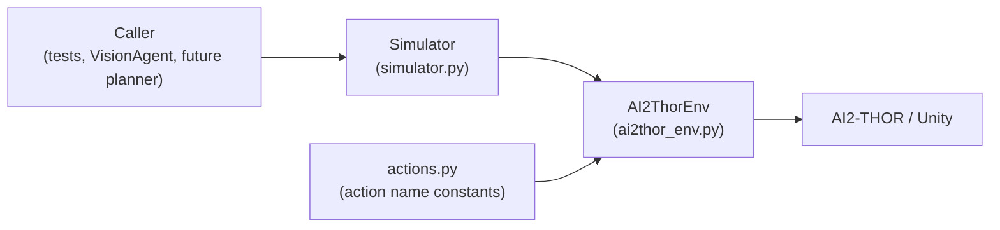
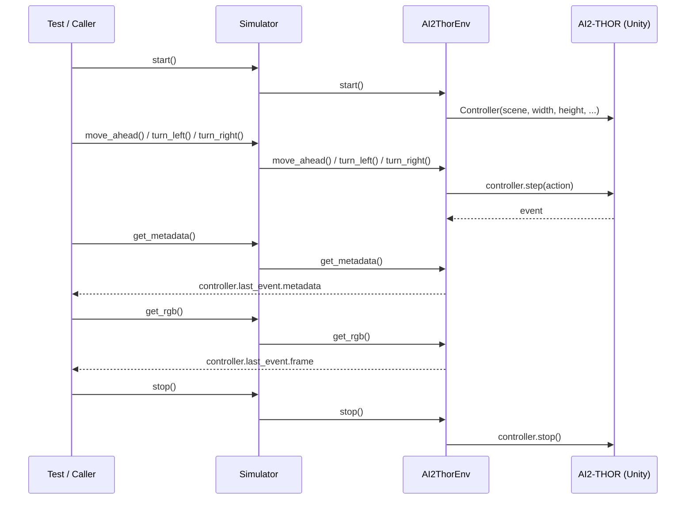

# Phase 1 -- Simulator & Navigation

Status: ✅ Complete

## Goal

Establish a robot simulator that the rest of the project (vision,
planning, memory) can drive without ever knowing which physical or
simulated backend it's talking to.

## Architecture

Three layers, one direction of dependency:

- **`actions.py`** -- action name constants only (`MoveAhead`,
  `RotateLeft`, ...). No logic.
- **`ai2thor_env.py`** (`AI2ThorEnv`) -- the only file in the project
  allowed to import `ai2thor.controller.Controller`. Launches Unity,
  steps actions, and reads back RGB frames / metadata from
  `controller.last_event`.
- **`simulator.py`** (`Simulator`) -- the public interface everything
  else depends on. A thin pass-through to `AI2ThorEnv` today, but the
  seam that lets AI2-THOR be swapped for Habitat, Isaac Sim, or a
  real ROS2 robot later without any caller changing.

### Simulator Abstraction

The rule enforced by this layering: **no planner, memory system,
vision module, or LLM calls AI2-THOR directly.** Every caller goes
through `Simulator`. This is what makes "port this project to a
different simulator" a change confined to `simulator/`, rather than a
project-wide rewrite.

### `actions.py`

Centralizes action-name strings (`"MoveAhead"`, `"RotateLeft"`, ...)
so they're typo-checked by import rather than typed as raw strings
throughout the codebase, and so the planner has one place to look up
what actions exist.

### `ai2thor_env.py`

Owns the AI2-THOR `Controller` lifecycle (`start`/`stop`), action
stepping (`move_ahead`, `turn_left`, `turn_right`, `look_up`,
`look_down`), and read access to the current frame (`get_rgb`) and
full simulator metadata (`get_metadata`), both sourced from
`controller.last_event`.

### `simulator.py`

`Simulator` exposes the exact same method surface as `AI2ThorEnv` and
delegates every call to `self.env`. It intentionally adds no logic of
its own yet -- its value today is establishing the seam; its value
later is absorbing whatever changes when the backend changes (e.g. a
different action-stepping API) without every caller needing to change.

### `test_navigation.py`

Integration test used to validate the wrapper end to end: start the
simulator, move/turn the agent, then read back `metadata["agent"]`
(position, rotation) and an RGB frame.

## Navigation Flow

## Validation Performed

`test_navigation.py` was run to confirm:

- Unity launches successfully from `Simulator.start()`.
- `move_ahead`, `turn_left`, `turn_right` change agent pose as
  expected, confirmed by reading `metadata["agent"]["position"]` and
  `["rotation"]` after each step.
- `get_rgb()` returns a `(height, width, 3)` RGB array matching the
  configured `width`/`height`.
- `Simulator.stop()` cleanly tears down the controller.

## Lessons Learned

- Keeping `AI2ThorEnv` as the *only* AI2-THOR import site paid off
  immediately in Phase 2: `vision_agent.py`, every detector, and every
  test needed RGB frames, and none of them import `ai2thor` -- they
  all go through `Simulator.get_rgb()`.
- Fixed navigation parameters (`gridSize=0.25`, `snapToGrid=True`,
  `rotateStepDegrees=90`) make agent pose deterministic and simple to
  assert on in tests, at the cost of continuous motion -- acceptable
  for a discrete-action planner, revisit if continuous control is
  ever needed.
- `controller.last_event` as the read path for both `get_rgb()` and
  `get_metadata()` means both always reflect the most recent action,
  with no separate state to keep in sync.

## Future Integration

- `VisionAgent` (Phase 2) already consumes `Simulator.get_rgb()`
  exclusively -- no changes needed here as perception grew.
- The future planner will drive `Simulator`'s action methods directly,
  using `Scene.relationships` (Phase 2.8) and eventually
  `Scene.robot_state` to decide which action to take next.
- Swapping simulators later (Habitat, Isaac Sim, a real robot over
  ROS2) means writing a new class with `Simulator`'s method surface --
  `move_ahead`, `turn_left`, `turn_right`, `look_up`, `look_down`,
  `get_rgb`, `get_metadata` -- and nothing outside `simulator/` should
  need to change.
