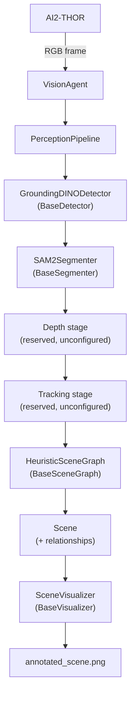
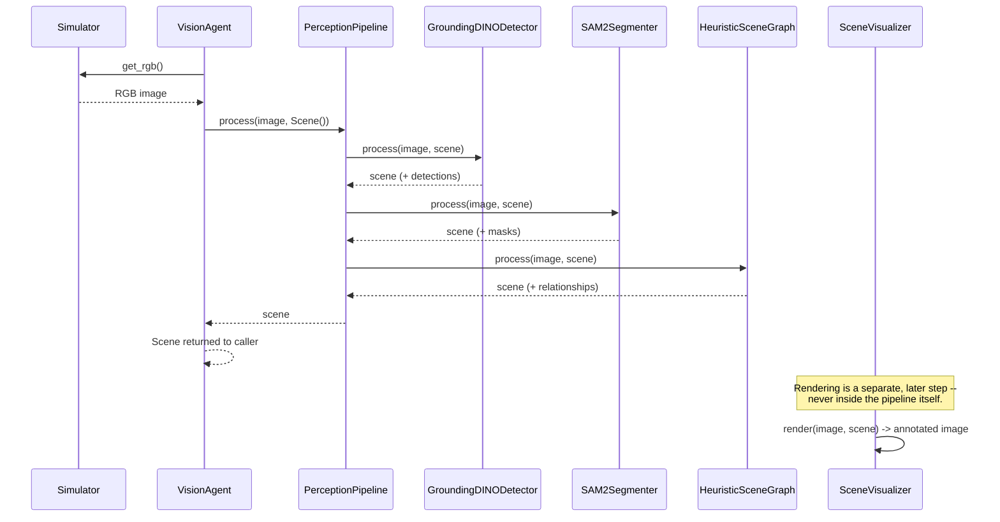

# Phase 2 -- Vision / Perception

Status: Phases 2.1--2.8 complete, plus the `PerceptionPipeline`
architectural refactor.

## Goal

Turn a raw RGB frame from the simulator into a structured, typed
`Scene` -- object detections with confidences and boxes, pixel-accurate
masks, and (eventually) depth, tracking identities, and spatial
relationships -- without any perception module knowing about the
simulator, and without any two perception modules knowing about each
other.

## Architecture



Every box under `PerceptionPipeline` implements the same
`process(image, scene)` method and is optional -- `PerceptionPipeline`
skips any stage constructed as `None`. `detector`, `segmenter`, and
`scene_graph` are wired up today; `depth` and `tracker` are accepted
constructor arguments with no implementation behind them yet.

### PerceptionPipeline

`vision/pipeline/perception_pipeline.py`. Owns stage *sequencing*
only: given `(image, scene)`, call `process(image, scene)` on each
configured stage in order (detector, segmenter, depth, tracker, scene
graph) and return the resulting `Scene`. It has zero knowledge of what
any stage's `process` does internally.

This exists so `VisionAgent` doesn't have to grow every time a new
perception capability is added -- see
[`docs/architecture/perception_pipeline.md`](../architecture/perception_pipeline.md)
for the full rationale.

### Grounding DINO

`vision/detectors/grounding_dino_detector.py` (`GroundingDINODetector`,
implements `BaseDetector`). A zero-shot, text-prompted object detector:
given an RGB image and a text prompt like `"chair. table. mug.
refrigerator."` (read from `scene.metadata[SceneMetadata.DETECTION_PROMPT]`),
it adds one `Detection(label, confidence, bbox)` per matched object to
`scene`. It knows nothing about where its weights come from -- that's
`ModelManager`'s job -- and nothing about segmentation, which happens
in a later stage.

### SAM2

`vision/segmenters/sam2_segmenter.py` (`SAM2Segmenter`, implements
`BaseSegmenter`). Unlike a detector, a segmenter never creates new
objects -- it enriches detections that already exist. For every
`Detection` already in `scene`, it uses `detection.bbox` as a box
prompt for SAM2 and attaches the resulting pixel mask as
`detection.mask` (a `Mask`).

### Scene

`scene/scene.py`. The single data structure every perception stage
reads and writes, so the planner (and any other downstream consumer)
can reason about "what does the robot currently perceive" without
knowing which models produced which piece of it.

| Field | Populated by | Status |
|-------|---------------|--------|
| `detections` | `GroundingDINODetector` | ✅ |
| `detections[i].mask` | `SAM2Segmenter` | ✅ |
| `detections[i].tracking_id` | future tracker | not yet populated |
| `detections[i].depth`, `position_3d` | future depth stage | not yet populated |
| `robot_state` | future simulator-pose wiring | not yet populated |
| `relationships` | `HeuristicSceneGraph` | ✅ |
| `metadata` | any stage (e.g. detection prompt) | ✅ |

### Detection

`scene/detection.py`. One detected object: `label`, `confidence`,
`bbox` (required -- every detector produces these today), plus
optional `mask`, `tracking_id`, `depth`, `position_3d`, `attributes`
for stages that don't exist yet. A strongly typed dataclass instead of
a dict, so a typo in a field name fails immediately instead of
silently producing an empty result.

### Mask

`scene/mask.py`. Wraps a segmenter's raw boolean array (`binary`)
together with `area` and `bbox`, both computed once at mask-creation
time rather than recomputed on every access. Exists as its own type
(rather than `Detection.mask: np.ndarray`) so future mask operations
(polygon extraction, IoU, centroid, visible-ratio-under-occlusion) have
one obvious home instead of being scattered free functions.

### PerceptionPipeline scene graph stage: HeuristicSceneGraph

`vision/scene_graph/` (`BaseSceneGraph`, `HeuristicSceneGraph`).
Implements `BaseSceneGraph.process(image, scene) -> Scene`, the same
contract every other stage follows. Unlike a detector or segmenter, it
never adds or modifies detections -- it only reads the `bbox` (and
`mask`, when present) of every existing detection and appends
`Relationship` objects (`scene/relationship.py`) to
`scene.relationships`.

For every unordered pair of detections, it emits exactly one
`Relationship`:

- **`INSIDE`** -- one detection's overlap with the other covers
  ≥ 90% of its own area (mask-based pixel intersection when both are
  segmented, bounding-box intersection otherwise).
- **`OVERLAPS`** -- non-containing overlap with IoU ≥ 0.2.
- **`INTERSECTS`** -- any smaller overlap.
- **`LEFT_OF` / `RIGHT_OF` / `ABOVE` / `BELOW`** -- no overlap at all;
  decided from the pair's bounding-box centers, using whichever axis
  (horizontal vs. vertical) has the larger displacement.

Predicate names live in `RelationshipType`
(`scene/relationship.py`), which mirrors `SceneMetadata`'s pattern of
centralizing well-known string constants rather than scattering raw
strings like `"LEFT_OFF"` that can typo silently.

Because this stage only depends on `Scene` (via `BaseSceneGraph`), a
future learned scene-graph model can be swapped in by implementing the
same interface and passing it to `PerceptionPipeline(scene_graph=...)`
-- no change to `VisionAgent`, `PerceptionPipeline`, or any other
stage. This was exercised directly: `PerceptionPipeline` and
`VisionAgent` already reserved a `scene_graph` constructor slot before
`HeuristicSceneGraph` existed, and wiring it in required editing
neither.

### Visualization

`vision/visualization/` (`BaseVisualizer`, `SceneVisualizer`). Renders
an existing `Scene` onto its source image with OpenCV --
semi-transparent masks (alpha blending via `cv2.addWeighted`, drawn
first), then bounding boxes, then label + confidence text (drawn last,
so text stays legible on top of the masks). Colors are derived
deterministically from each label's MD5 hash, so the same label always
renders in the same color across runs. Visualizers never run
inference and never mutate the `Scene` or source image they're given
-- they are a pure read-only rendering step, which is what lets the
exact same `SceneVisualizer` keep working unchanged as depth,
tracking, and scene-graph data get added to `Scene` later.

## Folder Structure

```
backend/
    scene/
        detection.py         Detection dataclass
        mask.py               Mask dataclass
        relationship.py         Relationship dataclass + RelationshipType
        scene.py               Scene dataclass (the shared data model)
        metadata_keys.py       Well-known Scene.metadata key constants
    config/
        model_config.py       ModelConfig registry (what/where per model)
        model_manager.py       Download/load lifecycle for any model
    vision/
        vision_agent.py         Image acquisition + pipeline construction
        pipeline/
            perception_pipeline.py   Stage sequencing (detector -> ... -> scene graph)
        detectors/
            base_detector.py
            grounding_dino_detector.py
        segmenters/
            base_segmenter.py
            sam2_segmenter.py
        scene_graph/
            base_scene_graph.py
            heuristic_scene_graph.py
        visualization/
            base_visualizer.py
            scene_visualizer.py
        depth/, tracking/       Reserved, empty
```

## Data Flow



## Design Decisions

### Why `process(image, scene)` exists

Every perception stage -- detector, segmenter, and (by convention)
future depth/tracking/scene-graph stages -- implements the same
two-argument method: take the current frame and the `Scene` built so
far, enrich it, and return it. This uniform shape is what lets
`PerceptionPipeline` iterate a list of stages and call `process` on
each without a special case per stage type, and what let a scene
segmenter be added later (Phase 2.6) without changing the detector or
`VisionAgent`'s calling convention. See
`vision/detectors/base_detector.py` for the full argument, including
why a detector's text prompt travels via `scene.metadata` rather than
breaking this two-argument shape.

### ModelManager

`config/model_manager.py`. Owns the full lifecycle of a model on disk:
check whether `models/<name>/` already holds a usable snapshot (a pure
filesystem check, no network call), download from the Hugging Face Hub
into that project-local directory if not, then load a
`(processor, model)` pair via whatever `transformers` `Auto*` classes
the caller supplies. Centralizing this means a new detector/segmenter
is a ~15-line class that only implements the parts that are genuinely
model-specific (its inference method) -- see `sam2_segmenter.py` and
`grounding_dino_detector.py` for how thin they are as a result.

### Model Registry

`config/model_config.py`. One `ModelConfig(name, hf_name, local_dir)`
per model, all living under the repository's top-level `models/`
directory rather than a user's global HF cache, so the project is
self-contained and reproducible. `SAM2` intentionally does **not**
point at the official `facebook/sam2-hiera-base-plus-hf` repo -- that
repo's weights use parameter names that don't match any version of
`transformers`' `Sam2Model` and load as silently random weights
(verified directly; see the comment on `SAM2` in `model_config.py`).
`danelcsb/sam2.1_hiera_tiny` is used instead, verified to load with
zero missing/unexpected/mismatched keys.

Separately: every SAM2.1 checkpoint currently on the Hub (including
the official `facebook/sam2.1-hiera-tiny`) declares
`"model_type": "sam2_video"` in its `config.json`, which makes
`transformers` print a harmless `model_type` mismatch warning when
loaded as the image-only `Sam2Model`. This is scoped-suppressed for
the duration of that one load call in `sam2_segmenter.py`, with the
verification (zero missing/unexpected/mismatched keys) recorded in a
comment there.

### Scene metadata

`scene/metadata_keys.py` (`SceneMetadata`). `Scene.metadata` is a
deliberately open `Dict[str, Any]`, so any stage can attach ad-hoc
context without a schema change -- but raw string keys
(`scene.metadata["prmopt"]`) invite silent typo bugs. `SceneMetadata`
centralizes the keys more than one module is expected to read/write
(currently `DETECTION_PROMPT`, plus reserved `TARGET_OBJECT`, `TASK`,
`FRAME_NUMBER`), without preventing one-off keys for module-specific
data.

## Future Perception Modules

These remain reserved, unconfigured constructor slots on
`PerceptionPipeline` (`depth=None`, `tracker=None`):

- **Depth** -- a `BaseDepthEstimator`-style stage populating
  `Detection.depth` / `Detection.position_3d` (planned: Depth Anything).
- **Tracking** -- a `BaseTracker`-style stage populating
  `Detection.tracking_id` to link the same physical object across
  frames.
- **Learned Scene Graph** -- a second `BaseSceneGraph` implementation
  (e.g. a GNN or VLM-based relationship classifier), swappable with
  `HeuristicSceneGraph` since both implement the same
  `process(image, scene) -> Scene` interface.

Each will be documented here once implemented, following the same
pattern as Grounding DINO, SAM2, and `HeuristicSceneGraph` above: own
its inference/logic, know nothing about the simulator or other stages,
and read/write only `Scene`.
